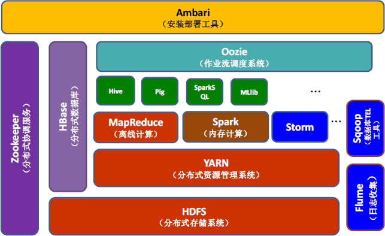

# HBase

HBase是一个分布式的、面向列的开源数据库，该技术来源于 Fay Chang 所撰写的Google论文“Bigtable：一个结构化数据的[分布式存储系统](https://baike.baidu.com/item/分布式存储系统/6608875)”。就像Bigtable利用了Google文件系统（File System）所提供的分布式数据存储一样，HBase在Hadoop之上提供了类似于Bigtable的能力。HBase是Apache的Hadoop项目的子项目。HBase不同于一般的关系数据库，它是一个适合于非结构化数据存储的数据库。另一个不同的是HBase基于列的而不是基于行的模式。

- [百度百科](https://baike.baidu.com/item/HBase/7670213?fr=aladdin)
- belong to apache
- code Java

- 多了basic_data和property_data两个列族！

# Hadoop与HBase的关系

> http://c.biancheng.net/view/6501.html

[HBase](http://c.biancheng.net/hbase/) 参考了 Google 公司的 Bigtable 建模，而 Bigtable 是基于 GFS 来完成数据的分布式存储的，因此，HBase 与 HDFS 有非常紧密的关系，它使用 HDFS 作为底层存储系统。虽然 HBase 可以单独运行在本地文件系统上，但这不是 HBase 设计的初衷。

- HBase 是在 Hadoop 这种分布式框架中提供持久化的数据存储与管理的工具。在使用 HBase 的分布式集群模式时，前提是必须有 Hadoop 系统。
- Hadoop 系统为 HBase 提供给了分布式文件存储系统，同时也使得 MapReduce 组件能够直接访问 HBase 进行分布式计算。
- HBase 最重要的访问方式是 [Java](http://c.biancheng.net/java/) API（Application Programming Interface，应用程序编程接口），MapReduce 的批量操作方式并不常用。
- 

 HBase 在 Hadoop 生态系统中的位置：

## 参考资料

- https://hub.docker.com/r/dajobe/hbase
- 