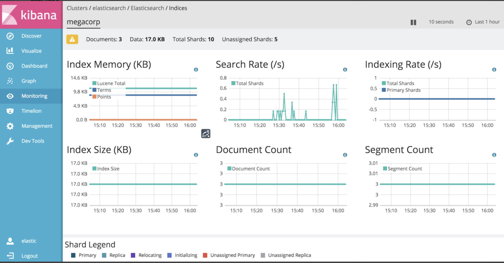

# ELK


ElasticStack = ELK + Beats


## Beats

轻量级的数据采集器，采集一切数据的beats，包括以下：

| types      | cn name     | 说明                                                         |
| ---------- | ----------- | ------------------------------------------------------------ |
| Filebeat   | 日志文件    | 用于监控、收集服务器日志文件，其已取代logstash forwarder     |
| Metricbeat | 服务指标    | 可定期获取外部系统的监控指标信息，其可以监控、收集Apache、haproxy、MongoDB、MySQL、nginx、postgresql、redis、system、zookeeper等服务； |
| Packetbeat | 网络流量    | 网络数据包分析器，收集网络流量信息，嗅探服务器之间的流量，解析应用层协议，并关联到消息的处理，其支持ICMP(v4 & v6)、DNS、HTTP、MySQL、postgresql、redis、mongodb、memcache等协议 |
| Winlogbeat | Win事件日志 | 用于监控、收集windows系统的日志信息                          |
| Heartbeat  | 健康检查    |                                                              |

是elastic公司开源的一款采集系统监控数据的代理agent，是在被监控服务器上以客户端形式运行的数据收集器的统称。可以直接把数据发送给elasticsearch或者通过logstash发送给elasticsearch。

其中的filebeat和metricbeat最重要。


## filebeat

采集集群中的所有服务器的日志。免去逐个ssh查看的烦恼。


### 标准输入输出

配置文件：itcast.yml

```yml
filebeat.inputs:
- type: stdin
  enabled: true # 启用标准输入
setup.template.settings:
  index.number_of_shareds: 3 # 数据发送到ES的shared数 此处无效果，因为是下面配置类发送到控制台
output.console:
  pretty: true
  enable: true
```

启动：

```bash
./filebeat -e -c itcast.yml
```

输入和输出日志：

```bash
hello

{
  "@timestamp": "2021-01-21T10:33:27.926Z",
  "@metadata": { # 元数据信息
    "beat": "filebeat",
    "type": "_doc",
    "version": "7.10.2"
  },
  "log": {
    "offset": 0,
    "file": {
      "path": ""
    }
  },
  "message": "hello", # 输入的内容
  "input": {
    "type": "stdin"
  },
  "ecs": {
    "version": "1.6.0"
  },
  "host": {
    "name": "gzc-pro.local"
  },
  "agent": { # beat版本以及主机信息
    "version": "7.10.2",
    "hostname": "gzc-pro.local",
    "ephemeral_id": "98ebb1b3-21f8-484e-962c-c53f91fe7305",
    "id": "ed756a55-b0e2-4ffe-b245-d55f781c1221",
    "name": "gzc-pro.local",
    "type": "filebeat"
  }
}

```


### 读取文件

配置文件：itcast-log.yml

```yml
filebeat.inputs:
- type: log
  enabled: true 
  paths:
  - /Users/apple/devops/ELK/filebeat-7.10.2-darwin-x86_64/itcast/beasts/logs/*.log
setup.template.settings:
  index.number_of_shareds: 3
output.console:
  pretty: true
  enable: true
```

启动：

```bash
./filebeat -e -c itcast-log.yml
```

输入和输出日志：

```bash
echo "good luck" >> a.log 

{
  "@timestamp": "2021-01-21T11:05:39.311Z",
  "@metadata": {
    "beat": "filebeat",
    "type": "_doc",
    "version": "7.10.2"
  },
  "ecs": {
    "version": "1.6.0"
  },
  "log": {
    "file": {
      "path": "/Users/apple/devops/ELK/filebeat-7.10.2-darwin-x86_64/itcast/beasts/logs/a.log"
    },
    "offset": 12
  },
  "message": "good luck",
  "input": {
    "type": "log"
  },
  "host": {
    "name": "gzc-pro.local"
  },
  "agent": {
    "version": "7.10.2",
    "hostname": "gzc-pro.local",
    "ephemeral_id": "b28f06a9-9f8d-45b1-b81a-4b3a837e7534",
    "id": "ed756a55-b0e2-4ffe-b245-d55f781c1221",
    "name": "gzc-pro.local",
    "type": "filebeat"
  }
}

```


### 自定义字段

配置文件：itcast-log.yml

```yml
filebeat.inputs:
- type: log
  enabled: true 
  paths:
  - . /itcast/beasts/logs/*.log
  tags: ["web"] # 添加自定义tag，便于后续的处理
  fields: # 添加自定义字段
    from: itcast-im
  fields_under_root: true # true为添加到根节点，false为添加到子节点中  
setup.template.settings:
  index.number_of_shareds: 3
output.console:
  pretty: true
  enable: true

```

测试：

```bash
{
  "@timestamp": "2021-01-21T11:16:07.847Z",
  "@metadata": {
    "beat": "filebeat",
    "type": "_doc",
    "version": "7.10.2"
  },
  "tags": [
    "web"
  ],
  "input": {
    "type": "log"
  },
  "from": "itcast-im",
  "ecs": {
    "version": "1.6.0"
  },
  "host": {
    "name": "gzc-pro.local"
  },
  "agent": {
    "type": "filebeat",
    "version": "7.10.2",
    "hostname": "gzc-pro.local",
    "ephemeral_id": "b56de6ca-0d9f-4de2-8f8b-3bb150f84ca1",
    "id": "ed756a55-b0e2-4ffe-b245-d55f781c1221",
    "name": "gzc-pro.local"
  },
  "message": "123",
  "log": {
    "offset": 22,
    "file": {
      "path": "/Users/apple/devops/ELK/filebeat-7.10.2-darwin-x86_64/itcast/beasts/logs/a.log"
    }
  }
}
```


### 输出到elasticsearch中

配置文件：itcast-es.yml

```yml
filebeat.inputs:
- type: log
  enabled: true 
  paths:
  - ./itcast/beasts/logs/*.log
  tags: ["web"] # 添加自定义tag，便于后续的处理
  fields: # 添加自定义字段
    from: itcast-im
  fields_under_root: true # true为添加到根节点，false为添加到子节点中  
# setup.template.settings:
#   index.number_of_shareds: 3
setup.template.enabled: false
output.elasticsearch: # 指定ES的配置
  hosts: ["localhost:9200"]
```

随后通过elasticsearch-head中可以查看filebeat的统计信息，会新增了索引，数据浏览中也可以查看数据。

```yaml
filebeat.inputs:
- type: log
  enabled: true 
  paths:
  - D:\ToolServices\service-manager\log\RtAPPManager-*.log
  tags: ["app-manager"] # 添加自定义tag，便于后续的处理
  fields: # 添加自定义字段
    from: service-manager
  fields_under_root: true # true为添加到根节点，false为添加到子节点中  
# setup.template.settings:
#   index.number_of_shareds: 3
setup.template.enabled: false
output.elasticsearch: # 指定ES的配置
  hosts: ["localhost:9200"]
```


[Windows下查看应用的命令行参数](https://jingyan.baidu.com/article/11c17a2ccfb5daf446e39dbf.html)：

```powershell
C:\Users\zhongcai.guan>wmic process where caption="filebeat.exe" get caption,commandline /value


Caption=filebeat.exe
CommandLine="C:\Program Files\Elastic\Beats\8.0.1\filebeat\filebeat.exe"  --path.home "C:\Program Files\Elastic\Beats\8.0.1\filebeat" --path.config "C:\ProgramData\Elastic\Beats\filebeat" --path.data "C:\ProgramData\Elastic\Beats\filebeat\data" --path.logs "C:\ProgramData\Elastic\Beats\filebeat\logs" -E logging.files.redirect_stderr=true
```

启动测试：

```powershell
C:\Program Files\Elastic\Beats\8.0.1\filebeat
filebeat.exe -e -c C:\ProgramData\Elastic\Beats\filebeat\out2es.yml
```


### 配置文件详解

https://www.cnblogs.com/zlslch/p/6622079.html


### nginx日志收集

配置文件：itcast-nginx.yml

```yml
filebeat.inputs:
- type: log
  enabled: true 
  paths:
  - ./itcast/beasts/logs/*.log
  tags: ["nginx"] # 添加自定义tag，便于后续的处理
  fields: # 添加自定义字段
    from: itcast-im
  fields_under_root: true # true为添加到根节点，false为添加到子节点中  
setup.template.settings:
  index.number_of_shareds: 1 # hosts有几个就填几个 though still can't work
output.elasticsearch: # 指定ES的配置
  hosts: ["localhost:9200"]
filebeat.config.modules:
  path: ${path.config}/modules.d/*.yml
  reload.enabled: false  
setup.kibana:
	host: "localhost:5601"
```


需要执行elasticsearch-plugin的安装：

```bin
sudu bin/elasticsearch-plugin install ingest-user-agent
sudu bin/elasticsearch-plugin install ingest-geoip
```

安装nginx日志仪表盘到kibana中：

```bash
./filebeat -c itcast-nginx.yml setup
# 安装完成后到kibana的dashboards中查找[Filebeat Nginx]..即可见
```

报错：

```log
Exiting: error loading template: could not load template. Elasticsearch returned: couldn't load template: 400 Bad Request: {"error":{"root_cause":[{"type":"illegal_argument_exception","reason":"unknown setting [index.number_of_shareds] did you mean any of [index.number_of_shards, index.number_of_replicas]?"}],"type":"illegal_argument_exception","reason":"unknown setting [index.number_of_shareds] did you mean any of [index.number_of_shards, index.number_of_replicas]?"},"status":400}. Response body: {"error":{"root_cause":[{"type":"illegal_argument_exception","reason":"unknown setting [index.number_of_shareds] did you mean any of [index.number_of_shards, index.number_of_replicas]?"}],"type":"illegal_argument_exception","reason":"unknown setting [index.number_of_shareds] did you mean any of [index.number_of_shards, index.number_of_replicas]?"},"status":400}. Template is: {
...
```


### filebeat工作原理

filebeat有两个主要组件：prospector 和 harvester

- harvester 收割器
  - 负责读取单个文件的内容
  - 如果文件在读取时被删除或重命名，filebeat将继续跟踪读取文件
- prospector 探勘者
  - prospector负责管理harvester并找到所有要读取的文件来源
  - 如果输入类型为日志，则查找器将查找路径匹配的所有文件，并为每个文件启动一个harvester
  - filebeat目前支持两种prospector类型：log和stdin
- filebeat如何保持文件的状态
  - filebeat保存每个文件的状态并经常将状态刷新到磁盘的注册文件中
  - 该状态用于记住harvester正在读取的最后**偏移量**，并确保发送所有日志行
  - 如果输出（es或logstash）无法访问，filebeat会跟踪最后发送的行，并在输出再次可用时继续读取文件！
  - 在filebeat运行时，每个prospector内存中也会保存文件状态信息，以减少IO，提高性能；
  - 当重新启动filebeat时，将使用注册文件的数据来重建文件状态，filebeat将每个harvester在从保存的最后偏移量继续读取！
  - 文件状态记录在data/registry文件中


### Registry文件

> [Filebeat的Registry文件解读 (qq.com)](https://mp.weixin.qq.com/s/H5QiZ10KSdUXFW5LdH79wA)

Filebeat会将自己处理日志文件的进度信息写入到registry文件中，以保证filebeat在重启之后能够接着处理未处理过的数据，而无需从头开始

registry文件内容为一个list，list里的每个元素都是一个字典，字典的格式如下：

```json
{
    "source": "/home/logs/app/exception.log",
    "offset": 8137,
    "FileStateOS": {
        "inode": 1048,
        "device": 29
    },
    "timestamp": "2019-03-28T13:31:10.87878789+08:00",
    "ttl": -1
}
```

每个字段的意义解释：

**source：** 记录采集日志的完整路径

**offset：** 采集这个日志文件到了哪个位置，总采集字节数

**inode：** 日志文件的inode号，关于inode的详细解释看下文

**device：** 日志所在的磁盘编号，下文`stat`命令中Device的值

**timestamp：** 日志最后一次发生变化的时间戳

**ttl：** 采集失效时间，-1表示永不失效

Filebeat在每次启动时都会来读取这个文件，如果文件不存在则会创建新文件


### inode相关知识

硬盘格式化的时候，操作系统自动将硬盘分成了两个区域。

一个是**数据区**，用来存放文件的数据信息

一个是**inode区**，用来存放文件的元信息，比如文件的创建者、创建时间、文件大小等等

每一个文件都有对应的inode，里边包含了与该文件有关的一些信息，**可以用`stat`命令查看文件的inode信息**

```bash
# stat /home/logs/app/exception.log
  File: '/home/logs/app/exception.log'
  Size: 40210         Blocks: 80         IO Block: 4096   regular file
Device: 1dh/29d    Inode: 1038        Links: 1
Access: (0644/-rw-r--r--)  Uid: (    0/    root)   Gid: (    0/    root)
Access: 2019-03-28 00:27:01.522594000 +0800
Modify: 2019-03-28 15:59:14.582594000 +0800
Change: 2019-03-28 15:59:14.582594000 +0800
 Birth: -
```

我们可能遇到过明明查看磁盘空间还充足，但无法创建新文件的问题，这时候可能就是因为磁盘的inode用完了，磁盘的inode可以通过命令`df -i`查看

```bash
# df -i
Filesystem        Inodes IUsed     IFree IUse% Mounted on
none           104855552 39836 104815716    1% /
tmpfs            1024703    16   1024687    1% /dev
tmpfs            1024703    10   1024693    1% /sys/fs/cgroup
/dev/vdc1      104855552 39836 104815716    1% /etc/hosts
```

每个inode都有一个号码，操作系统就是通过这个号码来识别不同文件的，这个号码就是filebet配置中的inode，可以通过`ls -i`命令查看

```
# ls -i /home/logs/app/exception.log
1048 /home/logs/app/exception.log
```

可能你查看registry文件发现**同名的log文件记录有很多条**，造成这个的主要原因是你的log文件可能被重命名过，常见的场景例如log4j里边的每日生成一个日志文件，把老的日志文件重命名


### logstash有关配置参数

**registry_file：** registry文件路径，可以只写文件名，那么文件会创建在默认的`${path.data}`目录下，也可以指定一个绝对路径

**registry_file_permissions：** registry文件的权限，默认是0600，只有属主有读写权限

**registry_flush：** registry文件的刷新时间，默认为0，表示实时刷新，filebeat处理一条日志就实时的将信息写入到registry文件中，这在日志量大的时候会频繁读写registry文件，可考虑适当增加这个值来降低磁盘开销

如果filebeat在处理发送事件时还没有等到output的响应就意外关闭或僵死了，新发送的日志状态没有来得及记录进registry文件中，那么在filebeat重新启动后会去读取registry文件记录的信息重新发送日志，这确保了所有日志都被发送过，但可能会有重复的日志被发送


### 重新从头读取日志

有些情况下我们需要让filebeat重新从头读取日志，尤其是在调试的时候，有了上边的知识我们就很容易实现filebeat重新从头读取日志了，核心的思想就是干掉registry文件

1. 找到registry文件的位置，如果没有单独配置那么文件路径为`/var/lib/filebeat/registry`，不在也没关心，可以直接find命令查找

```
# find / -name registry
/var/lib/filebeat/registry
```

2. 关闭filebeat --> 删掉registry文件 --> 启动filebeat

```
/etc/init.d/filebeat stop &&\
rm -r /var/lib/filebeat/registry &&\
/etc/init.d/filebeat start
```

3. 查看registry文件内容重新生成了数据


### Modules

前面要想实现日志数据的读取以及处理都是自己要手动配置的！其实，在filebeat中，有大量的module，可以简化我们的配置！直接用就可以了！

```bash
./filebeat modules list

Enabled:
..
Disabled:
.. many many modules !

# 启用nginx module
./filebeat modules enable nginx
# 禁用nginx module
./filebeat modules disable nginx

# 查看module.d目录中的nginx.yml
vi ./module.d/nginx.yml
```

譬如启用了nginx module，收集nginx的日志会对raw http数据进行格式化为形如：

```json
...
response_code" :"304",
method: "GET",
http_version: "1.1",
url: "/"
...
```


## Metricbeat

收集cpu、内存、io等os参数，采集给elasticsearch

分为两部分：

1. module：收集的对象，如mysql、redis、nginx、操作系统等
2. metricset：收集指标的集合，如cpu、memory、network等

比如收集redis，通过其info指令，收集数据到ES


## Elasticseartch

基于java，是个开源分布式搜索引擎，特点有：

1. 分布式
2. 零配置
3. 自动发现
4. 索引自动分片
5. 索引副本机制
6. restful风格接口
7. 多数据源
8. 自动搜索负载等


### 安装

新建elsearch用户，elasticsearch不支持root用户运行：

```bash
useradd elsearch
# 解压安装包
tar -xvf elasticsearch-6.5.4.tar.gz -C /itcast/es/
chown elsearch:elsearch itcast/ -R
su - elsearch
```

Mac环境：

```bash
# 安装
brew install elasticsearch
# 运行ES
brew services start elasticsearch

# 相应目录
Data:    /usr/local/var/lib/elasticsearch/
Logs:    /usr/local/var/log/elasticsearch/elasticsearch_apple.log
Plugins: /usr/local/var/elasticsearch/plugins/
Config:  /usr/local/etc/elasticsearch/
```

**本地浏览器访问 [http://localhost:9200](http://localhost:9200/)**


### 修改配置文件

使之可以异地访问：

```yml
# vim elasticsearch.yml
network.host: 0.0.0.0

# 如果上面不是localhost或127.0.0.1，ES会认为是生产环境，进而会需要更高的资源需求
# 修改下面两个参数可以配置：初始堆总内存、最大堆总内存
-Xms128m
-Xmx128m
```

### 启动：

```bash
# 前台启动
./elasticsearch
# 后台启动
./elasticsearch -d
```

### 停止：

```bash
# 查看当前运行的java进程
jps
3386 elasticsearch
# 关闭ES
kill 3286
```


### SQL客户端使用

```
./bin/elasticsearch-sql-cli
sql> select * from indexName;
```


### curl命令操作

详见：https://blog.csdn.net/lixi5718/article/details/76270700

```bash
#  1.查询数据
  curl -XGET ‘http://localhost:9200/{index}/{type}/{id}’
#  2.索引(插入)数据
  curl -XPOST ‘http://localhost:9200/{index}/{type}/{id}’ -d'{“key”:”value”,“key”:”value”}’
#  3.批量导入数据(在a.json文件所在当前文件下)
  curl -XPOST 'localhost:9200/{index}/{type}/_bulk' --data-binary "@a.json"
```


```ht
查看具体命令 curl localhost:9200/_cat
  1.集群健康状态
  /_cat/health 
  2.资源信息
  /_cat/allocation
  3.查看文档总数
  /_cat/count
```


### elasticsearch-head安装

- chrome插件安装：搜索elasticsearch-head，安装后使用

- docker安装

```bash
# 拉去镜像
docker pull mobz/elasticsearch-head:5

# 创建容器
docker create --name elasticsearch-head -p 9100:9100 mobz/elasticsearch-head:5

# 启动容器
docker start elasticsearch-head
```

注意：

由于前后端分离，所以会存在跨域的问题，需要在elasticsearch端配置CORS：

```yml
# vim elasticsearch.yml 添加：
http.cors.enabled: true
http.cors.allow-orgin: "*"
```


连接带用户名和密码的elasticsearch：

```
http://localhost:9100/?auth_user=elastic&auth_password=changeme
```


### 概念

> 索引

- 索引（index）：是elasticsearch对逻辑数据的逻辑存储，所以它可以分为更小的部分
- 可以把索引看成关系型数据库的表，索引的结构是为快速有效的全文索引准备的，特别是他不存储原始值。
- elasticsearch可以把索引存放在一台机器或者分散到多台服务器上，每个索引由一或多个分片（shard），每个分片可以有多个副本（replica）

> 文档

- 存储在elasticsearch中的主要实体叫文档（document）。用关系型数据库来类比的话，一个文档相当于一个数据库表中的一行记录。
- elasticsearch和MongoDB的文档类似，都可以有不同的结构。但elasticsearch的文档中，相同字段必须有相同类型。
- 文档由多个字段组成，每个字段可能多次出现在一个文档里，这样的字段叫 **多值字段（multivalued）**

- 每个字段的类型，可以是文本、数值、日期等。字段类型也可以是复杂类型，一个字段包含其他子文档或者数组。

> 映射

- 所有文档写进索引之前，都会先进行分析，如何将输入的文本分割为词条、哪些词条又会被过滤，这种行为叫做映射（mapping）。一般由用户自己定义规则。

> 文档类型

- 在elasticsearch中，一个索引对象可以存储很多不同用途的对象。例如，一个博客应用程序可以保存文章和评论。？
- 每个文档可以有不同的结构。
- 不同的文档类型不能为相同的属性设置不同的类型！例如，在同一个索引中的所有文档类型中，一个叫title的字段必须具有相同的类型。

> Restful API

在ES中，提供了功能丰富的RESTful API的操作，包括基本的CRUD、创建索引、删除索引等操作。

在Lucene中，创建索引是需要定义字段名称已经字段类型的。在elasticsearch中提供了非结构化的索引，不需要创建索引结构，即可写入数据到索引中，实际上在elasticsearch底层会进行结构化操作。


中文分词：IK分词器


x server：连接linux系统的windows的UI工具


## Kibana

数据分析的可视化平台。基于nodejs，是一个开源和免费的工具，可以汇总、分析和搜索重要数据日志。

### 数据探索

1. 路径：

   >  导航栏中：Management -> Index Patterns -> Create index pattern：

2. 会自动显示出已有的ES中的索引库。或手动输入做查找：

   > metricbeat-*

3. Time Filter field name 选择 @timestamp，确认创建 【Create index pattern】

4. 导航栏中 Discover，可查看ES中的数据

5. metric-beat的dashboard安装

   1. 在 `metricbeat.yml` 中配置kibana地址：

      ```yml
      setup.kibana:
        host: :"localhost:5601"
      ```

   2. 安装仪表盘到kibana：

      ```bash
      ./metricbeat setup --dashboards
      ```

   3. 在kibana的导航栏Dashboards中可以看到仪表盘数据：

6. file-beat的dashboard安装

   ```bash
   # kibana仪表盘安装
   
   ./filebeat -c itcast-nginx.yml setup
   # 启动filebet
   ./filebeat -e -c itcast-nginx.yml
   ```


### grokdebugger

```
http://localhost:5601/app/dev_tools#/grokdebugger
```


### X-Pack

> https://www.oschina.net/p/x-pack?hmsr=aladdin1e1

X-Pack 是一个Elastic Stack的扩展，将**安全，警报，监视，报告和图形功能**包含在一个易于安装的软件包中。在Elasticsearch 5.0.0 之前，您必须安装单独的Shield，Watcher和Marvel插件才能获得在X-Pack中所有的功能

X-pack监控组件使您可以通过Kibana轻松地监控ElasticSearch。您可以实时查看集群的健康和性能，以及分析过去的集群、索引和节点度量。此外，您可以监视Kibana本身性能。当你安装X-pack在群集上，监控代理运行在每个节点上收集和指数指标从Elasticsearch。安装在X-pack在Kibana上，您可以查看通过一套专门的仪表板监控数据。




## LogStash

基于java，是个开源的用于收集，分析和存储日志的工具。

logstash的采集工作已经被beats代替掉了，因为前者是java的，需要一个JVM，速度太慢。现在基本通过beats采集。


### [进入容器时给容器root权限](https://www.cnblogs.com/sucretan2010/p/12811418.html)

执行以下命令给容器root权限：

```bash
docker exec -u 0 -it mycontainer bash
```

 

在容器里root用户的默认ID是0，所以指定root用户的ID即有root权限

或者直接root 用户

```bash
docker exec -it --user root mycontainer bash
```


### 安装启动

```bash
# 检查jdk环境，需要1.8+
java -version

# 解压安装包
tar -xvf logstash-6.5.4.tar.gz

# 第一个logstash示例
bin/logstash -e 'input {stdin {}} output {stdout {}}'
```


### 配置

```yml
input { # 输入
	stdin {...} # 标准输入
}

filter { # 过滤，对数据进行分割、截取等处理
	...
}

output { # 输出
	stdout {...} # 标准输出
}
```

实际中可以通过filebeat收集数据，发送给logstash，也可以用logstash直接采集过滤


### 读取自定义日志

日志结构示例：

```log
2021-01-17 20:21:52|ERROR|读取数据出错|参数: id=1002
```

自定义配置文件：

```yml
# vim itcast-pipeline.conf
input {
	file {
		path => "/itcast/logstash/logs/app.log" # 读取一个日志文件
		start_position => "beginning"
	}
}

filter {
	mutate {
		split => {"message" => "|"}
	}
}

output {
	elasticsearch {
		hosts => ["192.168.1.11:9200","192.168.1.12:9200","192.168.1.13:9200"]
	}
}
```

启动：

```bash
./bin/logstash -f itcast-pipeline.confg
```

logstash捕获到的日志：

```json
{
  "host" => "node01",
  "message" => [
  	[0] "2021-01-17"
		[1] "ERROR"
		[2] "读取数据出错"
		[3] "参数: id=1002"
  ],
	"@version" => "1",
	"@timestamp" => 2021-01-17T20:30:22.294Z,
	"path" => "/itcast/logstash/logs/app.log"
}
```

此时在elasticsearch里可以看到新增了index：logstash-2021.01.17，其中会有数据


### logstash三个组件

- input plugins: 输入插件使Logstash可以读取特定的事件源。[参考资料](https://www.elastic.co/guide/en/logstash/7.9/input-plugins.html)
  - beats：从Elastic Beats框架接收事件
  - elasticsearch：从Elasticsearch集群读取查询结果
  - file：从文件流事件
  - exec命令行中：将shell命令的输出捕获为事件
  - github：从GitHub Webhook读取事件
  - http: 通过HTTP或HTTPS接收事件
  - kafka: 读取来自Kafka主题的事件
  - log4j: 从Log4jSocketAppender对象通过TCP套接字读取事件
  - rabbitmq: 从RabbitMQ交换中提取事件
  - redis: 从Redis实例读取事件
  - TCP/UDP
  - ........

- output plugins: 用于定义数据到哪里去，[参考资料]()

  mongodb/file/exec/http/tcp/rabbitmq/kafka/redis/..

- filter plugin: 过滤器（beats）


## docker-compose版

```yaml
# ELK/filebeat服务

version: '3.8'

services:
  elasticsearch:
    image: elasticsearch:7.9.3
    container_name: elasticsearch
    restart: always
    ports:
      - 9200:9200
      - 9300:9300
    environment:
      discovery.type: single-node
      ES_JAVA_OPTS: -Xms256m -Xmx1024m
    networks: 
      - webtps    
    volumes:  
      - es_data:/usr/share/elasticsearch/data

  kibana:
    image: docker.elastic.co/kibana/kibana:7.9.3 
    container_name: kibana
    restart: always
    ports:
      - 5601:5601
    environment:
      - I18N_LOCALE=zh-CN
      - XPACK_GRAPH_ENABLED=true
      - TIMELION_ENABLED=true
      - XPACK_MONITORING_COLLECTION_ENABLED="true"
    depends_on:
      - elasticsearch

  filebeat:
    image: docker.elastic.co/beats/filebeat:8.0.1
    container_name: filebeat
    restart: always
    depends_on:
      - elasticsearch
      - kibana


volumes: 
  es_data:

networks: 
  webtps:
    name: webtps_bridge
```


## go访问elasticsearch

- [gitee的github镜像仓库：olivere/elastic](https://gitee.com/mirrors_olivere/elastic)

goland 报红的话: 

1. go mod tidy 
2. goland Preference->Go->Go Modules(vgo) -> Enable Go Modules(vgo)intergration


### 日志代理logagent

```go
import "github.com/hpcloud/tail" 
```

- [go与tail（github.com/hpcloud/tail）](https://blog.csdn.net/sinat_26682309/article/details/93858475)


filebeat -> rabbitmq -> logagent -> solar


# docker版本

便于日常运维和部署


## 目标

- elasticsearch和kibana是docker版本
- filebeat既有docker版本也有自管理版本
- filebeat收集日志到es中
- 多日志源，包括自研的gin、java、dotnet应用，也包括postgresql和rabbitmq等日志
- 日志目标的展示支持gin、log4j、log4net、Windows events等
- 带dashboard
- 常用查询
- filebeat的配置
- kibana的配置和使用


## 加载外部配置文件

Filebeat允许将配置分隔为多个较小的配置文件，然后加载外部配置文件。

**输入配置**

```yml
filebeat.config.inputs:
  enabled: true
  path: configs/*.yml
```

每一个在path下的文件都必须包含一个或多个input定义，例如：

```yml
- type: log
  paths:
    - /var/log/mysql.log
  scan_frequency: 10s

- type: log
  paths:
    - /var/log/apache.log
  scan_frequency: 5s
```


## 多项目实践

> https://blog.csdn.net/wsdc0521/article/details/106308441

filebeat.yml

```yaml
filebeat.inputs:
- type: log
  enabled: true
  backoff: "1s"
  tail_files: false
  paths:
    - /usr/local/nginx/logs/access-json.log
  fields:
    filetype: log_nginxjson
  fields_under_root: true
  
- type: log
  enabled: true
  backoff: "1s"
  tail_files: false
  paths:
    - /var/log/messages
  fields:
    filetype: log_system
  fields_under_root: true
  
output.logstash:
  enabled: true
  hosts: ["wykd:5044"]
```


logstash.conf

```yaml
input {
   #从filebeat取数据，端口与filebeat配置文件一致
   beats {
     host => "0.0.0.0"
     port => 5044
   }
}

filter {
    #只对nginx的json日志做json解析，系统message为其他格式，无需处理
    if [filetype] == "log_nginxjson"{
      json {
         source => "message"
         remove_field => ["beat","offset","tags","prospector"] #移除字段，不需要采集
      }
      date {
        match => ["timestamp", "dd/MMM/yyyy:HH:mm:ss Z"] #匹配timestamp字段
        target => "@timestamp"  #将匹配到的数据写到@timestamp字段中
      }
  }
}
 
output {
       # 输出es，这的filetype就是在filebeat那边新增的自定义字段名
       if [filetype] == "log_nginxjson" {
         elasticsearch {
            hosts => ["wykd:9200"]
            index => "nginx-%{+YYYY.MM.dd}"
        }
       } else if [filetype] == "log_system" {
         elasticsearch {
            hosts => ["wykd:9200"]
            index => "msg-%{+YYYY.MM.dd}"
        }
       }
 
}
```


# Todo

- [ ] filebeat收集docker容器中stdout的gin日志到logstash中，在kibana中展示
- [ ] 多输入源、多过滤器、输出到不同的es的索引中
- [ ] 同理，abp、springboot等
- [x] grok
- [ ] tag：是针对不同的Service来设定的
- [ ] source
- [ ] 索引的过期策略
- [ ] 自动收集docker容器的日志并展示在kibana侧


## 参考资料

- [Elastic Stack（ELK）从入门到实践](https://www.bilibili.com/video/BV1iJ411c7Az?t=82&p=60)
- [filebeat-中文指南](https://elkguide.elasticsearch.cn/beats/file.html)
- [Filebeat 模块与配置](https://www.cnblogs.com/cjsblog/p/9495024.html)
- [Kibana7.9.2设置elasticsearch索引过期时间，到期自动删除](https://blog.csdn.net/qq_41631365/article/details/109773675?utm_medium=distribute.pc_aggpage_search_result.none-task-blog-2~aggregatepage~first_rank_ecpm_v1~rank_v31_ecpm-1-109773675.pc_agg_new_rank&utm_term=elk+%E8%AE%BE%E7%BD%AE%E7%B4%A2%E5%BC%95%E8%BF%87%E6%9C%9F%E6%97%B6%E9%97%B4&spm=1000.2123.3001.4430)
- [bash-declare/local](https://ss64.com/bash/declare.html)
- 
