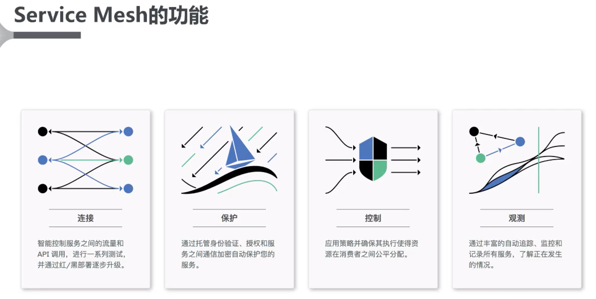
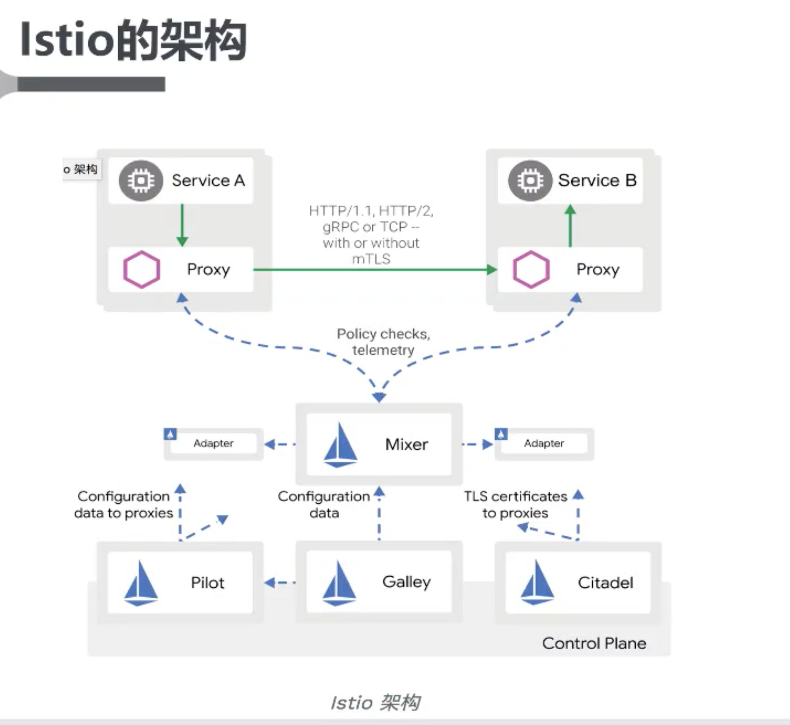

# Service Mesh

## 优势

1. 治理功能从应用开发SDK中分离
2. 微服务治理是到基础设施层的

## Istio的功能

- 服务发现、负载均衡
- 故障恢复、指标收集和监控
- A/B测试、灰度发布
- 限流、访问控制和端到端认证

# Istio的架构

https://github.com/istio/istio

[Istio](https://istio.io/latest/docs/concepts/what-is-istio/)是一个开放平台，用于提供一种统一的方式来[集成微服务](https://istio.io/latest/docs/examples/microservices-istio/)、管理跨微服务的[流量](https://istio.io/latest/docs/concepts/traffic-management/)、执行策略和聚合遥测数据。Istio 的控制平面在底层集群管理平台（如 Kubernetes）上提供了一个抽象层。

- Proxy：使用Envoy技术的数据代理层
- telemetry: 遥测技术
- Pilot：领航员
- Galley：单层甲板的大帆船
- Gitadel：大本营；避难处

## Envoy

> Envoy是C++编写的，所以需要包一下，变为Proxy，和其他的都是Go写的应用交互

- Istio使用Envoy代理的扩展版本
- Envoy提供许多内置功能：
  - 动态服务发现
  - 负载均衡
  - TLS终止
  - HTTP/2 & gRPC代理
  - 熔断器
  - 健康检查、基于百分比流量拆分的灰度发布
  - 故障注入
  - 丰富的度量指标

## Mixer

- 负责执行访问控制和使用策略

- 从Envoy代理和其他服务

  搜集遥测数据

- 插件模型，可抽象出基础设施：以适配到不同的云平台

  后端的服务代理

## Pilot

- 提供服务发现功能

- 为智能路由和弹性（超时、重试、熔断器等）提供流量管理功能：A/B测试，灰度发布

- 将控制流量行为的高级路由规则

  转换为特定于Envoy的配置

## Citadel

- 身份和凭证管理
- 微服务间和最终用户身份验证
- 升级服务网格中未加密的流量：http升级到https
- 支持基于角色的访问控制（RBAC）

## Galley

- Istio的API Server
- 验证用户编写的Istio API配置
- 将接管Istio获取配置、处理和分配组件