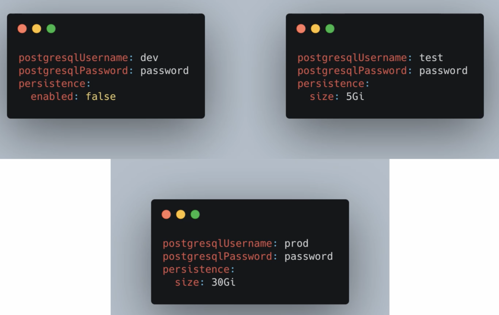

# Helm

## 1.概述

Helm是k8s的包管理工具，类似Linux系统常用的 apt、yum等包管理工具。

使用helm可以简化k8s应用部署

## 2.基本概念

- **Chart**：一个 Helm 包，其中包含了运行一个应用所需要的镜像、依赖和资源定义等，还可能包含 Kubernetes 集群中的服务定义，类似 Homebrew 中的 formula、APT 的 dpkg 或者 Yum 的 rpm 文件。
- **Release**：在 Kubernetes 集群上运行的 Chart 的一个实例。在同一个集群上，一个 Chart 可以安装很多次。每次安装都会创建一个新的 release。例如一个 MySQL Chart，如果想在服务器上运行两个数据库，就可以把这个 Chart 安装两次。每次安装都会生成自己的 Release，会有自己的 Release 名称。
- **Repository**：用于发布和存储 Chart 的存储库。

## 3.架构


**Chart Install 过程：**

1. Helm从指定的目录或者tgz文件中解析出Chart结构信息
2. Helm将指定的Chart结构和Values信息通过gRPC传递给Tiller
3. Tiller根据Chart和Values生成一个Release
4. Tiller将Release发送给Kubernetes运行。


**Chart Update 过程：**

1. Helm从指定的目录或者tgz文件中解析出Chart结构信息
2. Helm将要更新的Release的名称和Chart结构，Values信息传递给Tiller
3. Tiller生成Release并更新指定名称的Release的History
4. Tiller将Release发送给Kubernetes运行


比如，在安装PostgreSQL时，我们可能会需要如下资源：

- 实际运行postgresql的Deployment或StatefulSet
- 允许其他应用访问的Service
- 数据存储需要的PersistenceVolumeClaim或PersistenceVolume
- 保存数据库配置的ConfigMap
- 保存数据库密码的Secret

所有这些资源声明组成了应用的安装包，Helm称之为Chart



可在 [ArtifactHub](https://artifacthub.io/)上查找Helm Chart可用包。


## 4.安装helm

helm主要包括helm客户端和Tiller服务端两部分，Tiller部署在k8s集群中。

```bash
#这是通过--kubeconfig参数指定k8s证书的方式操作k8s集群
#下面命令是部署一个名字叫app-demo的应用，helm包在./chart目录中
helm --kubeconfig ./config/k8s.conf install app-demo ./chart
```

安装服务端：

使用`helm init` 命令，可以一键安装。


## 5.基本用法

这里以制作一个简单的网站应用chart包为例子介绍helm的基本用法。

### 5.1.创建chart包

通过`helm create`命令创建一个新的chart包

例子:

在当前目录创建一个myapp chart包

```bash
helm create myapp
```

 

创建完成后，得到的目录结构如下:

```
myapp                                   - chart 包目录名
├── charts                              - 依赖的子包目录，里面可以包含多个依赖的chart包
├── Chart.yaml                          - chart定义，可以定义chart的名字，版本号信息。
├── templates                           - k8s配置模版目录， 我们编写的k8s配置都在这个目录， 除了NOTES.txt和下划线开头命名的文件，其他文件可以随意命名。
│   ├── deployment.yaml
│   ├── _helpers.tpl                    - 下划线开头的文件，helm视为公共库定义文件，主要用于定义通用的子模版、函数等，helm不会将这些公共库文件的渲染结果提交给k8s处理。
│   ├── ingress.yaml
│   ├── NOTES.txt                       - chart包的帮助信息文件，执行helm install命令安装成功后会输出这个文件的内容。
│   └── service.yaml
└── values.yaml                         - chart包的参数配置文件，模版可以引用这里参数。
```

我们要在k8s中部署一个网站应用，需要编写**deployment、service、ingress**三个配置文件，刚才通过helm create命令已经创建好了。

### 5.2.使用helm生成k8s应用部署配置文件

### 5.3.提取k8s应用部署配置文件中的参数，作为chart包参数。

我们通过提**取配置中的参数**，**注入模版变量，模版表达式**将配置文件转化为**模版文件**，helm在运行的时候**根据参数动态的将模版文件**渲染成最终的配置文件。

> {{  }} 两个花括号包裹的内容为模版表达式


### 5.4.通过helm命令安装/更新应用

**安装应用：**

```bash
helm install ./myapp
```

命令详解：

```bash
#命令格式: helm install  --set key=value   chart包目录
#–set 参数可以指定多个参数，他的值会覆盖values.yaml定义的值，对象类型数据可以用 . (点)分割属性名,例子:  --set apiAppResources.requests.cpu=1

$ helm install     \
--set replicas=2   \
--set host=www.xxxx.com \
 ./myapp
```

**更新应用：**

命令格式: `helm upgrade release名字  chart包目录`

```
$ helm upgrade myapp ./myapp
```

命令详解：

```bash
$ helm upgrade -i     \   # 当release不存在的时候则安装，存在则更新
--set replicas=2   \
--set host=www.xxxx.com \
 myapp ./myapp
```


### 6.6.调试

编写好chart包的模版之后，我们可以给helm命令加上`--debug --dry-run` 两个参数，**让helm输出模版结果，但是不把模版输出结果交给k8s处理**。

```bash
# helm install命令类似，加上--debug --dry-run两个参数即可
$ helm upgrade **--debug --dry-run** -i  \
--set replicas=2  \
--set host=www.xxxx.com \
 myapp ./myapp
```


## 参考资料

- [Helm教程](https://www.cnblogs.com/lyc94620/p/10945430.html)