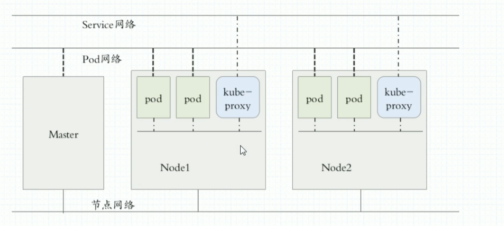

# k8s

## Name

- k8s内部，使用“`资源`”来定义每一种逻辑概念（功能），每种资源都有自己的`名称`
- 资源有：
  - api版本：apiVersion
  - 类别：kind
  - 元数据：metadata
  - 定义清单：spec
  - 状态：status

- `名称`通常定义在“资源”的“元数据”信息里

## NameSpace

名称空间，隔离k8s内各种`资源`的方法，可以理解为k8s内部的虚拟集群组。k8s里默认的Namespace有：

- default
- kube-system
- kube-public

查询k8s里特定`资源`要带上相应的Namespace

## Label

便于分类隔离资源对象

一个标签可以对应多个资源，一个资源也可以欧多个标签

## Service

- k8是中每个pod都会被分配一个单独的IP地址，但这个IP地址会随着pod的销毁而消失
- Service（服务）就是用来解决这个问题的核心概念

- 一个Service可以用作医嘱提供相同服务的pod的对外访问接口
- Service作用于哪些pod是通过标签选择器来定义的

## Ingress

- Ingress是k8s集群里工作在osi网络参考模型下，第7层的应用，对外暴露的接口
- Service只能进行L4流量调度，表现形式是ip+port
- Ingress则可以调度不同业务域、不同URL访问路径的业务流量

## k8s网络

k8s的3条网络：

## 参考资料

- [跟我一步步部署k8s](https://www.bilibili.com/video/BV1nr4y1T7Bf?p=29&spm_id_from=pageDriver)