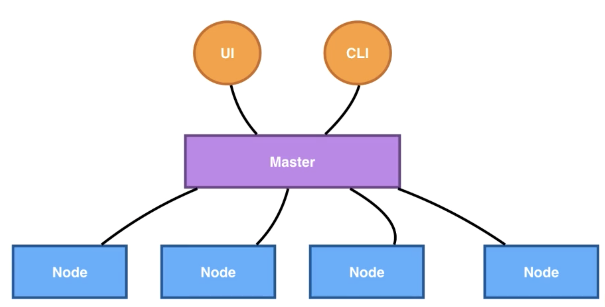

# k8s-aliyun





1. 安装 VirtualBox：https://www.virtualbox.org
2. 安装阿里云版`MiniKube`: https://developer.aliyun.com/article/221687

```bash
# 启动
minikube start --vm-driver virtualbox
```


**容器的本质是？**

- 一个试图被隔离、资源受限的进程

- 容器里PID=1的进程就是应用本身
- 管理虚拟机=管理基础设施
- 管理容器=直接管理应用本身


**kubernetes是？**

- kubernetes就是云时代的操作系统！
- 以此类推，容器镜像其实就是：这个操作系统的软件安装包


## 容器

- 资源视图隔离 - Namespace

- 控制资源使用率 - CGroup

- 独立的文件系统 - chroot：在*nix下，chroot这个系统调用，可以把一个子目录变为根目录，在视图级别进行隔离。

  > chroot是将应用隔离到一个虚拟的私有root下


metadata:

- Labels: 资源标签，可以使用selector来查询（类SQL）

- Annotations：用来描述资源的注解

- OwnerReference: 用来描述多个资源对象之间相互关系


Selector:

Tie：所处的系统层级，front/back

Env: 环境，dev/prod/test/gray


label:

```bash
# 查看资源信息
kubectl get pods nginx1 -o yaml | less

# 配置label
kubectl lable pods nginx1 env-test --overwrite

# 查看label
kubectl get pods --show-labels

# 移除label
kubectl label pods nginx1 tie-

# label检索查询
kubectl get pods --show-labels -l env=test,tie=front
kubectl get pods --show-labels -l 'env in (test,dev)'
```

annotation:

```bash
# 打注解
kubectl annotate pods nginx1 my-annotate='my comment, ok'
```

更新镜像：

```bash
kubectl set image deployment.v1.apps/nginx-deployment nginx=nginx:1.9.1

# 查看历史
kubectl rollout history deployment.apps/source-ip-app
```


查看DaemonSet回滚更新状态：

```bash
kubectl rollout status ds/fluentd-elasticsearch
```


## ConfigMap

创建命令：

```bash
kubectl create configmap [name] [data]
```

指定文件：

```bash
kubectl create configmap kube-flannel-cfg --from-file=configure-pod-container/configmap/cni-conf.json -n kube-system
```

指定键值对：

```bash
kubectl create configmap special-config --from-literal=special.how=very --from-literal=special.type=charm
```


Kubernetes 是允许管理员在命名空间中指定资源 Request 和 Limit 的，这一特性对于资源管理限制非常有用：**如果管理员在命名空间中设置了 CPU** **Request 配额，那么所有 Pod 也要在其定义中设置 CPU** **Request，否则就无法被调配资源**。

- **尊敬的开发人员，请在你的工作负载中设置 Request 和 Limit；**
- **尊敬的集群管理员，设置命名空间配额会强制命名空间中的所有工作负载的容器中使用该 Request 和 Limit。**


## Namespace

使用`unshare`实现资源隔离的。

```bash
man unshare

sudo unshare --mount-proc --pid --fork /bin/bash
```


- csi: continuous storege interface
- `findmnt`: 可以查找已经mount的目录信息

- shim 的职责就是作为 Adapter 将各种容器运行时本身的接口适配到 Kubernetes 的 CRI 接口上。


## 存储快照

要解决的问题：

- 数据误操作之后的how to快速恢复？
- 快速进行复制，迁移重要数据？how to进行环境复制与数据开发？

解决办法：

kubernetes CSI Snapshotter controller ！

存储拓扑：

因为Pod需要在特定的网络访问自己的PV，例如云服务器上的云盘。

PV在Binding或者Dynamic Provisioning时，并不知道使用它的Pod会被调度到哪些Node上，但PV本身的访问对Node的“位置”（拓扑）有限制。


## 可观测性

- liveness probe 保活探针，探测到不活了就移除此pod
- readiness probe 就绪指针，探测到就绪了就可以分配流量对外提供服务

开源的调试工具

kubectl-debug

```bash
kubectl debug demo-pod
```


## 开发实践

- 一个nginx前端，一个go的后端API，实现user的增删改查
- redis数据库
- 机密信息存ConfigMap
- 有Ingress
- 高可用，多副本


## 参考资料

- [Linux命名空间入门（一） UTS命名空间](https://blog.csdn.net/weifenghai/article/details/52836109)

- [【笔记】《CNCF × Alibaba云原生技术公开课》知识点](https://www.cnblogs.com/fudonghai/p/10851076.html)
- [K8S Runtime CRI OCI contained dockershim 理解](https://blog.csdn.net/u011563903/article/details/90743853)

- [CRI 与 ShimV2：一种 Kubernetes 集成容器运行时的新思路](https://developer.aliyun.com/article/679993)

- [语义化版本 2.0.0](https://semver.org/lang/zh-CN/)
- 