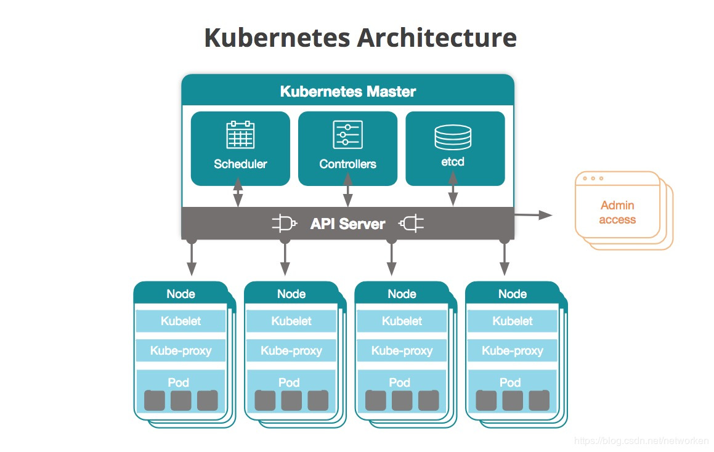
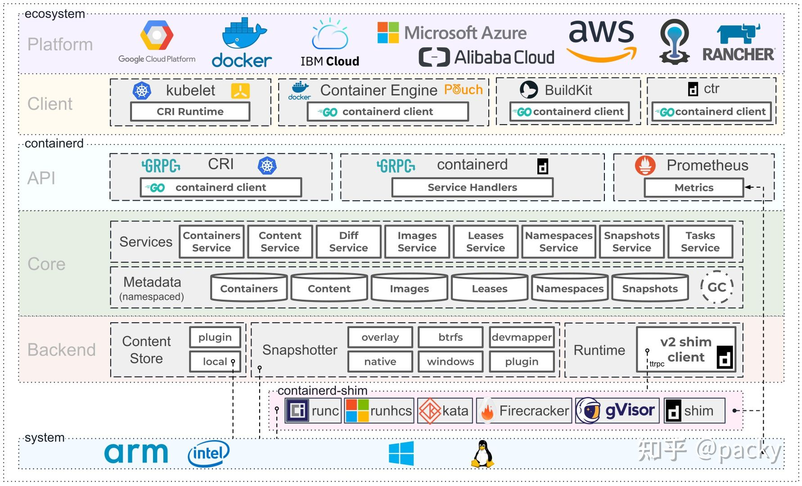
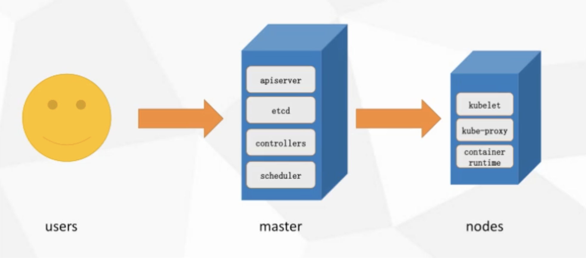
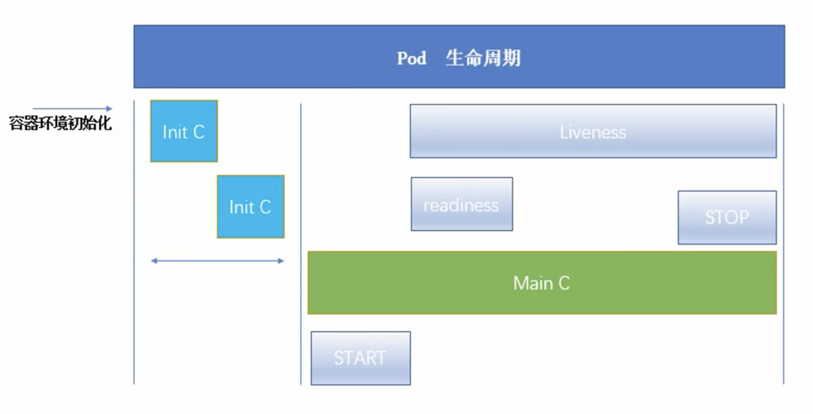
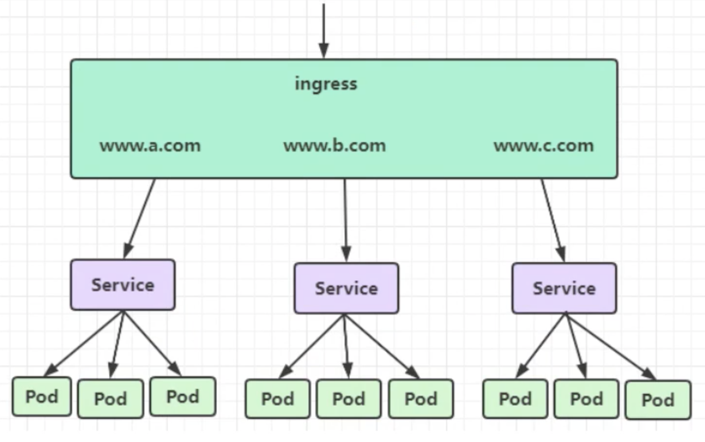

# kubernates

**Kubernetes协调连接在一起作为一个单元工作的高可用性计算机集群。**Kubernetes中的抽象允许您将容器化的应用程序部署到集群，而无需将它们专门绑定到单个机器。


k8s（k和s中间有8个字母）源自于Google的borg资源管理器，10年+容器化基础架构。后使用golang实现的超大规模分布式部署的解决方案。

docker的标准是鲸鱼🐳，k8s的图标是船舵，表示方向盘领航的意思。

[谷歌的容器之路：从 Borg 到 Kubernetes](https://www.infoq.cn/article/2015/05/Kubernetes-Borg-Eurosys)

> Borg 是谷歌公司的内部容器管理系统。早在十几年前，该公司就已经部署 Borg 系统对来自于几千个应用程序所提交的 job 进行接收、调试、启动、停止、重启和监控。该项目的目的是实现资源管理的自动化以及跨多个数据中心的资源利用率最大化。......


**IPVS：**

IP虚拟服务器（IP Virtual Server），基本上是一种高效的layer-4交换机！是运行在LVS下的提供负载平衡功能的一种技术。（from 章文嵩博士）[reference](https://baike.baidu.com/item/ipvs/5041817?fr=aladdin)

> 当一个TCP连接的初始SYN报文到达时，IPVS就选择一台服务器，将报文转发给它。此后通过查发报文的IP和TCP报文头地址，保证此连接的后继报文被转发到相同的服务器。这样，IPVS不用检查到请求的内容再选择服务器，这就要求后端的服务器组是提供相同的服务，不管请求被送到哪一台服务器，返回结果都应该是一样的。但是在有一些应用中后端的服务器可能功能不一，有的是提供HTML文档的Web服务器，有的是提供图片的Web服务器，有的是提供CGI的Web服务器。这时，就需要基于内容请求分发 (Content-Based Request Distribution)，同时基于内容请求分发可以提高后端服务器上访问的局部性。


**和apache的mesos比较**

也是分布式资源管理框架，Twitter之前使用的，2019年也放弃mesos，转向k8s


**和docker swarm比较**

是docker原厂出品，很轻量，本机只消耗几十MB。但功能相对于k8s太少，比如：滚动更新、回滚等操作，swarm手动实现起来很复杂。也能大规模化，但实现起来还是太费事。

阿里云也在2019年取消swarm，只支持k8s。


## 特点

- 轻量级：消耗资源少
- 开源
- 弹性伸缩：可大可小
- 负载均衡：IPVS


**borg框架：**


**k8s框架：**


**高可用集群副本数据最好是大于等于3的奇数个！**




### master组件

**主机负责管理群集。**主服务器协调集群中的所有活动，例如调度应用程序，维护应用程序的所需状态，扩展应用程序以及推出新的更新。

- api server： 所有服务访问的统一入口
- Replication controller：维持副本期望数目
- Scheduler：负责接收任务，选择合适的节点进行分配任务
- etcd：键值对数据库，储存k8s集群所有重要信息（持久化）

```shell
minikube start --docker-env HTTP_PROXY=http://localhost:5710 --docker-env HTTPS_PROXY=http://localhost:15710 --vm-driver=xhyve
```

### node组件

节点是作为Kubernetes集群中的工作机的虚拟机或物理计算机。每个节点都有一个Kubelet，它是管理节点和与Kubernetes主机通信的代理。

- kubelet：直接跟容器引擎交互，实现容器的生命周期管理。

- kube proxy：负责写入规则值IPtables、IPVS，实现服务映射访问的。


### 其他插件

- CoreDNS：可以为集群中的SVC创建一个域名映射IP的对应关系解析
- Dashboard：给k8s集群提供的BS结构的访问web界面
- Ingress Controller: 官方k8s实现了4层代理，Ingress可以实现七层代理（即主机名和域名的代理）
- Federation: 提供一个可以跨集群中心、多k8s的统一管理的功能
- Prometheus: tsdb，提供k8s集群的监控能力
- ELK：提供k8s集群日志统一分析介入平台


**ETCD版本选择：**


ETCD的V2版本数据都在内存中，V3版本引入了本地的卷的持久化操作，保证了数据不会丢失，所以建议使用v3版本etcd。


## WAL

> 为了保持存储系统内存中元数据和物理数据间的状态一致性，系统所有的数据操作对应的元数据变更都需要持久化到元数据db内，这里有一个性能问题，每次变更如果都要实时同步到外部db内，是否意味着高频的io操作？是否有延时写入的手段呢？

Write Ahead Log，在**分布式存储系统**中的**元数据更新**中应用得十分广泛。WAL的主要意思是说在将元数据的变更操作写入到持久稳定的db之前，**先预先写入到一个log中**，然后再由另外的操作将log apply到**外部的持久db**里去。这种模式会减少掉每次的db写入操作，尤其当系统要处理大量的transaction操作的时候，WAL的方式相比较于实时同步db的方式有着更高的效率。

WAL还有一点很重要的帮助是可以在disaster recovery过程中起到**状态恢复**的作用，系统在load完元数据db后，再把未来得及提交的WAL apply进来，就能恢复成和之前最终一致的状态。


> 实践操作！follow the tutorial！


## minikube

- [安装minikube](https://www.cnblogs.com/mengyucloud/p/12244168.html)

```bash
# Mac download & install
curl -Lo minikube https://github.com/kubernetes/minikube/releases/download/v1.6.2/minikube-darwin-amd64 && chmod +x minikube && sudo mv minikube /usr/local/bin/

# 安装minikube缺省支持的Kubernetes版本
minikube start --image-mirror-country cn \
    --iso-url=https://kubernetes.oss-cn-hangzhou.aliyuncs.com/minikube/iso/minikube-v1.6.0.iso \
    --registry-mirror=https://xxxxxx.mirror.aliyuncs.com

```


## Pod控制器

Pod控制器是k8s的灵魂！自主式Pod、控制器管理Pod，类型有：

- 同一个pod中的容器共享网络：可以相互以localhost访问，端口不可重复

- 同一个pod中共享存储卷

  

#### ReplicationController 和ReplicaSet

**负责pod创建和销毁**。用来确保容器应用的副本数始终保持在用户定义的副本数，即如果有容器异常退出，会自动创建新的Pod替代。如果多出来，也会自动回收。**新版本中后者是取代前者的，后者也是大型项目中使用**。


#### Deployment

自动管理ReplicaSet。Deployment比RC和RS多了支持rolling-update（滚动更新）。但Deployment不负责pod创建

> 若要更新V2版本，Deployment会创建另一个RS2，RS2负责产生V2版本的容器，此时V1的RS1会逐步停止，但不会删除，为回滚准备。


#### DaemonSet

DaemonSet确保全部Node上运行一个Pod的副本。当有Node加入集群时，也会为他们新增一个Pod。当有Node从集群移除时，这些Pod也会被回收。删除DaemonSet将会删除它创建的所有Pod。典型用法有：

- 运行集群部署daemon，例如在每个Node上运行glusterd、ceph。？？？
- 在每个Node上运行日志收集daemon，例如fluentd、logstash
- 在每个Node上运行监控daemon，例如Prometheus Node Exporter

当需要运行好几个不同daemon的时候，可以把他们放入一个pod来运行。


#### Job

负责执行批处理任务，仅执行一次。它保证批处理任务的一个或多个Pod成功结束。


#### CronJob

同linux的crob。


#### StatefulSet

为了解决有状态服务的问题。（Deployment和ReplicaSet为无状态服务而设计），应用场景包括：

- 稳定的持久化存储：即Pod重新调度后，还是能访问到相同的持久化数据，基于PVC实现
- 稳定的网络标志：即Pod重新调度后期PodName和HostName不变，基于Headless Service（即没有Cluster IP的Service）来实现
- 有序部署，有序扩展：即Pod是有顺序的，在部署或者扩展的时候，要依据定义的顺序依次进行（即从0到N-1，在下一个Pod运行之前所有之前的Pod必须都是Running 和Ready状态），基于init containers来实现。
- 有序收缩，有序删除：即从N-1到0


#### Horizontal Pod Autoscaling：HPA，

平滑扩缩容，根据Pod的CPU利用率（v1版本）（v1 alpha版本中可以根据内存和用户自定义metric）

>  if CPU > 80 then Max=10, Min=2


## 网络通讯模式

k8s的网络模型假定了所有Pod都在一个互相连通（通过IP）的扁平化网络空间中。这在GCE（Google Compute Engine）里面是线程的网络模型，k8s假定这个网络已经存在。

在私有云里搭建k8s集群，我们需要自己实现网络互通，将不同节点上的docker容器之间的互相访问先打通，再运行k8s。

- 同一个Pod内的多个容器之间：localhost
- 各Pod之间的通讯：Overlay Network，覆盖网络
- Pod与Service之间的通讯：各节点的IPtables规则，新版本用LVS了，效率更高


**Flannel** 是CoreOS团队针对k8s使得网络规划服务，它**是让集群中的不同节点主机创建的docker容器都具有全集群唯一的虚拟IP地址**。而且它还能在这些IP地址之间建立一个**覆盖网络（overlay network）**，通过这个覆盖网络，将数据包原封不动地传递到目标容器内。


etcd之flannel提供说明：

- 存储管理flannel可分配的IP地址段资源
- 监控etcd中每个pod的实际地址，并在内存中建立维护pod节点路由表


不同网络下通讯方式

- 同一个pod内部通信：共享了同一个网络命名空间，共享同一个linux协议栈

- pod1至pod2：
  - 不在同一台主机：pod的地址是与docker0在同一个网段的，但docker0网段与宿主网卡是两个不同的IP网段，并且不同Node之间的通信只能通过宿主机的物理网卡进行。将pod的IP和所在Node的IP关联起来，通过这个关联让Pod可以互相访问。
  - 在同一台主机：由docker0网桥直接转发请求至pod2，不需要经过 flannel


- pod到service的网络：目前基于性能考虑，全部为iptables维护和转发；最新版为lvs。

- pod到外网：pod向外网发送请求，查找路由表，转发数据包到宿主机的网卡，宿主网卡完成路由选择后，iptables执行masquerade（伪装，掩藏），把源IP更改为宿主网卡的IP，然后向外网服务器发送请求。

- 外网访问Pod：Service


## minikube

```bash
minikube start --vm-driver=virtualbox --image-mirror-country=cn --image-repository=registry.cn-hangzhou.aliyuncs.com/google_containers --iso-url=https://kubernetes.oss-cn-hangzhou.aliyuncs.com/minikube/iso/minikube-v1.7.3.iso --registry-mirror=https://reg-mirror.qiniu.com
```


## 存储

configMap: 专门用于存储配置文件

Secret：存储一些比较重要的数据，比如用户名密码，需要加密的

volume：存一些基本的数据，比如网页文件

PV：是动态的调用过程

实际生产中，需要根据实际情况选择不同的存储方式。


## 调度器

k8s会自动调用容器和pod调度到对应的节点！

也能实现把pod定义到想要的节点运行！


## 集群安全

集群的认证、鉴权、访问控制。需要反复温故知新！


## HELM

相当于linux中的yum安装包管理器


## 运维

CICD构建 With Jenkins

kubeadm源码修改：目的是修改默认1年的证书限制

k8s高可用构建


## kubectl 常用命令

```bash
# kubectl查看pod
kubectl get pod -n default -o wide

# kubectl查看pod日志
kubectl -n default log -f tomcat-6bfcb9b549-fs2zt

# kubectl进入到pod容器内
kubectl -n default exec -it tocat-imageid

# kubectl查看service
kubectl get svr -n default -o wide

# kubectl查看deployment
kubectl get deployment -n default -o wide

# kubectl查看node
kubectl get node

# kubectl查看资源文件内容
kubectl get ing tomcat n default -o json

# kubectl创建命名空间
kubectl create namespace dev

# kubectl通过yml文件创建资源对象
kubectl create -f tomecat-deployment.yml --namespace=default
```


## sandbox

Sandbox（沙箱）是指一种技术，在这种技术中，软件运行在操作系统受限制的环境中。由于该软件在受限制的环境中运行，即使一个闯入该软件的入侵者也不能无限制访问操作系统提供设施；获得该软件控制权的黑客造成的损失也是有限的。此外，如果攻击者要获得对操作系统的完全控制，他们就不得不攻克沙箱限制。Sandbox也提供深度防御，许多PaaS系统都提供了一个实时运行环境，它的核心就是一个沙箱应用程序，如Azu re和Google App Engime。 


## containerd

一个行业标准的容器运行时，强调**简单性**、**健壮性**和**可移植性**: www.containerd.io

**containerd**可用作 Linux 和 Windows 的守护程序。它管理其主机系统的完整容器生命周期，从图像传输和存储到容器执行和监督，再到低级存储到网络附件等等。

docker由 docker-client ,dockerd,containerd,docker-shim,runc组成，所以containerd是docker的基础组件之一



从k8s的角度看，可以选择 containerd 或 docker 作为运行时组件：Containerd 调用链更短，组件更少，更稳定，占用节点资源更少


调用链
Docker 作为 k8s 容器运行时，调用关系如下：
**kubelet --> docker shim （在 kubelet 进程中） --> dockerd --> containerd**

Containerd 作为 k8s 容器运行时，调用关系如下：
**kubelet --> cri plugin（在 containerd 进程中） --> containerd**


## 推荐k8s版本

1.15。因为1.16开始废弃了很多API，生态还未完善！

kubernetes：舵手；飞行员


Docker容器化封装应用程序的缺点：

- 单机使用，无法有效集群
- 随着容器数量的上升，管理成本攀升
- 没有有效的容灾/自愈机制
- 没有预设编排模板，无法实现快速、大规模容器调度
- 没有统一的配置管理中心工具
- 没有容器生命周期的管理工具
- 没有图形化运维管理工具
- ....

Kubernetes优势：

- 自动装箱，水平扩展，自我修复
- 服务发现和负载均衡
- 自动发布（默认滚动发布模式）
- 集中化配置管理和秘钥管理
- 存储编排
- 任务批处理运行
- ....


# Kubernetes快速入门



四组基本概念

- Pod/Pod控制器
- Name/Namespace
- Label/Label选择器
- Service/Ingress


## Pod

- Pod是K8S里能够被运行的最小的逻辑单元（原子单元）
- 1个Pod里面可以运行多个容器，它们共享 UTS+NET+IPC名称空间（container隔离了pid、net、user等6个）
- 可以把Pod理解成豌豆荚，而同一Pod内的每个容器是一颗颗豌豆
- 一个Pod里运行多个容器，又叫：边车（Sidecar）模式
- Pod可以直接启动，可没有任何控制器


## Pod控制器

- Pod控制器是Pod启动的一种模板，依赖保证在k8s里启动的Pod应始终按照人们的预期运行（副本数、生命周期、健康状态检查...)
- K8S内提供了众多的Pod控制器，常用的有以下：
  - Deployment
  - DeamonSet
  - ReplicaSet
  - StatefulSet
  - Job
  - Cronjob


CKA证：

Certified Kubernetes Administrator，是Linux基金会和CNCF（Cloud Native Computing Foundation）官方退出的全球k8s管理员认证，国内外都认可。


## 容器生命周期



- Init C: Init container，初始化容器，加载本地的容器文件等操作
- Main C：主容器操作
- START：容器执行之前的操作
- STOP：容器停止后的操作
- Liveness：生存检测
- readiness：就绪检测


# minikube

在线练习：https://kubernetes.io/docs/tutorials/hello-minikube/

执行button：Launch Terminal


# kubeadm

已经可以用在生成环境

https://kubernetes.io/docs/reference/setup-tools/kubeadm/

https://kubernetes.io/docs/setup/production-environment/tools/kubeadm/install-kubeadm/

主要提供两个命令：

```bash
kubeadm init
kubeadm join
```

centos7的系统要求：

1. 2核心2G内存及以上
2. 无swap分区或禁用


## 安装步骤

关闭防火墙：

```bash
systemctl stop firewalld
systemctl disable firewalld
```

关闭selinux

```bash
sed -i 's/enforcing/disabled/' /etc/selinux/config # 永久
setenforce 0 # 临时
```

关闭swap（k8s机制虚拟内存以提供性能）

```bash
swapoff -a #临时
sed -ri 's/.*swap.*/#&/' /etc/fstab # 永久
```

在master添加hosts

```bash
vi /etc/hosts
192.168.106.3 k8smaster
192.168.106.4 k8snode
```

设置网桥参数

```bash
cat <<EOF | sudo tee /etc/modules-load.d/k8s.conf
br_netfilter
EOF

cat <<EOF | sudo tee /etc/sysctl.d/k8s.conf
net.bridge.bridge-nf-call-ip6tables = 1
net.bridge.bridge-nf-call-iptables = 1
EOF
sudo sysctl --system
```

时间同步

```bash
yum install ntpdate -y
ntpdate time.windows.com
```

[装docker](https://www.runoob.com/docker/centos-docker-install.html)：

```bash
curl -fsSL https://get.docker.com | bash -s docker --mirror aliyun
```

配置加速器加速下载：

```json
{
  "registry-mirrors": ["https://registry.docker-cn.com"]
}
```

开机启动：

```bash
systemctl enable docker.service
```

[Kubernetes阿里云YUM更新源k8s国内源](https://blog.csdn.net/frdevolcqzyxynjds/article/details/107076450)

```bash
cat <<EOF > /etc/yum.repos.d/kubernetes.repo
[kubernetes]
name=Kubernetes
baseurl=https://mirrors.aliyun.com/kubernetes/yum/repos/kubernetes-el7-x86_64/
enabled=1
gpgcheck=0
repo_gpgcheck=0
gpgkey=https://mirrors.aliyun.com/kubernetes/yum/doc/yum-key.gpg https://mirrors.aliyun.com/kubernetes/yum/doc/rpm-package-key.gpg
EOF
```

安装kubeadm、kubelet、kubectl：

```bash
yum install -y kubelet-1.19.4 kubeadm-1.19.4 kubectl-1.19.4 -y
systemctl enable kubelet && systemctl start kubelet
```

开机启动：

```bash
systemctl enable kubelet.service
```

kubelet: 运行在cluster所有节点上，负责启动pod和容器

kubeadm：用于初始化cluster的一个工具

kubectl：kubectl是kubernetes命令行工具，通过kubectl可以部署和管理应用，查看各种资源，创建，删除，和更新组件

```bash
kubeadm init \
--apiserver-advertise-address=192.168.106.4 \
--image-repository registry.aliyuncs.com/google_containers \
--kubernetes-version v1.19.4 \
--service-cidr=10.96.0.0/12 \
--pod-network-cidr=10.244.0.0/16
```

按照完成的提示继续输入3个命令：

```bash
  mkdir -p $HOME/.kube
  sudo cp -i /etc/kubernetes/admin.conf $HOME/.kube/config
  sudo chown $(id -u):$(id -g) $HOME/.kube/config
```

查看nodes：

```bash
[root@localhost ~]# kubectl get nodes
NAME                    STATUS     ROLES    AGE   VERSION
localhost.localdomain   NotReady   master   14m   v1.19.4
```

修改主机名：

（原名称：localhost.localdomain）

```bash
hostnamectl set-hostname k8smaster # 使用这个命令会立即生效且重启也生效
hostname # 查看下
```

node节点加入master：

```bash
kubeadm join 192.168.106.4:6443 --token hiowkn.6syn5tydik6tefib \
    --discovery-token-ca-cert-hash sha256:8347172640e4817c6d4cb9ef850a2b8b970b3541fecce8889a68c1dbf500cd92 
```

master上下载 kube-flannel.yml

```bash
# /etc/hosts中添加：
# 199.232.68.133 raw.githubusercontent.com
wget https://raw.githubusercontent.com/coreos/flannel/master/Documentation/kube-flannel.yml

kubectl apply -f kube-flannel.yml
```

查看运行时pod：

```bash
# -n: namespace
kubectl get pods -n kube-system
```

部署nginx

```bash
# kubectl create $controller $name --image=$image 镜像会运行在pod里
kubectl create deployment nginx --image=nginx
kubectl expose deployment nginx --port=8082 --type=NodePort
kubectl get pod,svc
```

访问地址：http://NodeIP:Port

命令缩写：

```bash
kubectl get node(s)
kubectrl get svc (service(s))
kubectrl get deploy(ment)
kubectl get pod(s)
```

registry加速`/etc/docker/daemon.json`：

```json
{
  "registry-mirrors": ["https://gg3gwnry.mirror.aliyuncs.com"]
}
```


构建deploy.yml

```bash
docker build -t $imageName .

# --dry-run 空运行
kubectl create deploy $deployName --image=$imageName --dry-run -o yaml > deploy.yaml

kubectl apply -f deploy.yaml

kubectl get pods
```

## Ingress

是加在service之上的，把一组service再暴露出去，并提供负载均衡。外部请求加入k8s集群必经之入口：



Ingress是k8s集群中的一个API资源对象，相当于一个集群网关，我们可以自定义路由规则来转发、管理、暴露服务（一组pod），比较灵活。

Ingress不是k8s内置的，需要单独安装，且有多种类型：

- Google Cloud Load Balancer
- ingress-nginx: 是使用nginx作为反向代理和负载均衡器的k8s的Ingress控制器
- Contour
- Istio
- ...


minikube中开启Ingress：

```bash
minikube addons enable ingress
```

> 可以从阿里云后台那里找到k8s，然后搜索ingress关键词的镜像，找到一些国外的稀缺镜像，可pull下来
>
> https://cr.console.aliyun.com/images/cn-hangzhou/google_containers/nginx-ingress-controller


ingress-nginx官网：https://kubernetes.github.io/ingress-nginx/deploy

```bash
kubectl apply -f mandatory.yml
kubectl apply -f https://raw.githubusercontent.com/kubernetes/ingress-nginx/controller-v0.47.0/deploy/static/provider/baremetal/deploy.yaml
```


Ingress规则文件 `ingress-nginx-rule.yaml`：

```yaml
apiVersion: networking.k8s.io/v1
kind: Ingress
metadata:
	name: k8s-ingress
spec:
	rules:
	- host: www.abc.com
		http:
			paths:
			- pathType: Prefix
				path: /
				backend:
					service:
						name: nginx
						port:
							number: 80
```

应用规则：

```bash
kubectl apply -f ingress-nginx-rule.yaml
```

查看Ingress：

```bash
kubectl get ing(ress)
```

删除之前的规则残留：

```bash
kubectl delete -A ValidatingWebhookConfiguration ingress-nginx-admission
```


## Dashboard

```bash
docker pull kubernetesui/dashboard

kubectl apply -f recommened.yml

kubectl get pod -n kubernetes-dashboard
```


## Helm

[`Kubernetes Helm`](https://github.com/kubernetes/helm) 是一个用于管理预配置 Kubernetes 资源包的工具，也就是 Kubernetes 图表。

使用 Helm 来：

- 查找和使用打包为 Kubernetes 图表的流行软件

- 将你自己的应用程序共享为 Kubernetes 图表

- 为你的 Kubernetes 应用程序创建可重现的构建

- 智能管理你的 Kubernetes 清单文件

- 管理 Helm 包的发布

  

## Kompose

[`Kompose`](https://github.com/kubernetes/kompose) 是一个帮助 Docker Compose 用户迁移到 Kubernetes 的工具。

使用 Kompose：

- 将 Docker Compose 文件翻译成 Kubernetes 对象
- 从本地 Docker 开发转到通过 Kubernetes 管理你的应用程序
- 转换 Docker Compose v1 或 v2 版本的 `yaml` 文件或[分布式应用程序包](https://docs.docker.com/compose/bundles/)


# Secret

`Secret` 对象类型用来保存敏感信息，例如密码、OAuth 令牌和 SSH 密钥。 将这些信息放在 `secret` 中比放在 [Pod](https://kubernetes.io/docs/concepts/workloads/pods/pod-overview/) 的定义或者 [容器镜像](https://kubernetes.io/zh/docs/reference/glossary/?all=true#term-image) 中来说更加安全和灵活。 参阅 [Secret 设计文档](https://git.k8s.io/community/contributors/design-proposals/auth/secrets.md) 获取更多详细信息。

Secret 是一种包含少量敏感信息例如密码、令牌或密钥的对象。 这样的信息可能会被放在 Pod 规约中或者镜像中。 用户可以创建 Secret，同时系统也创建了一些 Secret。

> **注意：**
>
> Kubernetes Secret 默认情况下存储为 base64-编码的、非加密的字符串。 默认情况下，能够访问 API 的任何人，或者能够访问 Kubernetes 下层数据存储（etcd） 的任何人都可以以明文形式读取这些数据。 为了能够安全地使用 Secret，我们建议你（至少）：
>
> 1. 为 Secret [启用静态加密](https://kubernetes.io/zh/docs/tasks/administer-cluster/encrypt-data/)；
> 2. [启用 或配置 RBAC 规则](https://kubernetes.io/zh/docs/reference/access-authn-authz/authorization/)来限制对 Secret 的读写操作。 要注意，任何被允许创建 Pod 的人都默认地具有读取 Secret 的权限。


Secret三种类型：

- Service Account: 用来访问k8s API，由k8s自动创建，并且会自动挂载到pod的 `/run/secrets/kubernetes.io/serviceacount`目录中

  ```bash
  kubectl get pod -n kube-system
  # 查看k8s自己的Secret设置
  kubectl exec kube-proxy-fb85x -n kube-system -it -- ls /run/secrets/kubernetes.io/serviceacount
  ca.crt   namespace    token
  ```

  

- Opaque: base64编码格式的Secret，用来存储密码、密钥等

  生成base64编码：

  ```bash
  echo -n "admin" | base64
  YWRtaW4
  ```

  opaque-secret.yml:

  ```yaml
  apiVersion: v1
  kind: Secret
  metadata:
    name: mysecret
  type: Opaque
  data:
    password: Z29vZGx1Y2sxMjM=
    username: YMRtaW4=
  ```

  应用：

  ```bash
  kubectl apply -f opaque-secret.yml
  kubectl get secret
  ```

  后续可把此Secret加载到volume中，或导出到环境变量中！

- kubernetes.io/dockerconfigjson: 用来存储私有 docker Registry的认证信息


## Secret 概览

要使用 Secret，Pod 需要引用 Secret。 Pod 可以用三种方式之一来使用 Secret：

- 作为挂载到一个或多个容器上的 [卷](https://kubernetes.io/zh/docs/concepts/storage/volumes/) 中的[文件](https://kubernetes.io/zh/docs/concepts/configuration/secret/#using-secrets-as-files-from-a-pod)。
- 作为[容器的环境变量](https://kubernetes.io/zh/docs/concepts/configuration/secret/#using-secrets-as-environment-variables)
- 由 [kubelet 在为 Pod 拉取镜像时使用](https://kubernetes.io/zh/docs/concepts/configuration/secret/#using-imagepullsecrets)


## Secret 的类型 

在创建 Secret 对象时，你可以使用 [`Secret`](https://kubernetes.io/docs/reference/generated/kubernetes-api/v1.21/#secret-v1-core) 资源的 `type` 字段，或者与其等价的 `kubectl` 命令行参数（如果有的话）为其设置类型。 Secret 的类型用来帮助编写程序处理 Secret 数据。

Kubernetes 提供若干种内置的类型，用于一些常见的使用场景。 针对这些类型，Kubernetes 所执行的合法性检查操作以及对其所实施的限制各不相同。

| 内置类型                              | 用法                                     |
| ------------------------------------- | ---------------------------------------- |
| `Opaque`                              | 用户定义的任意数据                       |
| `kubernetes.io/service-account-token` | 服务账号令牌                             |
| `kubernetes.io/dockercfg`             | `~/.dockercfg` 文件的序列化形式          |
| `kubernetes.io/dockerconfigjson`      | `~/.docker/config.json` 文件的序列化形式 |
| `kubernetes.io/basic-auth`            | 用于基本身份认证的凭据                   |
| `kubernetes.io/ssh-auth`              | 用于 SSH 身份认证的凭据                  |
| `kubernetes.io/tls`                   | 用于 TLS 客户端或者服务器端的数据        |
| `bootstrap.kubernetes.io/token`       | 启动引导令牌数据                         |


## 参考资料

- [kubectl 常用命令](https://jingyan.baidu.com/article/d8072ac4087cbdac94cefd5c.html)

- [Kubernetes教程(K8s入门到精通)](https://www.bilibili.com/video/BV1w4411y7Go?p=3&spm_id_from=pageDriver)

- [sandbox-百度百科](https://baike.baidu.com/item/Sandbox/9280944?fr=aladdin)

- [centos7虚拟机没有ip地址](https://blog.csdn.net/qq_41622739/article/details/94826266)

- [Kubernetes-kubectl命令出现错误The connection to the server localhost:8080 was refused - did you specif...](https://blog.csdn.net/qq_24046745/article/details/94405188)

- [Kubernetes 包含多个内置工具来帮助你使用 Kubernetes 系统](https://kubernetes.io/zh/docs/reference/tools/)
