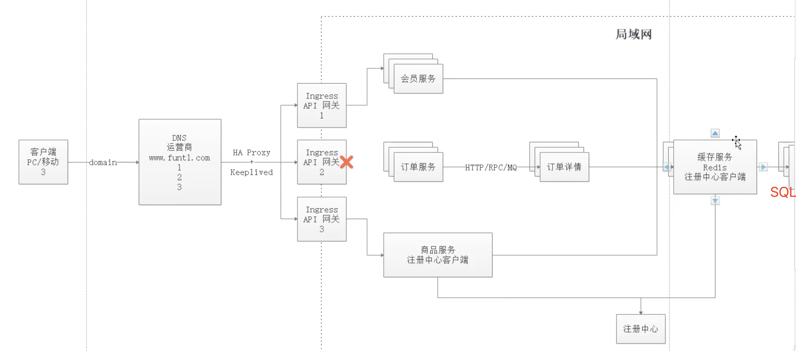
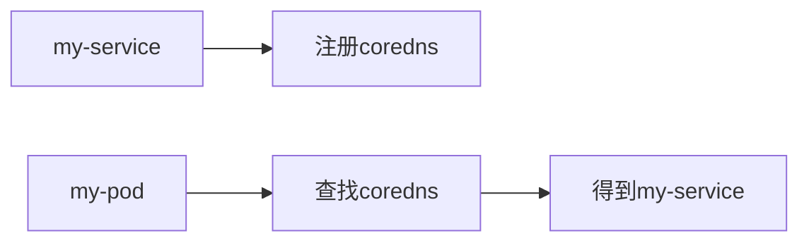

# kubernates

**Kubernetes协调连接在一起作为一个单元工作的高可用性计算机集群。**Kubernetes中的抽象允许您将容器化的应用程序部署到集群，而无需将它们专门绑定到单个机器。


k8s（k和s中间有8个字母）源自于Google的borg资源管理器，10年+容器化基础架构。后使用golang实现的超大规模分布式部署的解决方案。

docker的标准是鲸鱼🐳，k8s的图标是船舵，表示方向盘领航的意思。

[谷歌的容器之路：从 Borg 到 Kubernetes](https://www.infoq.cn/article/2015/05/Kubernetes-Borg-Eurosys)

> Borg 是谷歌公司的内部容器管理系统。早在十几年前，该公司就已经部署 Borg 系统对来自于几千个应用程序所提交的 job 进行接收、调试、启动、停止、重启和监控。该项目的目的是实现资源管理的自动化以及跨多个数据中心的资源利用率最大化。......


**IPVS：**

IP虚拟服务器（IP Virtual Server），基本上是一种高效的layer-4交换机！是运行在LVS下的提供负载平衡功能的一种技术。（from 章文嵩博士）[reference](https://baike.baidu.com/item/ipvs/5041817?fr=aladdin)

> 当一个TCP连接的初始SYN报文到达时，IPVS就选择一台服务器，将报文转发给它。此后通过查发报文的IP和TCP报文头地址，保证此连接的后继报文被转发到相同的服务器。这样，IPVS不用检查到请求的内容再选择服务器，这就要求后端的服务器组是提供相同的服务，不管请求被送到哪一台服务器，返回结果都应该是一样的。但是在有一些应用中后端的服务器可能功能不一，有的是提供HTML文档的Web服务器，有的是提供图片的Web服务器，有的是提供CGI的Web服务器。这时，就需要基于内容请求分发 (Content-Based Request Distribution)，同时基于内容请求分发可以提高后端服务器上访问的局部性。


**和apache的mesos比较**

也是分布式资源管理框架，Twitter之前使用的，2019年也放弃mesos，转向k8s


**和docker swarm比较**

是docker原厂出品，很轻量，本机只消耗几十MB。但功能相对于k8s太少，比如：滚动更新、回滚等操作，swarm手动实现起来很复杂。也能大规模化，但实现起来还是太费事。

阿里云也在2019年取消swarm，只支持k8s。


## 特点

- 轻量级：消耗资源少
- 开源
- 弹性伸缩：可大可小
- 负载均衡：IPVS


**borg框架：**


**k8s框架：**


**高可用集群副本数据最好是大于等于3的奇数个！**


这张图表展示了包含所有相互关联组件的 Kubernetes 集群：


### master组件

**主机负责管理群集。**主服务器协调集群中的所有活动，例如调度应用程序，维护应用程序的所需状态，扩展应用程序以及推出新的更新。

- api server： 所有服务访问的统一入口
- Replication controller：维持副本期望数目
- Scheduler：负责接收任务，选择合适的节点进行分配任务
- etcd：键值对数据库，储存k8s集群所有重要信息（持久化）

```shell
minikube start --docker-env HTTP_PROXY=http://localhost:5710 --docker-env HTTPS_PROXY=http://localhost:15710 --vm-driver=xhyve
```

### node组件

节点是作为Kubernetes集群中的工作机的虚拟机或物理计算机。每个节点都有一个Kubelet，它是管理节点和与Kubernetes主机通信的代理。

- kubelet：直接跟容器引擎交互，实现容器的生命周期管理。

- kube proxy：负责写入规则值IPtables、IPVS，实现服务映射访问的。


### 其他插件

- CoreDNS：可以为集群中的SVC创建一个域名映射IP的对应关系解析
- Dashboard：给k8s集群提供的BS结构的访问web界面
- Ingress Controller: 官方k8s实现了4层代理，Ingress可以实现七层代理（即主机名和域名的代理）
- Federation: 提供一个可以跨集群中心、多k8s的统一管理的功能
- Prometheus: tsdb，提供k8s集群的监控能力
- ELK：提供k8s集群日志统一分析介入平台


**ETCD版本选择：**


ETCD的V2版本数据都在内存中，V3版本引入了本地的卷的持久化操作，保证了数据不会丢失，所以建议使用v3版本etcd。


## WAL

> 为了保持存储系统内存中元数据和物理数据间的状态一致性，系统所有的数据操作对应的元数据变更都需要持久化到元数据db内，这里有一个性能问题，每次变更如果都要实时同步到外部db内，是否意味着高频的io操作？是否有延时写入的手段呢？

Write Ahead Log，在**分布式存储系统**中的**元数据更新**中应用得十分广泛。WAL的主要意思是说在将元数据的变更操作写入到持久稳定的db之前，**先预先写入到一个log中**，然后再由另外的操作将log apply到**外部的持久db**里去。这种模式会减少掉每次的db写入操作，尤其当系统要处理大量的transaction操作的时候，WAL的方式相比较于实时同步db的方式有着更高的效率。

WAL还有一点很重要的帮助是可以在disaster recovery过程中起到**状态恢复**的作用，系统在load完元数据db后，再把未来得及提交的WAL apply进来，就能恢复成和之前最终一致的状态。


> 实践操作！follow the tutorial！


## minikube

- [安装minikube](https://www.cnblogs.com/mengyucloud/p/12244168.html)

```bash
# Mac download & install
curl -Lo minikube https://github.com/kubernetes/minikube/releases/download/v1.6.2/minikube-darwin-amd64 && chmod +x minikube && sudo mv minikube /usr/local/bin/

# 安装minikube缺省支持的Kubernetes版本
minikube start --image-mirror-country cn \
    --iso-url=https://kubernetes.oss-cn-hangzhou.aliyuncs.com/minikube/iso/minikube-v1.6.0.iso \
    --registry-mirror=https://xxxxxx.mirror.aliyuncs.com

```


## Pod控制器

Pod控制器是k8s的灵魂！自主式Pod、控制器管理Pod，类型有：

- 同一个pod中的容器共享网络：可以相互以localhost访问，端口不可重复

- 同一个pod中共享存储卷

  

#### ReplicationController 和ReplicaSet

**负责pod创建和销毁**。用来确保容器应用的副本数始终保持在用户定义的副本数，即如果有容器异常退出，会自动创建新的Pod替代。如果多出来，也会自动回收。**新版本中后者是取代前者的，后者也是大型项目中使用**。


#### Deployment

自动管理ReplicaSet。Deployment比RC和RS多了支持rolling-update（滚动更新）。但Deployment不负责pod创建

> 若要更新V2版本，Deployment会创建另一个RS2，RS2负责产生V2版本的容器，此时V1的RS1会逐步停止，但不会删除，为回滚准备。


#### DaemonSet

DaemonSet确保全部Node上运行一个Pod的副本。当有Node加入集群时，也会为他们新增一个Pod。当有Node从集群移除时，这些Pod也会被回收。删除DaemonSet将会删除它创建的所有Pod。典型用法有：

- 运行集群部署daemon，例如在每个Node上运行glusterd、ceph。？？？
- 在每个Node上运行日志收集daemon，例如fluentd、logstash
- 在每个Node上运行监控daemon，例如Prometheus Node Exporter

当需要运行好几个不同daemon的时候，可以把他们放入一个pod来运行。


#### Job

负责执行批处理任务，仅执行一次。它保证批处理任务的一个或多个Pod成功结束。


#### CronJob

同linux的crob。


#### StatefulSet

为了解决有状态服务的问题。（Deployment和ReplicaSet为无状态服务而设计），应用场景包括：

- 稳定的持久化存储：即Pod重新调度后，还是能访问到相同的持久化数据，基于PVC实现
- 稳定的网络标志：即Pod重新调度后期PodName和HostName不变，基于Headless Service（即没有Cluster IP的Service）来实现
- 有序部署，有序扩展：即Pod是有顺序的，在部署或者扩展的时候，要依据定义的顺序依次进行（即从0到N-1，在下一个Pod运行之前所有之前的Pod必须都是Running 和Ready状态），基于init containers来实现。
- 有序收缩，有序删除：即从N-1到0


#### Horizontal Pod Autoscaling：HPA，

平滑扩缩容，根据Pod的CPU利用率（v1版本）（v1 alpha版本中可以根据内存和用户自定义metric）

>  if CPU > 80 then Max=10, Min=2


## 网络通讯模式

k8s的网络模型假定了所有Pod都在一个互相连通（通过IP）的扁平化网络空间中。这在GCE（Google Compute Engine）里面是线程的网络模型，k8s假定这个网络已经存在。

在私有云里搭建k8s集群，我们需要自己实现网络互通，将不同节点上的docker容器之间的互相访问先打通，再运行k8s。

- 同一个Pod内的多个容器之间：localhost
- 各Pod之间的通讯：Overlay Network，覆盖网络
- Pod与Service之间的通讯：各节点的IPtables规则，新版本用LVS了，效率更高


**Flannel** 是CoreOS团队针对k8s使得网络规划服务，它**是让集群中的不同节点主机创建的docker容器都具有全集群唯一的虚拟IP地址**。而且它还能在这些IP地址之间建立一个**覆盖网络（overlay network）**，通过这个覆盖网络，将数据包原封不动地传递到目标容器内。


etcd之flannel提供说明：

- 存储管理flannel可分配的IP地址段资源
- 监控etcd中每个pod的实际地址，并在内存中建立维护pod节点路由表


不同网络下通讯方式

- 同一个pod内部通信：共享了同一个网络命名空间，共享同一个linux协议栈

- pod1至pod2：
  - 不在同一台主机：pod的地址是与docker0在同一个网段的，但docker0网段与宿主网卡是两个不同的IP网段，并且不同Node之间的通信只能通过宿主机的物理网卡进行。将pod的IP和所在Node的IP关联起来，通过这个关联让Pod可以互相访问。
  - 在同一台主机：由docker0网桥直接转发请求至pod2，不需要经过 flannel


- pod到service的网络：目前基于性能考虑，全部为iptables维护和转发；最新版为lvs。

- pod到外网：pod向外网发送请求，查找路由表，转发数据包到宿主机的网卡，宿主网卡完成路由选择后，iptables执行masquerade（伪装，掩藏），把源IP更改为宿主网卡的IP，然后向外网服务器发送请求。

- 外网访问Pod：Service


## minikube

```bash
minikube start --vm-driver=virtualbox --image-mirror-country=cn --image-repository=registry.cn-hangzhou.aliyuncs.com/google_containers --iso-url=https://kubernetes.oss-cn-hangzhou.aliyuncs.com/minikube/iso/minikube-v1.7.3.iso --registry-mirror=https://reg-mirror.qiniu.com
```


## 存储

configMap: 专门用于存储配置文件

Secret：存储一些比较重要的数据，比如用户名密码，需要加密的

volume：存一些基本的数据，比如网页文件

PV：是动态的调用过程

实际生产中，需要根据实际情况选择不同的存储方式。


## 调度器

k8s会自动调用容器和pod调度到对应的节点！

也能实现把pod定义到想要的节点运行！


## 集群安全

集群的认证、鉴权、访问控制。需要反复温故知新！


## HELM

相当于linux中的yum安装包管理器

官网教程：https://helm.sh/zh/docs/intro/quickstart/

`helm install` 命令可以从多个来源进行安装：

- chart 的仓库（如上所述）
- 本地 chart 压缩包（`helm install foo foo-0.1.1.tgz`）
- 解压后的 chart 目录（`helm install foo path/to/foo`）
- 完整的 URL（`helm install foo https://example.com/charts/foo-1.2.3.tgz`）


在编辑 chart 时，可以通过 `helm lint` 验证格式是否正确。

当准备将 chart 打包分发时，你可以运行 `helm package` 命令：

```bash
helm create deis-workflow
Creating deis-workflow

helm package deis-workflow
deis-workflow-0.1.0.tgz
```


## 运维

CICD构建 With Jenkins

kubeadm源码修改：目的是修改默认1年的证书限制

k8s高可用构建


## kubectl 常用命令

```bash
# kubectl查看pod
kubectl get pod -n default -o wide

# kubectl查看pod日志
kubectl -n default log -f tomcat-6bfcb9b549-fs2zt

# kubectl进入到pod容器内
kubectl -n default exec -it tocat-imageid

# kubectl查看service
kubectl get svr -n default -o wide

# kubectl查看deployment
kubectl get deployment -n default -o wide

# kubectl查看node
kubectl get node

# kubectl查看资源文件内容
kubectl get ing tomcat n default -o json

# kubectl创建命名空间
kubectl create namespace dev

# kubectl通过yml文件创建资源对象
kubectl create -f tomecat-deployment.yml --namespace=default
```


## sandbox

Sandbox（沙箱）是指一种技术，在这种技术中，软件运行在操作系统受限制的环境中。由于该软件在受限制的环境中运行，即使一个闯入该软件的入侵者也不能无限制访问操作系统提供设施；获得该软件控制权的黑客造成的损失也是有限的。此外，如果攻击者要获得对操作系统的完全控制，他们就不得不攻克沙箱限制。Sandbox也提供深度防御，许多PaaS系统都提供了一个实时运行环境，它的核心就是一个沙箱应用程序，如Azu re和Google App Engime。 


## containerd

一个行业标准的容器运行时，强调**简单性**、**健壮性**和**可移植性**: www.containerd.io

**containerd**可用作 Linux 和 Windows 的守护程序。它管理其主机系统的完整容器生命周期，从图像传输和存储到容器执行和监督，再到低级存储到网络附件等等。

docker由 docker-client ,dockerd,containerd,docker-shim,runc组成，所以containerd是docker的基础组件之一


从k8s的角度看，可以选择 containerd 或 docker 作为运行时组件：Containerd 调用链更短，组件更少，更稳定，占用节点资源更少


调用链
Docker 作为 k8s 容器运行时，调用关系如下：
**kubelet --> docker shim （在 kubelet 进程中） --> dockerd --> containerd**

Containerd 作为 k8s 容器运行时，调用关系如下：
**kubelet --> cri plugin（在 containerd 进程中） --> containerd**


## 推荐k8s版本

1.15。因为1.16开始废弃了很多API，生态还未完善！

kubernetes：舵手；飞行员


Docker容器化封装应用程序的缺点：

- 单机使用，无法有效集群
- 随着容器数量的上升，管理成本攀升
- 没有有效的容灾/自愈机制
- 没有预设编排模板，无法实现快速、大规模容器调度
- 没有统一的配置管理中心工具
- 没有容器生命周期的管理工具
- 没有图形化运维管理工具
- ....

Kubernetes优势：

- 自动装箱，水平扩展，自我修复
- 服务发现和负载均衡
- 自动发布（默认滚动发布模式）
- 集中化配置管理和秘钥管理
- 存储编排
- 任务批处理运行
- ....


# Kubernetes快速入门


四组基本概念

- Pod/Pod控制器
- Name/Namespace
- Label/Label选择器
- Service/Ingress


## Pod

- Pod是K8S里能够被运行的最小的逻辑单元（原子单元）
- 1个Pod里面可以运行多个容器，它们共享 UTS+NET+IPC名称空间（container隔离了pid、net、user等6个）
- 可以把Pod理解成豌豆荚，而同一Pod内的每个容器是一颗颗豌豆
- 一个Pod里运行多个容器，又叫：边车（Sidecar）模式
- Pod可以直接启动，可没有任何控制器


## Pod控制器

- Pod控制器是Pod启动的一种模板，依赖保证在k8s里启动的Pod应始终按照人们的预期运行（副本数、生命周期、健康状态检查...)
- K8S内提供了众多的Pod控制器，常用的有以下：
  - Deployment
  - DeamonSet
  - ReplicaSet
  - StatefulSet
  - Job
  - Cronjob


CKA证：

Certified Kubernetes Administrator，是Linux基金会和CNCF（Cloud Native Computing Foundation）官方退出的全球k8s管理员认证，国内外都认可。


## 容器生命周期


- Init C: Init container，初始化容器，加载本地的容器文件等操作
- Main C：主容器操作
- START：容器执行之前的操作
- STOP：容器停止后的操作
- Liveness：生存检测
- readiness：就绪检测


# minikube

在线练习：https://kubernetes.io/docs/tutorials/hello-minikube/

执行button：Launch Terminal


# kubeadm

已经可以用在生成环境

https://kubernetes.io/docs/reference/setup-tools/kubeadm/

https://kubernetes.io/docs/setup/production-environment/tools/kubeadm/install-kubeadm/

主要提供两个命令：

```bash
kubeadm init
kubeadm join
```

centos7的系统要求：

1. 2核心2G内存及以上
2. 无swap分区或禁用


## 安装步骤

关闭防火墙：

```bash
systemctl stop firewalld
systemctl disable firewalld
```

关闭selinux

```bash
sed -i 's/enforcing/disabled/' /etc/selinux/config # 永久
setenforce 0 # 临时
```

关闭swap（k8s机制虚拟内存以提供性能）

```bash
swapoff -a #临时
sed -ri 's/.*swap.*/#&/' /etc/fstab # 永久
```

在master添加hosts

```bash
vi /etc/hosts
192.168.106.3 k8smaster
192.168.106.4 k8snode
```

设置网桥参数

```bash
cat <<EOF | sudo tee /etc/modules-load.d/k8s.conf
br_netfilter
EOF

cat <<EOF | sudo tee /etc/sysctl.d/k8s.conf
net.bridge.bridge-nf-call-ip6tables = 1
net.bridge.bridge-nf-call-iptables = 1
EOF
sudo sysctl --system
```

时间同步

```bash
yum install ntpdate -y
ntpdate time.windows.com
```

[装docker](https://www.runoob.com/docker/centos-docker-install.html)：

```bash
curl -fsSL https://get.docker.com | bash -s docker --mirror aliyun
```

配置加速器加速下载：

```json
{
  "registry-mirrors": ["https://registry.docker-cn.com"]
}
```

开机启动：

```bash
systemctl enable docker.service
```

[Kubernetes阿里云YUM更新源k8s国内源](https://blog.csdn.net/frdevolcqzyxynjds/article/details/107076450)

```bash
cat <<EOF > /etc/yum.repos.d/kubernetes.repo
[kubernetes]
name=Kubernetes
baseurl=https://mirrors.aliyun.com/kubernetes/yum/repos/kubernetes-el7-x86_64/
enabled=1
gpgcheck=0
repo_gpgcheck=0
gpgkey=https://mirrors.aliyun.com/kubernetes/yum/doc/yum-key.gpg https://mirrors.aliyun.com/kubernetes/yum/doc/rpm-package-key.gpg
EOF
```

安装kubeadm、kubelet、kubectl：

```bash
yum install -y kubelet-1.19.4 kubeadm-1.19.4 kubectl-1.19.4 -y
systemctl enable kubelet && systemctl start kubelet
```

开机启动：

```bash
systemctl enable kubelet.service
```

kubelet: 运行在cluster所有节点上，负责启动pod和容器

kubeadm：用于初始化cluster的一个工具

kubectl：kubectl是kubernetes命令行工具，通过kubectl可以部署和管理应用，查看各种资源，创建，删除，和更新组件

```bash
kubeadm init \
--apiserver-advertise-address=192.168.106.4 \
--image-repository registry.aliyuncs.com/google_containers \
--kubernetes-version v1.19.4 \
--service-cidr=10.96.0.0/12 \
--pod-network-cidr=10.244.0.0/16
```

按照完成的提示继续输入3个命令：

```bash
  mkdir -p $HOME/.kube
  sudo cp -i /etc/kubernetes/admin.conf $HOME/.kube/config
  sudo chown $(id -u):$(id -g) $HOME/.kube/config
```

查看nodes：

```bash
[root@localhost ~]# kubectl get nodes
NAME                    STATUS     ROLES    AGE   VERSION
localhost.localdomain   NotReady   master   14m   v1.19.4
```

修改主机名：

（原名称：localhost.localdomain）

```bash
hostnamectl set-hostname k8smaster # 使用这个命令会立即生效且重启也生效
hostname # 查看下
```

node节点加入master：

```bash
kubeadm join 192.168.106.4:6443 --token hiowkn.6syn5tydik6tefib \
    --discovery-token-ca-cert-hash sha256:8347172640e4817c6d4cb9ef850a2b8b970b3541fecce8889a68c1dbf500cd92 
```

master上下载 kube-flannel.yml

```bash
# /etc/hosts中添加：
# 199.232.68.133 raw.githubusercontent.com
wget https://raw.githubusercontent.com/coreos/flannel/master/Documentation/kube-flannel.yml

kubectl apply -f kube-flannel.yml
```

查看运行时pod：

```bash
# -n: namespace
kubectl get pods -n kube-system
```

部署nginx

```bash
# kubectl create $controller $name --image=$image 镜像会运行在pod里
kubectl create deployment nginx --image=nginx
kubectl expose deployment nginx --port=8082 --type=NodePort
kubectl get pod,svc
```

访问地址：http://NodeIP:Port

命令缩写：

```bash
kubectl get node(s)
kubectrl get svc (service(s))
kubectrl get deploy(ment)
kubectl get pod(s)
```

registry加速`/etc/docker/daemon.json`：

```json
{
  "registry-mirrors": ["https://gg3gwnry.mirror.aliyuncs.com"]
}
```


构建deploy.yml

```bash
docker build -t $imageName .

# --dry-run 空运行
kubectl create deploy $deployName --image=$imageName --dry-run -o yaml > deploy.yaml

kubectl apply -f deploy.yaml

kubectl get pods
```

## Ingress

是加在service之上的，把一组service再暴露出去，并提供负载均衡。外部请求加入k8s集群必经之入口：


Ingress是k8s集群中的一个API资源对象，相当于一个集群网关，我们可以自定义路由规则来转发、管理、暴露服务（一组pod），比较灵活。

Ingress不是k8s内置的，需要单独安装，且有多种类型：

- Google Cloud Load Balancer
- ingress-nginx: 是使用nginx作为反向代理和负载均衡器的k8s的Ingress控制器
- Contour
- Istio
- ...


minikube中开启Ingress：

```bash
minikube addons enable ingress
```

> 可以从阿里云后台那里找到k8s，然后搜索ingress关键词的镜像，找到一些国外的稀缺镜像，可pull下来
>
> https://cr.console.aliyun.com/images/cn-hangzhou/google_containers/nginx-ingress-controller


ingress-nginx官网：https://kubernetes.github.io/ingress-nginx/deploy

```bash
kubectl apply -f mandatory.yml
kubectl apply -f https://raw.githubusercontent.com/kubernetes/ingress-nginx/controller-v0.47.0/deploy/static/provider/baremetal/deploy.yaml
```


Ingress规则文件 `ingress-nginx-rule.yaml`：

```yaml
apiVersion: networking.k8s.io/v1
kind: Ingress
metadata:
	name: k8s-ingress
spec:
	rules:
	- host: www.abc.com
		http:
			paths:
			- pathType: Prefix
				path: /
				backend:
					service:
						name: nginx
						port:
							number: 80
```

应用规则：

```bash
kubectl apply -f ingress-nginx-rule.yaml
```

查看Ingress：

```bash
kubectl get ing(ress)
```

删除之前的规则残留：

```bash
kubectl delete -A ValidatingWebhookConfiguration ingress-nginx-admission
```


## Dashboard

```bash
docker pull kubernetesui/dashboard

kubectl apply -f recommened.yml

kubectl get pod -n kubernetes-dashboard
```


## Helm

[`Kubernetes Helm`](https://github.com/kubernetes/helm) 是一个用于管理预配置 Kubernetes 资源包的工具，也就是 Kubernetes 图表。

使用 Helm 来：

- 查找和使用打包为 Kubernetes 图表的流行软件

- 将你自己的应用程序共享为 Kubernetes 图表

- 为你的 Kubernetes 应用程序创建可重现的构建

- 智能管理你的 Kubernetes 清单文件

- 管理 Helm 包的发布

  

## Kompose

[`Kompose`](https://github.com/kubernetes/kompose) 是一个帮助 Docker Compose 用户迁移到 Kubernetes 的工具。

使用 Kompose：

- 将 Docker Compose 文件翻译成 Kubernetes 对象
- 从本地 Docker 开发转到通过 Kubernetes 管理你的应用程序
- 转换 Docker Compose v1 或 v2 版本的 `yaml` 文件或[分布式应用程序包](https://docs.docker.com/compose/bundles/)


# Ingress-nginx

[Ingress](https://kubernetes.io/zh/docs/concepts/services-networking/ingress/)是一种 API 对象，其中定义了一些规则使得集群中的 服务可以从集群外访问。 [Ingress 控制器](https://kubernetes.io/zh/docs/concepts/services-networking/ingress-controllers/) 负责满足 Ingress 中所设置的规则。

下面是一个 Ingress 资源的配置文件，负责通过 `hello-world.info` 将服务请求 转发到你的服务。

[`service/networking/example-ingress.yaml`](https://raw.githubusercontent.com/kubernetes/website/main/content/zh/examples/service/networking/example-ingress.yaml)

```yaml
apiVersion: networking.k8s.io/v1
kind: Ingress
metadata:
  name: example-ingress
  annotations:
    nginx.ingress.kubernetes.io/rewrite-target: /$1
spec:
  rules:
    - host: hello-world.info
      http:
        paths:
          - path: /
            pathType: Prefix
            backend:
              service:
                name: web
                port:
                  number: 8080
          - path: /v2
            pathType: Prefix
            backend:
              service:
                name: web2
                port:
                  number: 8080
```

运行下面的命令创建 Ingress 资源:

```bash
kubectl apply -f https://k8s.io/examples/service/networking/example-ingress.yaml
```


# Secret

`Secret` 对象类型用来保存敏感信息，例如密码、OAuth 令牌和 SSH 密钥。 将这些信息放在 `secret` 中比放在 [Pod](https://kubernetes.io/docs/concepts/workloads/pods/pod-overview/) 的定义或者 [容器镜像](https://kubernetes.io/zh/docs/reference/glossary/?all=true#term-image) 中来说更加安全和灵活。 参阅 [Secret 设计文档](https://git.k8s.io/community/contributors/design-proposals/auth/secrets.md) 获取更多详细信息。

Secret 是一种包含少量敏感信息例如密码、令牌或密钥的对象。 这样的信息可能会被放在 Pod 规约中或者镜像中。 用户可以创建 Secret，同时系统也创建了一些 Secret。

> **注意：**
>
> Kubernetes Secret 默认情况下存储为 base64-编码的、非加密的字符串。 默认情况下，能够访问 API 的任何人，或者能够访问 Kubernetes 下层数据存储（etcd） 的任何人都可以以明文形式读取这些数据。 为了能够安全地使用 Secret，我们建议你（至少）：
>
> 1. 为 Secret [启用静态加密](https://kubernetes.io/zh/docs/tasks/administer-cluster/encrypt-data/)；
> 2. [启用 或配置 RBAC 规则](https://kubernetes.io/zh/docs/reference/access-authn-authz/authorization/)来限制对 Secret 的读写操作。 要注意，任何被允许创建 Pod 的人都默认地具有读取 Secret 的权限。


Secret三种类型：

- Service Account: 用来访问k8s API，由k8s自动创建，并且会自动挂载到pod的 `/run/secrets/kubernetes.io/serviceacount`目录中

  ```bash
  kubectl get pod -n kube-system
  # 查看k8s自己的Secret设置
  kubectl exec kube-proxy-fb85x -n kube-system -it -- ls /run/secrets/kubernetes.io/serviceacount
  ca.crt   namespace    token
  ```

  

- Opaque: base64编码格式的Secret，用来存储密码、密钥等

  生成base64编码：

  ```bash
  echo -n "admin" | base64
  YWRtaW4
  ```

  opaque-secret.yml:

  ```yaml
  apiVersion: v1
  kind: Secret
  metadata:
    name: mysecret
  type: Opaque
  data:
    password: Z29vZGx1Y2sxMjM=
    username: YMRtaW4=
  ```

  应用：

  ```bash
  kubectl apply -f opaque-secret.yml
  kubectl get secret
  ```

  后续可把此Secret加载到volume中，或导出到环境变量中！

- kubernetes.io/dockerconfigjson: 用来存储私有 docker Registry的认证信息


## Secret 概览

要使用 Secret，Pod 需要引用 Secret。 Pod 可以用三种方式之一来使用 Secret：

- 作为挂载到一个或多个容器上的 [卷](https://kubernetes.io/zh/docs/concepts/storage/volumes/) 中的[文件](https://kubernetes.io/zh/docs/concepts/configuration/secret/#using-secrets-as-files-from-a-pod)。
- 作为[容器的环境变量](https://kubernetes.io/zh/docs/concepts/configuration/secret/#using-secrets-as-environment-variables)
- 由 [kubelet 在为 Pod 拉取镜像时使用](https://kubernetes.io/zh/docs/concepts/configuration/secret/#using-imagepullsecrets)


## Secret 的类型 

在创建 Secret 对象时，你可以使用 [`Secret`](https://kubernetes.io/docs/reference/generated/kubernetes-api/v1.21/#secret-v1-core) 资源的 `type` 字段，或者与其等价的 `kubectl` 命令行参数（如果有的话）为其设置类型。 Secret 的类型用来帮助编写程序处理 Secret 数据。

Kubernetes 提供若干种内置的类型，用于一些常见的使用场景。 针对这些类型，Kubernetes 所执行的合法性检查操作以及对其所实施的限制各不相同。

| 内置类型                              | 用法                                     |
| ------------------------------------- | ---------------------------------------- |
| `Opaque`                              | 用户定义的任意数据                       |
| `kubernetes.io/service-account-token` | 服务账号令牌                             |
| `kubernetes.io/dockercfg`             | `~/.dockercfg` 文件的序列化形式          |
| `kubernetes.io/dockerconfigjson`      | `~/.docker/config.json` 文件的序列化形式 |
| `kubernetes.io/basic-auth`            | 用于基本身份认证的凭据                   |
| `kubernetes.io/ssh-auth`              | 用于 SSH 身份认证的凭据                  |
| `kubernetes.io/tls`                   | 用于 TLS 客户端或者服务器端的数据        |
| `bootstrap.kubernetes.io/token`       | 启动引导令牌数据                         |


# pod 访问service服务

这里涉及到k8s里面一个重要的概念service。它是一个服务的抽象，通过label（k8s会根据service和pod直接的关系创建endpoint，可以通过kubectl get ep查看）关联到后端的pod容器。

Service分配的ip叫cluster ip是一个虚拟ip（相对固定，除非删除service），这个ip只能在k8s集群内部使用，如果service需要对外提供，只能使用Nodeport方式映射到主机上，使用主机的ip和端口对外提供服务。（另外还可以使用LoadBalance方式，但这种方式是在gce这样的云环境里面使用的 ）。

节点上面有个kube-proxy进程，这个进程从master apiserver获取信息，感知service和endpoint的创建，然后做两个事：

1. 为每个service 在集群中每个节点上面创建一个随机端口，任何该端口上面的连接会代理到相应的pod

2. 集群中每个节点安装iptables规则，用于clusterip + port路由到上一步定义的随机端口上面，所以集群中每个node上面都有service的转发规则：


# pod 与 pod 容器之间

这种类型又可以分为两种情况：

1. 两个pod在一台主机上面

2. 两个pod分布在不同主机之上

针对第一种情况，就比较简单了，就是docker默认的docker网桥互连容器。

第二种情况需要更为复杂的网络模型了，k8s官方推荐的是使用flannel组建一个大二层扁平网络，pod的ip分配由flannel统一分配，通讯过程也是走flannel的网桥。

```bash
docker --daemon --bip=172.17.18.1/24 
```

注意其中的“--bip=172.17.18.1/24”这个参数，它限制了所在节点容器获得的IP范围。

每个node上面都会创建一个flannel0虚拟网卡，用于跨node之间通讯。所以容器直接可以直接使用pod id进行通讯。

跨节点通讯时，发送端数据会从docker0路由到flannel0虚拟网卡，接收端数据会从flannel0路由到docker0，这是因为flannel会添加一个路由


# 网络

## flannel


## calico

https://docs.projectcalico.org


```bash
$ kubectl get cs
Warning: v1 ComponentStatus is deprecated in v1.19+
NAME                 STATUS      MESSAGE                                                                                       ERROR
controller-manager   Unhealthy   Get "http://127.0.0.1:10252/healthz": dial tcp 127.0.0.1:10252: connect: connection refused   
scheduler            Unhealthy   Get "http://127.0.0.1:10251/healthz": dial tcp 127.0.0.1:10251: connect: connection refused   
etcd-0               Healthy     {"health":"true"} 

$ kubectl cluster-info
Kubernetes control plane is running at https://127.0.0.1:55936
CoreDNS is running at https://127.0.0.1:55936/api/v1/namespaces/kube-system/services/kube-dns:dns/proxy
```


## 资源配置文件

### deployment & Service

```yaml
apiVersion: extensions/v1beta1
kind: Deployment
metadata:
  name: nginx-app
spec:
  replicas: 2
  template:
    metadata:
      labels:
        name: nginx
    spec:
      containers:
      - name: nginx
        image: nginx:1.17
        imagePullPolicy: IfNotPresent
        ports:
        - containerPort: 80
---
apiVersion: v1
kind: Service
metadata:
  name: nginx-app
spec:
  ports:
    - port: 80
      targetPort: 80
  type: LoadBalancer
  selector:
    name: nginx                    
```




### 配置

[k8s官方教程](https://kubernetes.io/zh/docs/tutorials/configuration/configure-java-microservice/configure-java-microservice-interactive/)

```bash
# 检查pods的状态，并检查它们何时处于就绪状态（才返回）。这是通过向命令提供pod的标签（如inventory）来实现的。发出以下命令以检查微服务的状态：
kubectl wait --for=condition=ready pod -l app=inventory

# 此命令将名为sys-app-name的ConfigMap部署到集群。它有一个名为name的键，其值为my-system。--from-literal标志允许您指定要存储在此ConfigMap中的各个键值对。其他可用的选项，例如--from-file和--from-env-file，提供了关于如何配置的更多功能。关于这些选项的详细信息可以在这里的Kubernetes CLI文档中找到
kubectl create configmap sys-app-name --from-literal name=my-system

# 这个命令看起来与创建ConfigMap的命令非常相似，一个区别是generic这个词。这意味着你正在创建一个通用的密码，这意味着它不是一个特殊类型的密码。不同类型的密码，例如存储Docker凭据的秘密和存储公钥/私钥对的密码。
kubectl create secret generic sys-app-credentials --from-literal username=bob --from-literal password=bobpwd
```


kubernetes.yml:

> 请注意valueFrom字段。这指定了环境变量的值，可以从各种源进行设置。源包括ConfigMap、Secret和有关集群的信息。在本例中，configMapKeyRef使用ConfigMap sys-app-name的值设置密钥名称。类似地，secretKeyRef使用Secret sys-app-credentials中的值设置密钥username和password。

```yaml
apiVersion: apps/v1
kind: Deployment
metadata:
  name: system-deployment
  labels:
    app: system
spec:
  selector:
    matchLabels:
      app: system
  template:
    metadata:
      labels:
        app: system
    spec:
      containers:
      - name: system-container
        image: system:1.0-SNAPSHOT
        ports:
        - containerPort: 9080
        # Set the APP_NAME environment variable
        env:
        - name: APP_NAME
          valueFrom:
            configMapKeyRef:
              name: sys-app-name
              key: name
---
apiVersion: apps/v1
kind: Deployment
metadata:
  name: inventory-deployment
  labels:
    app: inventory
spec:
  selector:
    matchLabels:
      app: inventory
  template:
    metadata:
      labels:
        app: inventory
    spec:
      containers:
      - name: inventory-container
        image: inventory:1.0-SNAPSHOT
        ports:
        - containerPort: 9080
        # Set the SYSTEM_APP_USERNAME and SYSTEM_APP_PASSWORD environment variables
        env:
        - name: SYSTEM_APP_USERNAME
          valueFrom:
            secretKeyRef:
              name: sys-app-credentials
              key: username
        - name: SYSTEM_APP_PASSWORD
          valueFrom:
            secretKeyRef:
              name: sys-app-credentials
              key: password
---
apiVersion: v1
kind: Service
metadata:
  name: system-service
spec:
  type: NodePort
  selector:
    app: system
  ports:
  - protocol: TCP
    port: 9080
    targetPort: 9080
    nodePort: 31000
---
apiVersion: v1
kind: Service
metadata:
  name: inventory-service
spec:
  type: NodePort
  selector:
    app: inventory
  ports:
  - protocol: TCP
    port: 9080
    targetPort: 9080
    nodePort: 32000
```

应用修改：

```bash
kubectl replace --force -f kubernetes.yaml
kubectl get --watch pods
```


### ConfigMap

参见k8s官方教程：[使用 ConfigMap 来配置 Redis](https://kubernetes.io/zh/docs/tutorials/configuration/configure-redis-using-configmap/)


### 有状态应用

[PersistentVolume](https://kubernetes.io/zh/docs/concepts/storage/persistent-volumes/)（PV）是一块集群里由管理员手动提供，或 kubernetes 通过 [StorageClass](https://kubernetes.io/zh/docs/concepts/storage/storage-classes) 动态创建的存储。 [PersistentVolumeClaim](https://kubernetes.io/zh/docs/concepts/storage/persistent-volumes/#persistentvolumeclaims)（PVC）是一个满足对 PV 存储需要的请求。PersistentVolumes 和 PersistentVolumeClaims 是独立于 Pod 生命周期而在 Pod 重启，重新调度甚至删除过程中保存数据。


### PV & PVC

> **警告：** 根据存储类和回收策略，删除 *PersistentVolumeClaims* 可能导致关联的卷也被删除。 千万不要认为其容量声明被删除，你就能访问数据。


### Source IP

- [NAT](https://en.wikipedia.org/wiki/Network_address_translation): 网络地址转换
- [Source NAT](https://en.wikipedia.org/wiki/Network_address_translation#SNAT): 替换数据包的源 IP, 通常为节点的 IP
- [Destination NAT](https://en.wikipedia.org/wiki/Network_address_translation#DNAT): 替换数据包的目的 IP, 通常为 Pod 的 IP
- [VIP](https://kubernetes.io/zh/docs/concepts/services-networking/service/#virtual-ips-and-service-proxies): 一个虚拟 IP, 例如分配给每个 Kubernetes Service 的 IP
- [Kube-proxy](https://kubernetes.io/zh/docs/concepts/services-networking/service/#virtual-ips-and-service-proxies): 一个网络守护程序，在每个节点上协调 Service VIP 管理


1. Type=ClusterIP 类型 Services 的 Source IP[ ](https://kubernetes.io/zh/docs/tutorials/services/source-ip/#type-clusterip-类型-services-的-source-ip)

   ```bash
   kubectl get svc clusterip
   
   kubectl run busybox -it --image=busybox --restart=Never --rm
   
   wget -qO - 10.0.170.92
   
   ```

   无论客户端 pod 和 服务端 pod 是否在相同的节点上，client_address 始终是客户端 pod 的 IP 地址。

2. Type=NodePort 类型 Services 的 Source IP[ ](https://kubernetes.io/zh/docs/tutorials/services/source-ip/#type-nodeport-类型-services-的-source-ip)

   ```bash
   ```

   


### k8s.gcr.io镜像拉取

部署K8S最大的难题是镜像下载，在国内无FQ环境情况下很难从k8s.gcr.io等镜像源里下载镜像。

[这种情况下正确做法是](https://www.cnblogs.com/kevingrace/p/12778066.html)：

**1.** 直接指定国内镜像代理仓库（如阿里云代理仓库）进行镜像拉取下载。

**2.** 成功拉取代理仓库中的镜像后，再将其tag打标签成为k8s.gcr.io对应镜像。

**3.** 最后再删除从代理仓库中拉取下来的镜像。

**4.** 要确保imagePullPolicy策略是IfNotPresent，即本地有镜像则使用本地镜像，不拉取！

  或者将下载的镜像放到harbor私有仓库里，然后将image下载源指向harbor私仓地址。

阿里云代理仓库地址为：**registry.aliyuncs.com/google_containers**

比如下载

**k8s.gcr.io/coredns:1.6.5**

可以代理为：

**registry.aliyuncs.com/google_containers/coredns:1.6.5**


# 配置最佳实践

本文档来自于：https://kubernetes.io/zh/docs/concepts/configuration/overview/

## 一般配置提示

- 定义配置时，请指定最新的稳定 API 版本。

- 在推送到集群之前，配置文件应存储在版本控制中。 这允许您在必要时快速回滚配置更改。 它还有助于集群重新创建和恢复。

- 使用 YAML 而不是 JSON 编写配置文件。虽然这些格式几乎可以在所有场景中互换使用，但 YAML 往往更加用户友好。

- 只要有意义，就将相关对象分组到一个文件中。 一个文件通常比几个文件更容易管理。 请参阅[guestbook-all-in-one.yaml](https://github.com/kubernetes/examples/tree/master/guestbook/all-in-one/guestbook-all-in-one.yaml) 文件作为此语法的示例。

- 另请注意，可以在目录上调用许多`kubectl`命令。 例如，你可以在配置文件的目录中调用`kubectl apply`。

- 除非必要，否则不指定默认值：简单的最小配置会降低错误的可能性。

- 将对象描述放在注释中，以便更好地进行内省。
- 如果可能，不要使用独立的 Pods（即，未绑定到 [ReplicaSet](https://kubernetes.io/zh/docs/concepts/workloads/controllers/replicaset/) 或 [Deployment](https://kubernetes.io/zh/docs/concepts/workloads/controllers/deployment/) 的 Pod）。 如果节点发生故障，将不会重新调度独立的 Pods。
- 在创建相应的后端工作负载（Deployment 或 ReplicaSet），以及在需要访问它的任何工作负载之前创建 [服务](https://kubernetes.io/zh/docs/concepts/services-networking/service/)。
- 一个可选（尽管强烈推荐）的[集群插件](https://kubernetes.io/zh/docs/concepts/cluster-administration/addons/) 是 DNS 服务器。DNS 服务器为新的 `Services` 监视 Kubernetes API，并为每个创建一组 DNS 记录。 如果在整个集群中启用了 DNS，则所有 `Pods` 应该能够自动对 `Services` 进行名称解析。

- 除非绝对必要，否则不要为 Pod 指定 `hostPort`。 将 Pod 绑定到`hostPort`时，它会限制 Pod 可以调度的位置数，因为每个 `<hostIP, hostPort, protocol>`组合必须是唯一的。 如果您没有明确指定 `hostIP` 和 `protocol`，Kubernetes 将使用 `0.0.0.0` 作为默认 `hostIP` 和 `TCP` 作为默认 `protocol`。

- 如果您只需要访问端口以进行调试，则可以使用 [apiserver proxy](https://kubernetes.io/zh/docs/tasks/access-application-cluster/access-cluster/#manually-constructing-apiserver-proxy-urls)或 [`kubectl port-forward`](https://kubernetes.io/zh/docs/tasks/access-application-cluster/port-forward-access-application-cluster/)。

- 如果您明确需要在节点上公开 Pod 的端口，请在使用 `hostPort` 之前考虑使用 [NodePort](https://kubernetes.io/zh/docs/concepts/services-networking/service/#nodeport) 服务。

   


## IPVS代理的 Services 概述图


## Service 资源

Kubernetes Service 定义了这样一种抽象：逻辑上的一组 Pod，一种可以访问它们的策略 —— 通常称为微服务。 Service 所针对的 Pods 集合通常是通过[选择算符](https://kubernetes.io/zh/docs/concepts/overview/working-with-objects/labels/)来确定的。

> 选择算符：选择算符允许用户通过标签对一组资源对象进行筛选过滤。


## 定义 Service

Service 在 Kubernetes 中是一个 REST 对象，和 Pod 类似。 像所有的 REST 对象一样，Service 定义可以基于 `POST` 方式，请求 API server 创建新的实例。 Service 对象的名称必须是合法的 [DNS 标签名称](https://kubernetes.io/zh/docs/concepts/overview/working-with-objects/names#dns-label-names)。

> ### DNS 标签名 
>
> 某些资源类型需要其名称遵循 [RFC 1123](https://tools.ietf.org/html/rfc1123) 所定义的 DNS 标签标准。也就是命名必须满足如下规则：
>
> - 最多63个字符
> - 只能包含小写字母、数字，以及'-'
> - 须以字母数字开头
> - 须以字母数字结尾s

例如，假定有一组 Pod，它们对外暴露了 9376 端口，同时还被打上 `app=MyApp` 标签：

```yaml
apiVersion: v1
kind: Service
metadata:
  name: my-service
spec:
  selector:
    app: MyApp
  ports:
    - protocol: TCP
      port: 80
      targetPort: 9376
```

上述配置创建一个名称为 "my-service" 的 Service 对象，它会将请求代理到使用 TCP 端口 9376，并且具有标签 `"app=MyApp"` 的 Pod 上。

Kubernetes 为该服务分配一个 IP 地址（有时称为 "`集群IP`"），该 IP 地址由服务代理使用。 (请参见下面的 [VIP 和 Service 代理](https://kubernetes.io/zh/docs/concepts/services-networking/service/#virtual-ips-and-service-proxies)).

服务选择算符的控制器（The controller for the Service selector）不断扫描与其选择器匹配的 Pod，然后将所有更新发布到也称为 “my-service” 的 Endpoint 对象。

> **说明：** 需要注意的是，Service 能够将一个接收 `port` 映射到任意的 `targetPort`。 默认情况下，`targetPort` 将被设置为与 `port` 字段相同的值。


## **guestbook-all-in-one.yaml**

config文件的[all-in-one](https://github.com/kubernetes/examples/blob/master/guestbook/all-in-one/guestbook-all-in-one.yaml)示例：

```yaml
apiVersion: v1
kind: Service
metadata:
  name: redis-master
  labels:
    app: redis
    tier: backend
    role: master
spec:
  ports:
  - port: 6379
    targetPort: 6379
  selector:
    app: redis
    tier: backend
    role: master
---
apiVersion: apps/v1 #  for k8s versions before 1.9.0 use apps/v1beta2  and before 1.8.0 use extensions/v1beta1
kind: Deployment
metadata:
  name: redis-master
spec:
  selector:
    matchLabels:
      app: redis
      role: master
      tier: backend
  replicas: 1
  template:
    metadata:
      labels:
        app: redis
        role: master
        tier: backend
    spec:
      containers:
      - name: master
        image: k8s.gcr.io/redis:e2e  # or just image: redis
        resources:
          requests:
            cpu: 100m
            memory: 100Mi
        ports:
        - containerPort: 6379
---
apiVersion: v1
kind: Service
metadata:
  name: redis-slave
  labels:
    app: redis
    tier: backend
    role: slave
spec:
  ports:
  - port: 6379
  selector:
    app: redis
    tier: backend
    role: slave
---
apiVersion: apps/v1 #  for k8s versions before 1.9.0 use apps/v1beta2  and before 1.8.0 use extensions/v1beta1
kind: Deployment
metadata:
  name: redis-slave
spec:
  selector:
    matchLabels:
      app: redis
      role: slave
      tier: backend
  replicas: 2
  template:
    metadata:
      labels:
        app: redis
        role: slave
        tier: backend
    spec:
      containers:
      - name: slave
        image: gcr.io/google_samples/gb-redisslave:v1
        resources:
          requests:
            cpu: 100m
            memory: 100Mi
        env:
        - name: GET_HOSTS_FROM
          value: dns
          # If your cluster config does not include a dns service, then to
          # instead access an environment variable to find the master
          # service's host, comment out the 'value: dns' line above, and
          # uncomment the line below:
          # value: env
        ports:
        - containerPort: 6379
---
apiVersion: v1
kind: Service
metadata:
  name: frontend
  labels:
    app: guestbook
    tier: frontend
spec:
  # comment or delete the following line if you want to use a LoadBalancer
  type: NodePort 
  # if your cluster supports it, uncomment the following to automatically create
  # an external load-balanced IP for the frontend service.
  # type: LoadBalancer
  ports:
  - port: 80
  selector:
    app: guestbook
    tier: frontend
---
apiVersion: apps/v1 #  for k8s versions before 1.9.0 use apps/v1beta2  and before 1.8.0 use extensions/v1beta1
kind: Deployment
metadata:
  name: frontend
spec:
  selector:
    matchLabels:
      app: guestbook
      tier: frontend
  replicas: 3
  template:
    metadata:
      labels:
        app: guestbook
        tier: frontend
    spec:
      containers:
      - name: php-redis
        image: gcr.io/google-samples/gb-frontend:v4
        resources:
          requests:
            cpu: 100m
            memory: 100Mi
        env:
        - name: GET_HOSTS_FROM
          value: dns
          # If your cluster config does not include a dns service, then to
          # instead access environment variables to find service host
          # info, comment out the 'value: dns' line above, and uncomment the
          # line below:
          # value: env
        ports:
        - containerPort: 80
```


必须存在的yaml属性

使用命令可查看：

```bash
kubectl explain pod

kubectl explain pod.spec
```

查看Pod中指定容器的日志：

```bash
kubectl describe pod $podname
kubectl log $podName -c $containername
```

修改pod的配置：

```bash
kubectl edit pod balanced-bc49b7568-g8n95
```


## InitC

Pod可以有一个或多个先于内部应用容器启动的Init容器：

- Init容器总是运行到成功完成为止
- 每个Init容器都必须在下一个Init容器启动之前成功完成（阻塞式）
- 控制有启动顺序的多个容器间的协助：数据库先起，应用程序之前有个InitC，检查数据库是否work





## 参考资料

- [kubectl 常用命令](https://jingyan.baidu.com/article/d8072ac4087cbdac94cefd5c.html)

- [Kubernetes教程(K8s入门到精通)](https://www.bilibili.com/video/BV1w4411y7Go?p=3&spm_id_from=pageDriver)

- [sandbox-百度百科](https://baike.baidu.com/item/Sandbox/9280944?fr=aladdin)

- [centos7虚拟机没有ip地址](https://blog.csdn.net/qq_41622739/article/details/94826266)

- [Kubernetes-kubectl命令出现错误The connection to the server localhost:8080 was refused - did you specif...](https://blog.csdn.net/qq_24046745/article/details/94405188)

- [Kubernetes 包含多个内置工具来帮助你使用 Kubernetes 系统](https://kubernetes.io/zh/docs/reference/tools/)

- [Kube YAML-Validating Kubernetes objects](https://kubeyaml.com/)

- [K8S 容器之间通讯方式](https://www.cnblogs.com/linyouyi/p/11557771.html)
- 
