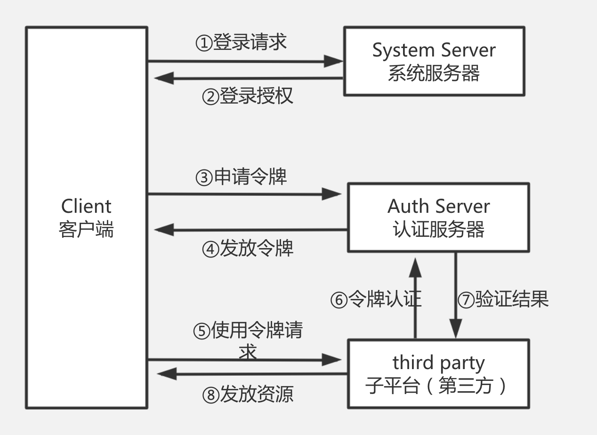
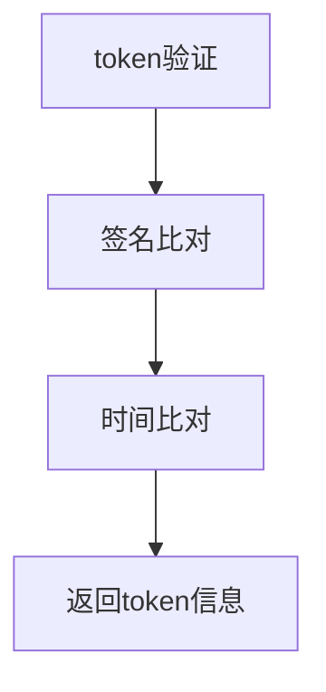

# OAuth2.0

Open Auth 开放平台授权中心。


## 认证流程



## 实际场景

```
A 网站让用户跳转到 GitHub。
GitHub 要求用户登录，然后询问"A 网站要求获得 xx 权限，你是否同意？"
用户同意，GitHub 就会重定向回 A 网站，同时发回一个授权码。
A 网站使用授权码，向 GitHub 请求令牌。
GitHub 返回令牌.
A 网站使用令牌，向 GitHub 请求用户数据。
```


## 请求参数

| 名称      | 类型   | 描述                                                         |
| --------- | ------ | ------------------------------------------------------------ |
| method    | string | 方法名称                                                     |
| param     | json   | 业务参数                                                     |
| token     | string | token值（APP key）                                           |
| sign      | string | 签名规则：md5(secret+method+param+token+secret+timestamp)<br />以指定顺序拼接字符串 |
| timestamp | long   | 请求时间差，允许与服务端10分钟误差                           |


## 服务端验证



