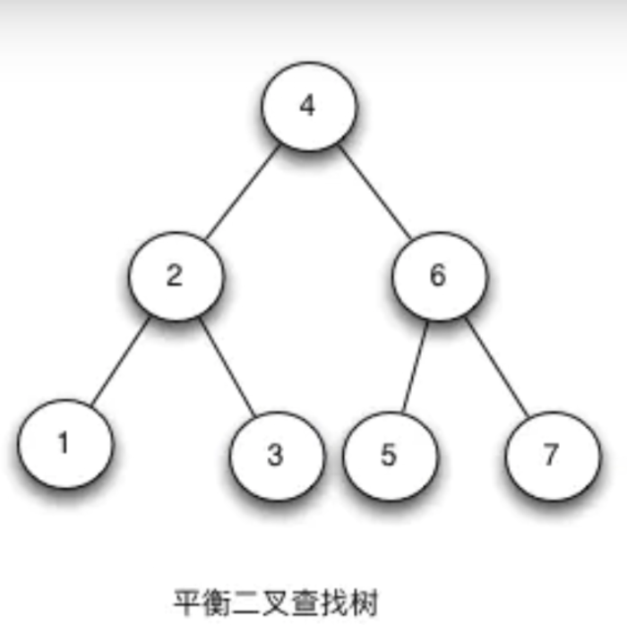
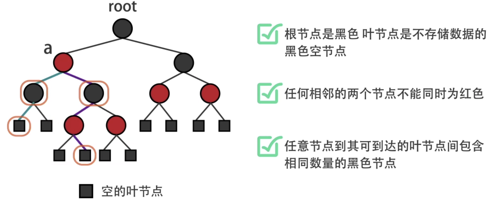

# alg算法

## 平衡二叉树

- 概念
  平衡二叉树是基于二分法的策略提高数据的查找速度的二叉树的数据结构；保证数据平衡的情况下查找数据的速度近于二分法查找；
- 特点
  平衡二叉树是采用二分法思维把数据按规则组装成一个树形结构的数据，用这个树形结构的数据减少无关数据的检索，大大的提升了数据检索的速度，在数据平衡的情况下查找数据的速度近于二分法查找；

平衡二叉树特点：
（1）非叶子节点最多拥有两个子节点；
（2）非叶子节值大于左边子节点、小于右边子节点；
（3）树的左右两边的层级数相差不会大于1;
（4）没有值相等重复的节点;

总结：左节点比父节点要小；右节点比父节点要大；高度决定查找效率

遍历分为三种（递归的按照相同方法逐层遍历）：

- 前序遍历：左子树-》根节点-》右子树  
  - 246 -> 123 46 -> 123 4 567
- 中序遍历：根节点-》左子树-》右子树 
  - 426 -> 4 213 6 -> 4 213 657
- 后续遍历：左子树-》右子树-》根节点 
  - 264 -> 132 64 -> 132 576 4

红黑树通用算法：

- 查找最小值：左子树一路找最后一个，查找次数为层数

- 查找最大值：右子树一路找最后一个，查找次数为层数

- 前驱节点：小于当前节点的最大值（节点4的是3，即4的左子树的最右边那个）

- 后继节点：大于当前节点的最小值（节点4的是5，即4的右子树的最左边那个）
- 删除：本质上是找前驱或者后继节点来替代！替代后整个数还是平衡的不用动！
  - 叶子结点直接删除
  - 只有一个子节点，就用子节点替代
  - 有两个自动，需找到前驱节点或者后继节点来作为替代节点

删除操作和红黑树一样，只不过红黑树多了着色（标记位）和旋转过程

https://www.bilibili.com/video/BV135411h7wJ?p=1

## B树

- 概念
  B树和平衡二叉树稍有不同的是B树属于多叉树又名平衡多路查找树（查找路径不只两个），数据库索引技术里大量使用者B树和B+树的数据结构，让我们来看看他有什么特点;

- B树查询流程
  如上图要从上图中找到E字母，查找流程如下

（1）获取根节点的关键字进行比较，当前根节点关键字为M，E<M（26个字母顺序），所以往找到指向左边的子节点（二分法规则，左小右大，左边放小于当前节点值的子节点、右边放大于当前节点值的子节点）；
（2）拿到关键字D和G，D<E<G 所以直接找到D和G中间的节点；
（3）拿到E和F，因为E=E 所以直接返回关键字和指针信息（如果树结构里面没有包含所要查找的节点则返回null）；

B树相对于平衡二叉树的不同是，每个节点包含的关键字增多了，特别是在B树应用到数据库中的时候，数据库充分利用了磁盘块的原理（磁盘数据存储是采用块的形式存储的，每个块的大小为4K，每次IO进行数据读取时，同一个磁盘块的数据可以一次性读取出来）把节点大小限制和充分使用在磁盘块大小范围；把树的节点关键字增多后树的层级比原来的二叉树少了，减少数据查找的次数和复杂度;

## B+树

- 概念
  B+树是B树的一个升级版，相对于B树来说B+树更充分的利用了节点的空间，让查询速度更加稳定，其速度完全接近于二分法查找。为什么说B+树查找的效率要比B树更高、更稳定；我们先看看两者的区别
- 规则
  （1）B+跟B树不同B+树的非叶子节点不保存关键字记录的指针，只进行数据索引，这样使得B+树每个非叶子节点所能保存的关键字大大增加；
  （2）B+树叶子节点保存了父节点的所有关键字记录的指针，所有数据地址必须要到叶子节点才能获取到。所以每次数据查询的次数都一样；
  （3）B+树叶子节点的关键字从小到大有序排列，左边结尾数据都会保存右边节点开始数据的指针。

特点
1、B+树的层级更少：相较于B树B+每个非叶子节点存储的关键字数更多，树的层级更少所以查询数据更快；

2、B+树查询速度更稳定：B+所有关键字数据地址都存在叶子节点上，所以每次查找的次数都相同所以查询速度要比B树更稳定;

3、B+树天然具备排序功能：B+树所有的叶子节点数据构成了一个有序链表，在查询大小区间的数据时候更方便，数据紧密性很高，缓存的命中率也会比B树高。
4、B+树全节点遍历更快：B+树遍历整棵树只需要遍历所有的叶子节点即可，，而不需要像B树一样需要对每一层进行遍历，这有利于数据库做全表扫描。

B树相对于B+树的优点是，如果经常访问的数据离根节点很近，而B树的非叶子节点本身存有关键字其数据的地址，所以这种数据检索的时候会要比B+树快。

## 红黑树

在线红黑树动态测试：

https://www.cs.usfca.edu/~galles/visualization/RedBlack.html

演示时的画图软件：Epic Pen