# memo


## etcd的raft算法

- 节点会有三个状态：follower，candidate，leader
- 算法中有两个超时设置，一个是选举超时，一个是心跳超时
- 数据的强一致性依靠日志的复制机制
- 初始时，大家都是follwer，这时选举超时机制触发leader选举，超时是随机的一个时间区间150-300ms，最先发起选举的节点，自己就会成为candidate，如果后续的选举得到大多数节点的通过，自己就成为leader；如果同时存在各一半节点数的选举，那么此次选举不算，将重新来一次leader选举；
- 以后所有的数据修改，都提交到leader，开始时先产生一条未提交的修改日志，当leader通知其他的大多数节点都统一修改，就执行这次修改，并提交此次的修改。
- 脑裂
  - 当发生网路分区时，因为节点数是奇数个，多数的节点继续提供服务，少数的节点不可用
  - 到网络分区恢复正常，少数的节点同步多数节点的日志，数据状态实现最终一致

## goroutine 实现机制

- golang语言层面控制的，运行在线程上，队列式的
- 每个协程最多运行10ms


## chan实现原理

源码目录位置：`runtime/chan.go`，以下贴出chan 类型的数据结构如下：

```go
type hchan struct {
 qcount   uint           // total data in the queue（循环队列元素数量）
 dataqsiz uint           // size of the circular queue（循环队列大小）
 buf      unsafe.Pointer // points to an array of dataqsiz elements（循环队列指针）
 elemsize uint16 //chan中元素大小
 closed   uint32 //是否已经close
 elemtype *_type // element type（chan元素类型）
 sendx    uint   // send index（send在buf中索引）
 recvx    uint   // receive index（recv在buf中索引）
 recvq    waitq  // list of recv waiters（receive的等待队列）
 sendq    waitq  // list of send waiters（sender等待队列）

 // lock protects all fields in hchan, as well as several
 // fields in sudogs blocked on this channel.
 //
 // Do not change another G's status while holding this lock
 // (in particular, do not ready a G), as this can deadlock
 // with stack shrinking.
 lock mutex //互斥锁，保护所有字段，上面注释已经讲得非常明确了
}
```


## GMP模型

> https://zhuanlan.zhihu.com/p/413218471

- G：goroutine，代表一个计算任务，由代码和上下文（如当前代码执行的位置、栈信息、状态等）组成
- M：machine，系统线程，想要在CPU上执行代码必须有线程，通过系统调用clone创建
- P：processor，虚拟处理器。M必须获得P才能执行P队列中的G代码，否则会陷入休眠


我们开启的协程都是一个计算任务，这些任务会被提交给go的runtime。如果计算任务非常多，有成千上万个，那么这些任务是不可能同时被立刻执行的，所以这个计算任务一定会被先暂存起来，一般的做法是放到内存的队列中等待被执行。

而消费端则是一个go runtime维护的一个**调度循环**。调度循环简单来说，就是不断从队列中消费计算任务并执行。这里本质上就是一个生产者-消费者模型，实现了用户任务与调度器的解耦。

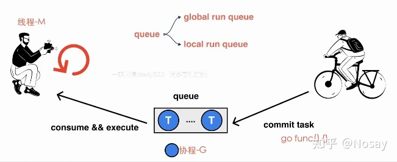

### 调度策略

在Go中，为了解决加锁的问题，将全局队列拆成了多个本地队列，而这个本地队列由一个叫做**P的结构来管理**。

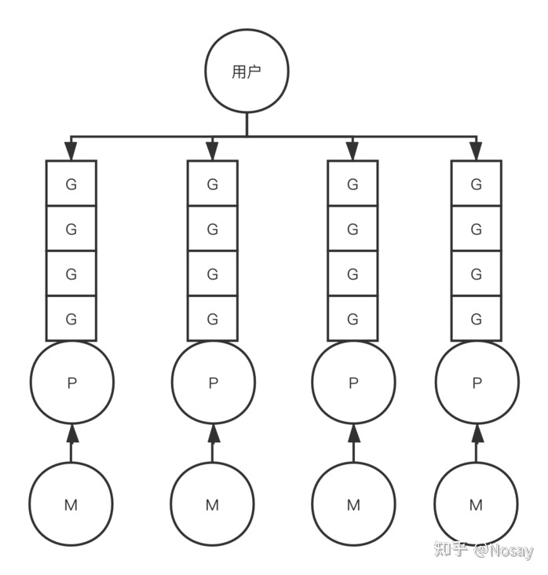

这样一来，每个M只需要去先找到一个P结构，和P结构绑定，然后执行P本地队列里的G即可，完美的解决了加锁的问题。

但是每个P的本地队列长度不可能无限长（目前为256），想象一下有成千上万个go routine的场景，这样很可能导致本地队列无法容纳这么多的Goroutine，所以Go保留了全局队列，用以处理上述情况。

那么为什么本地队列是数组，而全局队列是链表呢？由于全局队列是本地队列的**兜底策略**，所以全局队列大小必须是无限的，所以必须是一个链表。

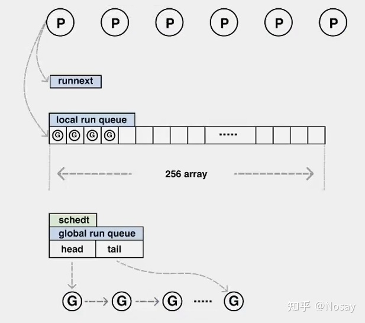

全局队列被分配在全局的调度器结构上，只有一份:

```go

type schedt struct {
    ...
    // Global runnable queue.
    runq     gQueue // 全局队列
    runqsize int32  // 全局队列大小
    ...
}
```


### 完整的生产流程

- 我们执行go func的时候，主线程m0会调用newproc()生成一个G结构体，这里会先选定当前m0上的P结构
- 每个协程G都会被尝试先放到P中的runnext，若runnext为空则放到runnext中，生产结束
- 若runnext满，则将原来runnext中的G踢到本地队列中，将当前G放到runnext中。生产结束
- 若本地队列也满了，则将本地队列中的G拿出一半，加上当前协程G，这个拼成的结构在源码中叫batch，会将batch一起放到全局队列中，生产结束。这样一来本地队列的空间就不会满了，接下来的生产流程不会被本地队列满而阻塞

所以我们看到，最终runnext中的G一定是最后生产出来的G，也会被优先被调度去执行。这里是考虑到局部性原理，最近创建出来的协程一定会被最先执行，优先级是最高的。

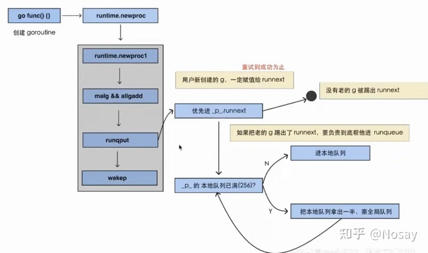


### schedule

schedule是调度循环的核心。由于P中的G分布在runnext、本地队列和全局队列中，则需要挨个判断是否有可执行的G，大体逻辑如下：

- 先到P上的runnext看一下是否有G，若有则直接返回
- runnext为空，则去本地队列中查找，找到了则直接返回
- 本地队列为空，则去阻塞的去全局队列、网路轮询器、以及其他P中查找，一直阻塞直到获取到一个可用的G为止

```go
func schedule() {
    _g_ := getg()
    var gp *g
    var inheritTime bool
    ...
    if gp == nil {
        // 每执行61次调度循环会看一下全局队列。为了保证公平，避免全局队列一直无法得到执行的情况，当全局运行队列中有待执行的G时，通过schedtick保证有一定几率会从全局的运行队列中查找对应的Goroutine；
        if _g_.m.p.ptr().schedtick%61 == 0 && sched.runqsize > 0 {
            lock(&sched.lock)
            gp = globrunqget(_g_.m.p.ptr(), 1)
            unlock(&sched.lock)
        }
    }
    if gp == nil {
        // 先尝试从P的runnext和本地队列查找G
        gp, inheritTime = runqget(_g_.m.p.ptr())
    }
    if gp == nil {
        // 仍找不到，去全局队列中查找。还找不到，要去网络轮询器中查找是否有G等待运行；仍找不到，则尝试从其他P中窃取G来执行。
        gp, inheritTime = findrunnable() // blocks until work is available
        // 这个函数是阻塞的，执行到这里一定会获取到一个可执行的G
    }
    ...
    // 调用execute，继续调度循环
    execute(gp, inheritTime)
}
```

其中schedtick这里，每执行61次的调度循环，就需要去全局队列尝试获取一次。为什么要这样做呢？假设有十万个G源源不断的加入到P的本地队列中，那么全局队列中的G可能永远得不到执行被饿死，所以必须要在从本地队列获取之前有一个判断逻辑，定期从全局队列获取G以保证公平。

与此同时，调度器会将全局队列中的一半G都拿过来，放到当前P的本地队列中。这样做的目的是，如果下次调度循环到来的时候，就不必去加锁到全局队列中在获取一次G了，性能得到了很好的保障。

这里去其他P中查找可用G的逻辑也叫`work stealing`，即工作窃取。这里也是会使用随机算法，随机选择一个P，偷取该P中一半的G放入当前P的本地队列，然后取本地队列尾部的一个G拿来执行。


### 阻塞处理

以上只是假设G正常执行的情况。如果G存在阻塞等待（如channel、系统调用）等，那么需要将此时此刻的M与P上的G进行解绑，让M执行其他P上的G，从而最大化提升CPU利用率。

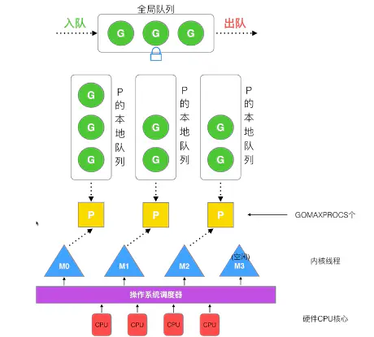


## go的slice

**`append()`这个函数在 `cap` 不够用的时候就会重新分配内存以扩大容量，而如果够用的时候不不会重新分享内存！**

```go
dir1 := path[:sepIndex:sepIndex]
```

代码使用了 Full Slice Expression，其最后一个参数叫“Limited Capacity”，于是，后续的 `append()` 操作将会导致重新分配内存。


## 接口完整性检查

```go
type Shape interface {
    Sides() int
    Area() int
}
type Square struct {
    len int
}
func (s* Square) Sides() int {
    return 4
}
func main() {
    s := Square{len: 5}
    fmt.Printf("%d\n",s.Sides())
}

// 声明一个 _ 变量（没人用），其会把一个 nil 的空指针，从 Square 转成 Shape，这样，如果没有实现完相关的接口方法，编译器就会报错：
var _ Shape = (*Square)(nil)
```

这样就做到了个强验证的方法。


## go的gc

> go语言内置运行时Runtime，抛弃传统的内存分配策略，改为自主分配；使用google的Thread-Cache Malloc算法，自己管理内存池和预分配，不用每次内存分配都需要向进行系统调用。

> 该算法核心思想就是把内存做分级管理，从而降低锁的粒度。它将可用的堆内存采用二级分配（全局内存池、线程内存池）的方式进行管理。每个线程都会自行维护一个独立的内存池，进行内存分配时优先从某个线程中的内存池分配；当内存不足时，才会向全局内存池申请，已避免不同线程对全局内存池的频繁竞争。

- 基本策略：
  - 每次从操作系统申请一块大内存，以减少系统调用
  - 将申请的大内存切分成不同大小的小块，构成链表，供后续使用
  - 为对象分配内存是，只需要从大小合适的链表中提取一个即可
  - 回收对象内存时，将该小块归还给原链表，以便复用
  - 如果闲置内存过多，则尝试归还部分内存给操作系统，降低整体开销。

- go程序启动时，向操作系统申请一块内存空间，切成小块然后自己进行管理。
- 申请到的内存会被分成3个区域，分别为：
  - 512M的span区域
  - 16G的bitmap区域
  - 512G的arena区域
- 这些只是虚拟的地址空间，并不会真正地分配内存
- 内存管理组件，分为3部分组成：
  - cache：每个运行期的工作线程都会绑定一个cache，用于无锁object的分配
  - central：为所有cache提供切分好的的后备span资源
  - heap：管理闲置span，需要时想操作系统申请内存
  - 
  - 分别为并启动多个线程管理，每个线程管理一部分被切割为不同大小的内存片，以后的使用直接向这些线程申请，避免锁粒度的性能消耗，使用完再返回给内存调度器


## sync.Pool

这个类设计的目的是用来短时间（2分钟内）保存和复用临时对象，以减少内存分配，降低CG压力。

这个清理过程是在每次垃圾回收之前做的。垃圾回收是固定两分钟触发一次。

```go
package main
 
import(
    "sync"
    "log"
)
 
func main(){
    // 建立对象
    var pipe = &sync.Pool{New:func()interface{}{return "Hello, BeiJing"}}
     
    // 准备放入的字符串
    val := "Hello,World!"
     
    // 放入
    pipe.Put(val)
     
    // 取出
    log.Println(pipe.Get())
     
    // 再取就没有了,会自动调用NEW
    log.Println(pipe.Get())
}
 
// 输出
2014/09/30 15:43:30 Hello, World!
2014/09/30 15:43:30 Hello, BeiJing
```

- 每次清理会将 Pool 中的所有对象都清理掉！

- sync.Pool 的定位不是做类似连接池的东西，它的用途仅仅是增加对象重用的几率，减少 gc 的负担，而开销方面也不是很便宜的。

[参考资料](https://www.cnblogs.com/-wenli/p/12325248.html)


#### 性能提示

Go 语言是一个高性能的语言，但并不是说这样我们就不用关心性能了，我们还是需要关心的。下面是一个在编程方面和性能相关的提示。

- 如果需要把数字转字符串，使用 `strconv.Itoa()` 会比 `fmt.Sprintf()` 要快一倍左右
- 尽可能地避免把`String`转成`[]Byte` 。这个转换会导致性能下降。
- 如果在for-loop里对某个slice 使用 `append()`请先把 slice的容量很扩充到位，这样可以避免内存重新分享以及系统自动按2的N次方幂进行扩展但又用不到，从而浪费内存。
- 使用`StringBuffer` 或是`StringBuild` 来拼接字符串，会比使用 `+` 或 `+=` 性能高三到四个数量级。
- 尽可能的使用并发的 go routine，然后使用 `sync.WaitGroup` 来同步分片操作
- 避免在热代码中进行内存分配，这样会导致gc很忙。尽可能的使用 `sync.Pool` 来重用对象。
- 使用 lock-free的操作，避免使用 mutex，尽可能使用 `sync/Atomic`包。 （关于无锁编程的相关话题，可参看《[无锁队列实现](https://coolshell.cn/articles/8239.html)》或《[无锁Hashmap实现](https://coolshell.cn/articles/9703.html)》）
- **使用 I/O缓冲，I/O是个非常非常慢的操作，使用 `bufio.NewWrite()` 和 `bufio.NewReader()` 可以带来更高的性能。**
- 对于在for-loop里的固定的正则表达式，一定要使用 `regexp.Compile()` 编译正则表达式。性能会得升两个数量级。
- 如果你需要更高性能的协议，你要考虑使用 [protobuf](https://github.com/golang/protobuf) 或 [msgp](https://github.com/tinylib/msgp) 而不是JSON，因为JSON的序列化和反序列化里使用了反射。
- 你在使用map的时候，使用整型的key会比字符串的要快，因为整型比较比字符串比较要快。

> bufio 是通过缓冲来提高效率
>
> 简单的说就是，把文件读取进缓冲（内存）之后再读取的时候就可以避免文件系统的io 从而提高速度。同理，在进行写操作时，先把文件写入缓冲（内存），然后由缓冲写入文件系统。看完以上解释有人可能会表示困惑了，直接把 内容->文件 和 内容->缓冲->文件相比， 缓冲区好像没有起到作用嘛。其实缓冲区的设计是为了存储多次的写入，最后一口气把缓冲区内容写入文件。下面会详细解释
>
>
> 链接：[golang中bufio包的实现原理](https://blog.csdn.net/LiangWenT/article/details/78995468)

参考资料：

- [star--go 学习之bufio](https://www.cnblogs.com/tigerzhouv587/p/11466556.html)


## go的chann

- chann的数据结构是hchan：

  ```go
  type hchan struct {
  	//channel队列里面总的数据量
  	qcount   uint           // total data in the queue
  	// 循环队列的容量，如果是非缓冲的channel就是0
  	dataqsiz uint           // size of the circular queue
  	// 缓冲队列，数组类型。
  	buf      unsafe.Pointer // points to an array of dataqsiz elements
  	// 元素占用字节的size
  	elemsize uint16
  	// 当前队列关闭标志位，非零表示关闭
  	closed   uint32
  	// 队列里面元素类型
  	elemtype *_type // element type
  	// 队列send索引
  	sendx    uint   // send index
  	// 队列索引
  	recvx    uint   // receive index
  	// 等待channel的G队列。
  	recvq    waitq  // list of recv waiters
  	// 向channel发送数据的G队列。
  	sendq    waitq  // list of send waiters
  
  	// lock protects all fields in hchan, as well as several
  	// fields in sudogs blocked on this channel.
  	//
  	// Do not change another G's status while holding this lock
  	// (in particular, do not ready a G), as this can deadlock
  	// with stack shrinking.
  	// 全局锁
  	lock mutex
  }
  ```

  - 全局的mutex锁
  - 接收协程队列recvq和发送协程队列sendq
  - 数组实现的环形队列circlebuffer，对于有缓冲的channel，sendx和recvx表示读写的缓冲区索引

- 在接收协程接收到新的缓冲消息时，会顺便触发阻塞读协程的重新运行，反之亦然。
- 思考：通过通信来实现共享内存，而不是通过共享内存来实现通信。（CSP）


## 内存分配

**new** 是一个分配内存的内建函数，但不同于其他语言中同名的new所作的工作，**它只是将内存清零，而不是初始化内存**。new(T)为一个类型为T的新项目分配了值为零的存储空间并返回其地址，也就是一个类型为*T的值。用Go的术语来说，就是**它返回了一个指向新分配的类型为T的零值的指针**。

`make(T, args)`函数的目的与`new(T)`不同。**它仅用于创建切片、map和chan（消息管道）**，并返回类型`T`（不是`*T`）的一个**被初始化了的**（不是**零**）实例。这种差别的出现是由于这三种类型实质上是对在使用前必须进行初始化的数据结构的引用。例如，切片是一个具有三项内容的描述符，包括指向数据（在一个数组内部）的指针、长度以及容量，在这三项内容被初始化之前，切片值为`nil`。对于切片、映射和信道，`make`初始化了其内部的数据结构并准备了将要使用的值。如：

下面的代码分配了一个整型数组，长度为10，容量为100，并返回前10个数组的切片

```go
make([]int, 10, 100)
```

以下示例说明了`new`和`make`的不同。

```go
var p *[]int = new([]int)   // 为切片结构分配内存；*p == nil；很少使用
var v  []int = make([]int, 10) // 切片v现在是对一个新的有10个整数的数组的引用

// 不必要地使问题复杂化：
var p *[]int = new([]int)
fmt.Println(p) //输出：&[]

*p = make([]int, 10, 10)
fmt.Println(p) //输出：&[0 0 0 0 0 0 0 0 0 0]
fmt.Println((*p)[2]) //输出： 0

// 习惯用法:
v := make([]int, 10)
fmt.Println(v) //输出：[0 0 0 0 0 0 0 0 0 0]
```


## mutex锁

### 并发编程的几个基础概念

- 概念1：并发执行不一定是并行执行。
- 概念2：单核CPU可以并发执行，不能并行执行。
- 概念3：单进程、单线程，也可以并发执行。
  并行是**同一时刻**的多任务处理，并发是一个**时间段**内（1秒、1毫秒）的多任务处理。
  区别并发和并行，多核的并行处理涉及到多核同时读写一个缓存行，所以很容易出现数据的脏读和脏写；单核的并发处理中因为任务内部的中间变量，所以有可能存在脏写的情况。

### 不用锁，也可以实现同样效果？

```
单线程串行化执行，队列式，CAS。
——不要通过共享内存来通信，而应该通过通信来共享内存
```


### 锁的底层实现类型

- 1 **锁内存总线**，针对内存的读写操作，在总线上控制，限制程序的内存访问

- 2 **锁缓存行**，同一个缓存行（`CacheLine`）的内容读写操作，CPU内部的高速缓存保证一致性

  **锁**，作用在一个对象或者变量上。现代CPU会优先在高速缓存查找，如果存在这个对象、变量的缓存行数据，会使用锁缓存行的方式。否则，才使用锁总线的方式。
  **速度**，加锁、解锁的速度，理论上就是高速缓存、内存总线的读写速度，它的效率是非常高的。**而出现效率问题，是在产生冲突时的串行化等待时间**，**再加上线程的上下文切换**，让多核的并发能力直线下降。


**缓存行，64Byte的内容 cacheline：**

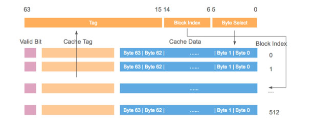

缓存行的存储空间是64Byte（字节），也就是可以放64个英文字母，或者8个int64变量。
注意伪共享的情况——56Byte共享数据不变化，但是8Byte的数据频繁更新，导致56Byte的共享数据也会频繁失效。
解决方法：缓存行的数据对齐，更新频繁的变量独占一个缓存行，只读的变量共享一个缓存行。


### 计算机结构

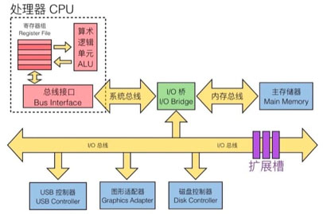

内核独享寄存器、L1/L2，共享L3。在早先时候只有单核CPU，那时只有L1和L2，后来有了多核CPU，为了效率和性能，就增加了共享的L3缓存。
多颗CPU通过QPI连接。再后来，同一个主板上面也可以支持多颗CPU，多颗CPU也需要有通信和控制，才有了QPI。
内存读写都要通过内存总线。CPU与内存、磁盘、网络、外设等通信，都需要通过各种系统提供的系统总线。


### CPU流水线

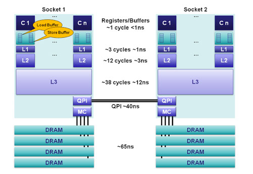

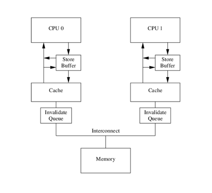

CPU流水线，里面还有异步的LoadBuffer,Store Buffer, Invalidate Queue。这些缓冲队列的出现，更多的异步处理数据，提高了CPU的数据读写性能。
CPU为了保证性能，默认是**宽松的数据一致性**。


**编译器优化**：

重排代码顺序，优先读操作（读有更好的性能，因为cache中有共享数据，而写操作，会让共享数据失效）
**CPU优化**：

指令执行乱序（多核心协同处理，自动优化和重排指令顺序）


### 编译器、CPU屏蔽

- 优化屏蔽：禁止编译器优化。按照代码逻辑顺序生成二进制代码，volatile关键词
- 内存屏蔽：禁止CPU优化。防止指令之间的重排序，保证数据的可见性，store barrier, load barrier, full barrier
- 写屏障：阻塞直到把Store Buffer中的数据刷到Cache中
- 读屏障：阻塞直到Invalid Queue中的消息执行完毕
- 全屏蔽：包括读写屏障，以保证各核的数据一致性
  Go语言中的Lock指令就是一个内存全屏蔽同时禁止了编译器优化。


### 加锁，加了些什么？

- 禁止编译器做优化（加了优化屏蔽）
- 禁止CPU对指令重排（加了内存屏蔽）
- 针对缓存行、内存总线上的控制
- 冲突时的任务等待队列


### 互斥锁操作 sync.Mutex.Lock

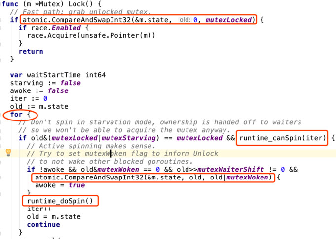

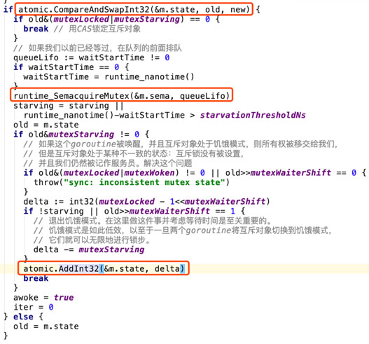

源码，参见 sync/mutex.go
**大概的源码处理逻辑如下：**

- 1 通过CAS操作来竞争锁的状态 &m.state；
- 2 没有竞争到锁，先主动自旋尝试获取锁 runtime_canSpin 和 runtime_doSpin (原地烧CPU)；
- 3 自旋尝试失败，再次CAS尝试获取锁；
- 4 runtime_SemacquireMutex 锁请求失败,进入休眠状态,等待信号唤醒后重新开始循环；
- 5 m.state等待队列长度（复用的int32位数字，第一位是锁的状态，后31位是锁的等待队列长度计数器）；


链接：https://www.imooc.com/article/283248


## 函数闭包

```go
func nextNum() func() int {
  i, j := 1,1
  return func() int {
    var tmp = i + j
    i, j = j, tmp
    return tmp
  }
}

// 打出下一个斐波拉契数
func main() {
  nextNumFunc := nextNum()
  for i := 0; i < 10; i++ {
    fmt.Println(nextNumFunc())
  }
}

```


## goroutine的并发安全性

**如果一个goroutine没有被阻塞，那么别的goroutine就不会得到执行**。这并不是真正的并发，如果你要真正的并发，你需要在你的main函数的第一行加上下面的这段代码：

```go
import "runtime"
...
runtime.GOMAXPROCS(4)
```


## Channel

### Channel的阻塞

注意，channel默认上是阻塞的，也就是说，如果Channel满了，就阻塞写，如果Channel空了，就阻塞读。于是，我们就可以使用这种特性来同步我们的发送和接收端。

**Channel阻塞的这个特性还有一个好处是，可以让我们的goroutine在运行的一开始就阻塞在从某个channel领任务，这样就可以作成一个类似于线程池一样的东西。关于这个程序我就不写了。我相信你可以自己实现的。**


### **Channel select阻塞的Timeout**

一般有两种方法：一种是阻塞但有timeout，一种是无阻塞。

给select设置上timeout:

```go
    for {
        timeout_cnt := 0
        select {
        case msg1 := <-c1:
            fmt.Println("msg1 received", msg1)
        case msg2 := <-c2:
            fmt.Println("msg2 received", msg2)
        case  <-time.After(time.Second * 30)：
            fmt.Println("Time Out")
            timout_cnt++
        }
        if time_cnt > 3 {
            break
        }
    }
```

select无阻塞：

```go
    for {
        select {
        case msg1 := <-c1:
            fmt.Println("received", msg1)
        case msg2 := <-c2:
            fmt.Println("received", msg2)
        default: //default会导致无阻塞
            fmt.Println("nothing received!")
            time.Sleep(time.Second)
        }
    }
```


## 定时器

`SetTimeout`通知一次：

```go
{
    timer := time.NewTimer(2*time.Second)
    <- timer.C
    fmt.Println("timer expired!")
}
```

`SetInterval`通知多次：

```go
{
    ticker := time.NewTicker(time.Second)
    for t := range ticker.C {
        fmt.Println("Tick at", t)
    }
}
```


## 系统调用

Go语言那么C，所以，一定会有一些系统调用。Go语言主要是通过两个包完成的。一个是[os包](http://golang.org/pkg/os/)，一个是[syscall包](http://golang.org/pkg/syscall/)。

这两个包里提供都是Unix-Like的系统调用，

- syscall里提供了什么Chroot/Chmod/Chmod/Chdir…，Getenv/Getgid/Getpid/Getgroups/Getpid/Getppid…，还有很多如Inotify/Ptrace/Epoll/Socket/…的系统调用。

- os包里提供的东西不多，主要是一个跨平台的调用。它有三个子包，Exec（运行别的命令）, Signal（捕捉信号）和User（通过uid查name之类的）


## MySQL索引

- B+树
- 是由二叉树演变而来的N叉数，即子节点数不是2个，是n个
- 叶子节点数目和数据节点的数目一样多，便于范围查找
- 聚簇索引是索引和数据都存储在一起，都在叶子节点，一般主键索引都是聚簇索引
- 非聚簇索引的索引和数据是分开存放的
- 二级索引又名辅助索引，存储的是主键值，而非数据地址，通过二级索引查询时先找到二级索引存储的主键值，然后再通过主键索引查找到存储的数据。唯一索引、普通索引、前缀索引都是二级索引。
- 因为B+树有最左原则，所以复合索引会依赖第一个字段索引排序，每个叶子节点对应的数据是已经排序好的


## SQL的事务隔离级别

- Read Uncommitted: 读未提交，事务做的操作，即使没有提交，其他事务也是可见的，所有会有脏读。脏读即读取了错误的数据，因为可能数据操作会需要undo回滚。
- Read Committed: 读已提交，只能读到已提交的事务，大多数数据库的默认隔离级别，又名不可重复读，因为会出现幻读，幻读即前后两次查询的结果可能不一致，因为这个前后两次间隔了某个事务的操作完成。
- Repeatable Read: 可重复读，mysql的默认隔离级别
- Serializable: 可串行化，事务的最高级别，让所有事务串行执行
- MVCC
  -  Multi-Version Concurrency Control，InnoDB的多版本并发控制，解决了幻读中的幻行问题。
  - InnoDB的MVCC是对每行记录增加两个隐藏的列实现的，一列是行的创建时间，一列是行的删除时间，列值存储的实际是系统版本号
  - 事务的版本号是事务开始的系统版本号，用来和查询到的每行记录的版本号进行比较
  - 事务只查找小于或等于事务版本号的数据行，小于事务版本号的是事务开始前就存在的，等于事务版本号的是事务自身修改过的。
  - 行的删除版本，要么未定义，要么比事务版本号大，以确保事务读取到的数据，在事务开始前未被删除

## mongo事务

- start transaction...commit
- 

## redis


### 事务

- mulit
- watch
- exec
- discard
- 如果没有watch，就会都执行，有语法错误也都顺序执行，不会停下。若有watch，则会都执行，如果无语法错误，则都成功

### 分片

### 备份方式

- RDB：二进制方式

- AOF：记录修改指令

  

## 架构设计的弹力设计

## 数据库异步写

## websocket


## mongo分片

## nodejs中的stream流

## Docker

### 镜像制作

- 将 Dockerfile 置于一个空目录下，或者项目根目录下