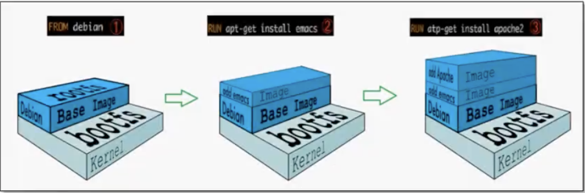

# 打包

```bash
mvn clean install -DskipTests=true
```


## docker

```dockerfile
FROM carsharing/alpine-oraclejdk8-bash
```

在容器外部提供一个映射路径，`-volumn webapps:/root/app/webapps`，在外部放置项目，就自动同步到内部了！


查看各容器占用的系统资源：

```bash
docker stats
```

```bash
CONTAINER ID   NAME        CPU %     MEM USAGE / LIMIT     MEM %     NET I/O           BLOCK I/O        PIDS
4f1eb7e71c39   portainer   0.00%     6.227MiB / 1.942GiB   0.31%     6.94kB / 1.73kB   19.4MB / 307kB   8
```


启动ES：

```bash
# 限制JVM内存最小64M最大512M
docker run -d --name elasticsearch -p 9200:9200 -p 9300:9300 -e "discovery.type=single-node" -e ES_JAVA_OPTS="-Xms=64m -Xmx512m" elasticsearch:7.6.2
```


## 镜像分层



- UnionFS

  联合文件系统，是一种分层、轻量级并且高性能的文件系统，它支持对文件系统的修改作为一次提交来一层层的叠加，同时可以将不同目录挂载到同一个虚拟文件系统下（unite serveral directories into a single virtual filesystem). 

  Union文件系统是Docker镜像的基础。镜像可以通过分层来进行继承。基于基础镜像，可以制作各种具体的应用镜像。

  特性：

  一次同时加载多个文件系统，但从外面看起来，只能看到一个文件系统，联合加载会把各层文件系统叠加起来，这样最终的文件系统会包含所有底层的文件和目录。

  

- bootfs

  boot file system，主要包含 BootLoader和kernal，BootLoader主要是遇到加载kernal，Linux刚启动时会加载bootfs文件系统，在docker镜像的最底层是bootfs。

  这一层与典型的Linux/Unix系统是一样的，包含boot加载器和内核。当boot加载完成之后，这个内核就都在内存中了，此时内存的使用权已由bootfs转交给内核，此时系统也会卸载bootfs。

  

- rootfs: 

  root file system，在bootfs之上。包含的就是典型的Linux系统中的/dev，/proc，/bin，/etc等标准目录和文件。rootfs就是各种不同的操作系统发行版，比如Ubuntu，centos等等。

  对于一个精简的OS，rootfs可以很小，只需要包含最基本的命令、工具、程序库就可以了（vi、ping都没有），因为底层直接用Host的kernal，自己只需要提供rootfs就可以了。所以docker容器启动是秒级，而虚拟机是分钟级别。