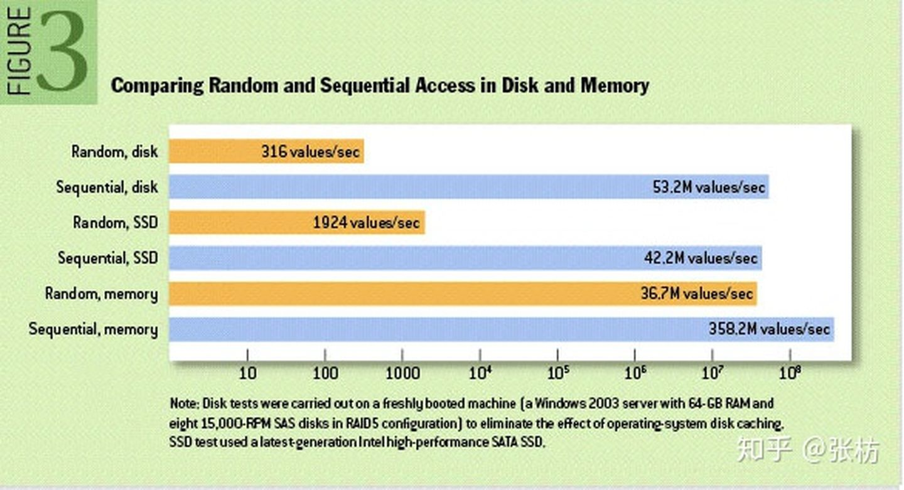
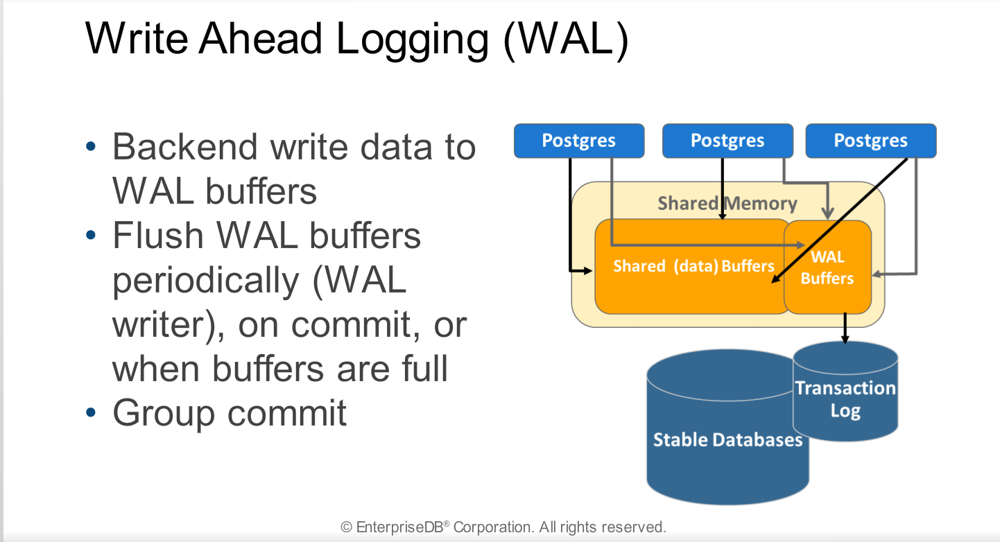
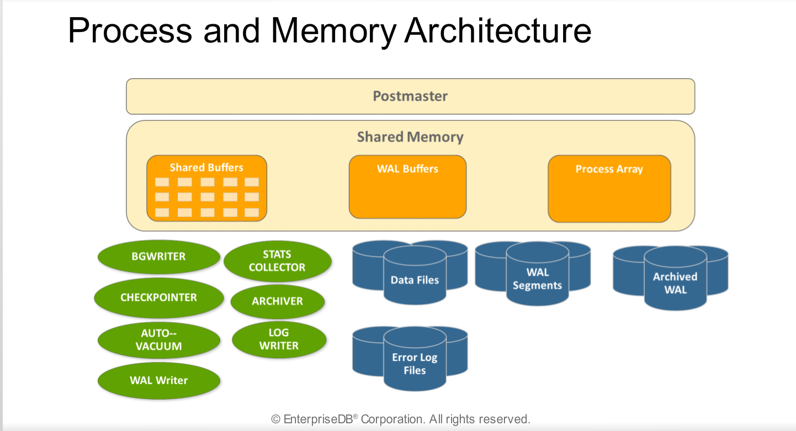

# WAL

## 1. WAL机制

> WAL即 Write Ahead Log，WAL的主要意思是说在将元数据的变更操作写入磁盘之前，先预先写入到一个log文件中

##  磁盘、SSD、内存随机读写与顺序读写性能对比

### 1.2 WAL原理

- 通过cache合并多条写操作为一条，减少IO次数
- 日志顺序追加性能远高于数据随机写.
- 随机内存处理性能远高于数据随机处理.

**性能:顺序的日志磁盘处理+随机的数据内存处理>随机的数据磁盘处理**

WAL还有一点很重要的帮助是可以在disaster recovery过程中起到状态恢复的作用，系统在load完元数据db后，再把未来得及提交的WAL apply进来，就能恢复成和之前最终一致的状态。

PGSQL架构：

## 参考资料

- [WAL(Write Ahead Log)-知乎](https://zhuanlan.zhihu.com/p/228335203)

- [postgres-wal-doc](https://pgadminedb.readthedocs.io/en/latest/module_02/#write-ahead-logging-wal)

