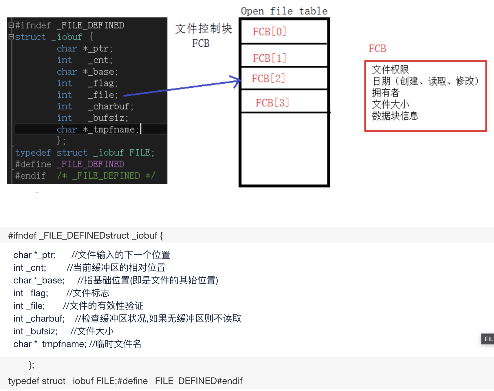

# stream流


## 什么是Stream？

> Java: 
>
> A source, A sequence of elements supporting sequential and parallel aggregate operations.
>
> 支持串行或并行的聚合操作的一个资源的元素序列


`Stream`不仅可以通过串行的方式实现数据操作，还可以通过并行的方式处理大批量数据，提高数据的处理效率。

1. `Sequence of elements（元素序列）`：简单来说，就是我们操作的集合中的所有元素
2. `source（数据源）` ：Stream流的作用就是操作数据，那么source 就是为Stream提供可操作的`源数据`(一般，集合、数组或I/OI/O resources 都可以成为Stream的source )
3. `Data processing operations（数据处理操作）`：上面菜单程序代码中出现的`filter`、sorted、map、collect，`以及我们后来会用到的`reduce、find、match`等都属于Stream 的一些操作数据的方法接口。这些操作可以顺序进行，也可以并行执行。
4. `Pipelining（管道、流水线）`：Stream对数据的操作类似数据库查询，也像电子厂的生产流线一样，Stream的每一个中间操作（后面解释什么是中间操作）比如上面的filter、sorted、map，每一步都会返回一个新的流，这些操作全部连起来就是想是一个工厂得生产流水线， like this：
   [](https://img2020.cnblogs.com/blog/2026387/202011/2026387-20201126155856126-577400707.jpg)
5. `Internal iteration（内部迭代）`：Stream API 实现了对数据迭代的封装，不用你再像操作集合一样，手动写for循环显示迭代数据。


**流是数据渠道，用于操作数据源（集合、数组等）所生成的元素序列。 ,“集合讲的是数据，流讲的是计算！ ” **

1. `Stream关注的是对数据的运算，与CPU打交道；集合关注的是数据的存储，与内存打交道`
2. ①Stream 自已不会储存元素。
   ②Stream 不会改变源对象。相反，他们会返回一个持有结果的`新Stream`
   ③Stream `操作是延迟执行的`。这意味着他们会等到需要结果的时候才执行(类似于懒加载)


## 为什么使用流？

目前集合在程序开发中的表现还不够完美`，比如你利用集合处理大量数据时，你不得不面对性能问题，不得不考虑进行并行代码的编写，这些工作都是比较繁重的，于是作者便创造了Stream 流。`相比较Collection集合来说，Stream在开发中就具有许多独特的优点:

- 以声明式的方式处理数据集合——更简洁，更易读
- 可复合——更灵活
- 可并行——无需写任何多线程代码，Stream API自动处理这些问题，性能更好

```java
//Lists是Guava中的一个工具类
List<Integer> numberlist = Lists.newArrayList(1,null,3,4,null,6);
/**
* 1.通过.Stream（）创建Stream实例----------创建Stream
* 2.通过.filter（）中间操作，根据内部迭代对list集合中的每一个元素判断是否为null---------转换Stream
* 3.通过。count（）方法统计数量------------聚合
*/
numberlist.stream().filter(num -> num != null).count();
```


## FILE



## 参考资料

- [到底什么是Stream流？](https://www.cnblogs.com/MrYuChen-Blog/p/14042801.html)

- [Stream初步认识（一）](https://www.cnblogs.com/MrYuChen-Blog/p/14036225.html)

- https://blog.51cto.com/lingdandan/1760155#:~:text=FILE%E7%BB%93%E6%9E%84%E4%BD%93%E7%94%A8%E4%BA%8E%E6%96%87%E4%BB%B6%E6%93%8D%E4%BD%9C%EF%BC%8C%E5%AE%9A%E4%B9%89%E5%9C%A8C%E8%AF%AD%E8%A8%80%E7%9A%84stdio.h%E5%A4%B4%E6%96%87%E4%BB%B6%E4%B8%AD%20%E6%88%91%E4%BB%AC%E9%80%9A%E5%B8%B8%E6%89%80%E5%86%99%E7%9A%84FILE,%2Afp%3B%20%E5%AE%9A%E4%B9%89%E4%BA%86%E4%B8%80%E4%B8%AA%E6%8C%87%E5%90%91%E8%AF%A5%E7%BB%93%E6%9E%84%E4%BD%93%E7%9A%84%E6%8C%87%E9%92%88%EF%BC%8C%E9%80%9A%E8%BF%87fopen%20%28%29%E8%BF%94%E5%9B%9E%E4%B8%80%E4%B8%AA%E6%8C%87%E5%90%91%E8%A6%81%E6%89%93%E5%BC%80%EF%BC%88%E6%88%96%E5%86%99%E5%85%A5%E3%80%81%E5%88%9B%E5%BB%BA%EF%BC%89%E6%96%87%E4%BB%B6%E7%9A%84%E6%8C%87%E9%92%88