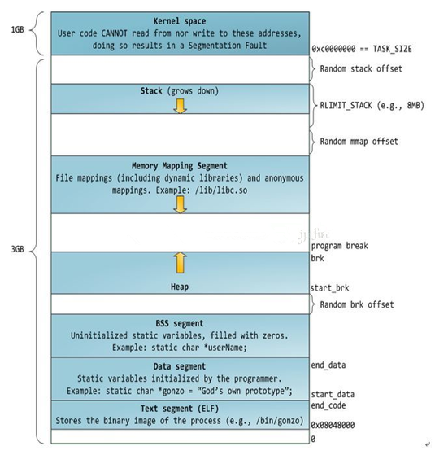

# 小林coding


## 一致性hash

> [微信一面：什么是一致性哈希？用在什么场景？解决了什么问题？ - 小林coding - 博客园 (cnblogs.com)](https://www.cnblogs.com/xiaolincoding/p/15918321.html)

- 假设总数据条数为 M，哈希算法在面对节点数量变化时，**最坏情况下所有数据都需要迁移，所以它的数据迁移规模是 O(M)**，这样数据的迁移成本太高了。
- 一致哈希算法也用了取模运算，但与哈希算法不同的是，哈希算法是对节点的数量进行取模运算，而**一致哈希算法是对 2^32 进行取模运算，是一个固定的值**。
- 哈希环
- 一致性哈希要进行两步哈希：
  - 第一步：对存储节点进行哈希计算，也就是对存储节点做哈希映射，比如根据节点的 IP 地址进行哈希；
  - 第二步：当对数据进行存储或访问时，对数据进行哈希映射；

- **一致性哈希是指将「存储节点」和「数据」都映射到一个首尾相连的哈希环上**。

- 对「数据」进行哈希映射得到一个结果要怎么找到存储该数据的节点呢？

  答案是，映射的结果值往**顺时针的方向的找到第一个节点**，就是存储该数据的节点。

- 加入**虚拟节点**，也就是对一个真实节点做多个副本。

  具体做法是，**不再将真实节点映射到哈希环上，而是将虚拟节点映射到哈希环上，并将虚拟节点映射到实际节点，所以这里有「两层」映射关系。**

- 比如 Nginx 的一致性哈希算法，每个权重为 1 的真实节点就含有160 个虚拟节点。


## SQL的count效率

- count() 是一个聚合函数，函数的参数不仅可以是字段名，也可以是其他任意表达式，该函数作用是**统计符合查询条件的记录中，函数指定的参数不为 NULL 的记录有多少个**。

  ```sql
  # 统计「 t_order 表中，name 字段不为 NULL 的记录」有多少个
  select count(name) from t_order;
  ```

- InnoDB 是通过 B+ 树来保持记录的，根据索引的类型又分为聚簇索引和二级索引，它们区别在于，聚簇索引的叶子节点存放的是实际数据，而二级索引的叶子节点存放的是主键值，而不是实际数据。

- 使用 MyISAM 引擎时，执行 count 函数只需要 O(1 )复杂度，这是因为每张 MyISAM 的数据表都有一个 meta 信息有存储了row_count值，由表级锁保证一致性，所以直接读取 row_count 值就是 count 函数的执行结果。

- 而 InnoDB 存储引擎是支持事务的，同一个时刻的多个查询，由于多版本并发控制（MVCC）的原因，InnoDB 表“应该返回多少行”也是不确定的，所以无法像 MyISAM一样，只维护一个 row_count 变量。

- 面对大表的记录统计，如果你的业务对于统计个数不需要很精确，比如搜索引擎在搜索关键词的时候，给出的搜索结果条数是一个大概值。我们就可以使用 show table status 或者 explain 命令来表进行估算。执行 explain 命令效率是很高的，因为它并不会真正的去查询


## nginx文件传输配置

来根据⽂件的⼤⼩来使⽤不同的⽅式：

```nginx
location /video/ {
  sendfile on;
  aio on;
  directio 1024m;
}
```

当⽂件⼤⼩⼤于 directio 值后，使⽤「异步 I/O + 直接 I/O」，否则使⽤「零拷⻉技术」。


- 为了提⾼⽂件传输的性能，于是就出现了零拷⻉技术，它通过⼀次系统调⽤（ sendfile ⽅

  法）合并了磁盘读取与⽹络发送两个操作，降低了上下⽂切换次数。另外，拷⻉数据都是发

  ⽣在内核中的，天然就降低了数据拷⻉的次数。

- Kafka 和 Nginx 都有实现零拷⻉技术，这将⼤⼤提⾼⽂件传输的性能。

- 零拷⻉技术是基于 PageCache 的，PageCache 会缓存最近访问的数据，提升了访问缓存数

  据的性能，同时，为了解决机械硬盘寻址慢的问题，它还协助 I/O 调度算法实现了 IO 合并与

  预读，这也是顺序读⽐随机读性能好的原因。这些优势，进⼀步提升了零拷⻉的性能。


## Linux一切皆文件

- 其实是一种面向对象的设计思想。
- 串口是文件，内存是文件，usb是文件，进程信息是文件，网卡是文件，建立的每个网络通讯都是文件，蓝牙设备也是文件，等等等等。
- 所有外设都是文件，本质上就是说他们都支持用来访问文件的那些接口，可以被当做文件来访问。这个原理与子类都能当做基类访问是一样的，就是操作系统层面的oop思想。

- 任何东西都挂在文件系统之上，即使它们不是文件，也以文件的形式来呈现。

- 有一个很关键的点，这个一切是单向的，也即所有的东西都单向通过文件系统呈现，反向不一定可行。比如通过新建文件的方式来创建磁盘设备是行不通的。

- 比如我们经常会讲的进程(/proc)、设备(/dev)、Socket等等，实际上都不是文件，但是你可以以文件系统的规范来访问它，修改属主和属性。

- Linux下有`lsof`命令，可以查看所有已经打开的文件，你使用`lsof -p [pid]`的方式就可以查看对应的进程都打开了什么文件，而其中的`type`字段就是表明它是什么类型，通过`man losf` 命令你可以查看到它有下面这么多种。

  ```bash
  # lsof siege-server
  ubuntu@test1:~$ lsof -p 1213429
  lsof: WARNING: can't stat() tracefs file system /sys/kernel/debug/tracing
        Output information may be incomplete.
  COMMAND       PID   USER   FD      TYPE             DEVICE SIZE/OFF     NODE NAME
  node\x20/ 1213429 ubuntu  cwd       DIR              252,2     4096   652074 /home/ubuntu/zone1/wj_slgsanguo2_server/server/siege-server
  node\x20/ 1213429 ubuntu  rtd       DIR              252,2     4096        2 /
  node\x20/ 1213429 ubuntu  txt       REG              252,2    14416   133994 /usr/bin/node
  node\x20/ 1213429 ubuntu  mem       REG              252,2   101320   152459 /usr/lib/x86_64-linux-gnu/libresolv-2.31.so
  node\x20/ 1213429 ubuntu  mem       REG              252,2    31176   152452 /usr/lib/x86_64-linux-gnu/libnss_dns-2.31.so
  node\x20/ 1213429 ubuntu  mem       REG              252,2    51832   152453 /usr/lib/x86_64-linux-gnu/libnss_files-2.31.so
  node\x20/ 1213429 ubuntu  mem       REG              252,2    20176   274288 /usr/share/zoneinfo-icu/44/le/timezoneTypes.res
  node\x20/ 1213429 ubuntu  mem       REG              252,2   156000   274290 /usr/share/zoneinfo-icu/44/le/zoneinfo64.res
  node\x20/ 1213429 ubuntu  mem       REG              252,2 28046896   131860 /usr/lib/x86_64-linux-gnu/libicudata.so.66.1
  node\x20/ 1213429 ubuntu  mem       REG              252,2   104984   130941 /usr/lib/x86_64-linux-gnu/libgcc_s.so.1
  node\x20/ 1213429 ubuntu  mem       REG              252,2  1369352   152447 /usr/lib/x86_64-linux-gnu/libm-2.31.so
  node\x20/ 1213429 ubuntu  mem       REG              252,2  1956992   130956 /usr/lib/x86_64-linux-gnu/libstdc++.so.6.0.28
  node\x20/ 1213429 ubuntu  mem       REG              252,2    18816   152445 /usr/lib/x86_64-linux-gnu/libdl-2.31.so
  node\x20/ 1213429 ubuntu  mem       REG              252,2  1976648   131879 /usr/lib/x86_64-linux-gnu/libicuuc.so.66.1
  node\x20/ 1213429 ubuntu  mem       REG              252,2  3132040   131862 /usr/lib/x86_64-linux-gnu/libicui18n.so.66.1
  node\x20/ 1213429 ubuntu  mem       REG              252,2   598104   134055 /usr/lib/x86_64-linux-gnu/libssl.so.1.1
  node\x20/ 1213429 ubuntu  mem       REG              252,2  2954080   134054 /usr/lib/x86_64-linux-gnu/libcrypto.so.1.1
  node\x20/ 1213429 ubuntu  mem       REG              252,2   162160   138528 /usr/lib/x86_64-linux-gnu/libnghttp2.so.14.19.0
  node\x20/ 1213429 ubuntu  mem       REG              252,2    75792   133990 /usr/lib/x86_64-linux-gnu/libcares.so.2.3.0
  node\x20/ 1213429 ubuntu  mem       REG              252,2   194648   131743 /usr/lib/x86_64-linux-gnu/libuv.so.1.0.0
  node\x20/ 1213429 ubuntu  mem       REG              252,2   108936   134327 /usr/lib/x86_64-linux-gnu/libz.so.1.2.11
  node\x20/ 1213429 ubuntu  mem       REG              252,2  2029224   152443 /usr/lib/x86_64-linux-gnu/libc-2.31.so
  node\x20/ 1213429 ubuntu  mem       REG              252,2   157224   152458 /usr/lib/x86_64-linux-gnu/libpthread-2.31.so
  node\x20/ 1213429 ubuntu  mem       REG              252,2 22721208   133992 /usr/lib/x86_64-linux-gnu/libnode.so.64
  node\x20/ 1213429 ubuntu  mem       REG              252,2   191472   152435 /usr/lib/x86_64-linux-gnu/ld-2.31.so
  node\x20/ 1213429 ubuntu    0u     unix 0x0000000000000000      0t0 88567492 type=STREAM
  node\x20/ 1213429 ubuntu    1u     unix 0x0000000000000000      0t0 88567494 type=STREAM
  node\x20/ 1213429 ubuntu    2u     unix 0x0000000000000000      0t0 88567496 type=STREAM
  node\x20/ 1213429 ubuntu    3u     unix 0x0000000000000000      0t0 88567498 type=STREAM
  node\x20/ 1213429 ubuntu    4u  a_inode               0,14        0    10385 [eventpoll]
  node\x20/ 1213429 ubuntu    5r     FIFO               0,13      0t0 88567500 pipe
  node\x20/ 1213429 ubuntu    6w     FIFO               0,13      0t0 88567500 pipe
  node\x20/ 1213429 ubuntu    7r     FIFO               0,13      0t0 88567501 pipe
  node\x20/ 1213429 ubuntu    8w     FIFO               0,13      0t0 88567501 pipe
  node\x20/ 1213429 ubuntu    9u  a_inode               0,14        0    10385 [eventfd]
  node\x20/ 1213429 ubuntu   10u  a_inode               0,14        0    10385 [eventpoll]
  node\x20/ 1213429 ubuntu   11r     FIFO               0,13      0t0 88567502 pipe
  node\x20/ 1213429 ubuntu   12w     FIFO               0,13      0t0 88567502 pipe
  node\x20/ 1213429 ubuntu   13u  a_inode               0,14        0    10385 [eventfd]
  node\x20/ 1213429 ubuntu   14u  a_inode               0,14        0    10385 [eventpoll]
  node\x20/ 1213429 ubuntu   15r     FIFO               0,13      0t0 88566591 pipe
  node\x20/ 1213429 ubuntu   16w     FIFO               0,13      0t0 88566591 pipe
  node\x20/ 1213429 ubuntu   17u  a_inode               0,14        0    10385 [eventfd]
  node\x20/ 1213429 ubuntu   18r      CHR                1,3      0t0        6 /dev/null
  node\x20/ 1213429 ubuntu   19u     IPv6           88567693      0t0      TCP *:40160 (LISTEN)
  node\x20/ 1213429 ubuntu   20w      REG              252,2        0  1443133 /home/ubuntu/zone1/wj_slgsanguo2_server/server/siege-server/logs/con-log-master-server-1.log
  node\x20/ 1213429 ubuntu   21w      REG              252,2        0  1443134 /home/ubuntu/zone1/wj_slgsanguo2_server/server/siege-server/logs/rpc-log-master-server-1.log
  node\x20/ 1213429 ubuntu   22w      REG              252,2        0  1443135 /home/ubuntu/zone1/wj_slgsanguo2_server/server/siege-server/logs/forward-log-master-server-1.log
  node\x20/ 1213429 ubuntu   23w      REG              252,2        0  1443136 /home/ubuntu/zone1/wj_slgsanguo2_server/server/siege-server/logs/rpc-debug-master-server-1.log
  node\x20/ 1213429 ubuntu   24w      REG              252,2        0  1443137 /home/ubuntu/zone1/wj_slgsanguo2_server/server/siege-server/logs/crash.log
  node\x20/ 1213429 ubuntu   25w      REG              252,2        0  1443138 /home/ubuntu/zone1/wj_slgsanguo2_server/server/siege-server/logs/admin.log
  node\x20/ 1213429 ubuntu   26w      REG              252,2    41405  1443139 /home/ubuntu/zone1/wj_slgsanguo2_server/server/siege-server/logs/pomelo-master-server-1.log
  node\x20/ 1213429 ubuntu   27w      REG              252,2     8171  1443140 /home/ubuntu/zone1/wj_slgsanguo2_server/server/siege-server/logs/pomelo-admin.log
  node\x20/ 1213429 ubuntu   28w      REG              252,2        0  1443141 /home/ubuntu/zone1/wj_slgsanguo2_server/server/siege-server/logs/pomelo-rpc-master-server-1.log
  node\x20/ 1213429 ubuntu   29u     unix 0x0000000000000000      0t0 88567694 type=STREAM
  node\x20/ 1213429 ubuntu   30u     IPv4           88567710      0t0      TCP localhost:47802->localhost:40160 (ESTABLISHED)
  node\x20/ 1213429 ubuntu   31u     unix 0x0000000000000000      0t0 88567696 type=STREAM
  node\x20/ 1213429 ubuntu   32u     IPv6           88567711      0t0      TCP localhost:40160->localhost:47802 (ESTABLISHED)
  node\x20/ 1213429 ubuntu   33u     unix 0x0000000000000000      0t0 88567698 type=STREAM
  node\x20/ 1213429 ubuntu   34u     IPv6           88569152      0t0      TCP localhost:40160->localhost:47848 (ESTABLISHED)
  ```

  ```bash
  ubuntu@test1:/proc/1213429$ cat limits 
  Limit                     Soft Limit           Hard Limit           Units     
  Max cpu time              unlimited            unlimited            seconds   
  Max file size             unlimited            unlimited            bytes     
  Max data size             unlimited            unlimited            bytes     
  Max stack size            8388608              unlimited            bytes     
  Max core file size        0                    unlimited            bytes     
  Max resident set          unlimited            unlimited            bytes     
  Max processes             29416                29416                processes 
  Max open files            1048576              1048576              files     
  Max locked memory         67108864             67108864             bytes     
  Max address space         unlimited            unlimited            bytes     
  Max file locks            unlimited            unlimited            locks     
  Max pending signals       29416                29416                signals   
  Max msgqueue size         819200               819200               bytes     
  Max nice priority         0                    0                    
  Max realtime priority     0                    0                    
  Max realtime timeout      unlimited            unlimited            us        
  
  ubuntu@test1:/proc/1213429$ sudo cat stack 
  [<0>] ep_poll+0x400/0x450
  [<0>] do_epoll_wait+0xb8/0xd0
  [<0>] __x64_sys_epoll_wait+0x1e/0x30
  [<0>] do_syscall_64+0x57/0x190
  [<0>] entry_SYSCALL_64_after_hwframe+0x44/0xa9
  
  ubuntu@test1:/proc/1213429$ ll fd
  total 0
  dr-x------ 2 ubuntu ubuntu  0 Apr  1 17:55 ./
  dr-xr-xr-x 9 ubuntu ubuntu  0 Mar 30 21:33 ../
  lrwx------ 1 ubuntu ubuntu 64 Apr  1 17:55 0 -> 'socket:[88567492]'
  lrwx------ 1 ubuntu ubuntu 64 Apr  1 17:55 1 -> 'socket:[88567494]'
  lrwx------ 1 ubuntu ubuntu 64 Apr  1 17:55 10 -> 'anon_inode:[eventpoll]'
  lr-x------ 1 ubuntu ubuntu 64 Apr  1 17:55 11 -> 'pipe:[88567502]'
  l-wx------ 1 ubuntu ubuntu 64 Apr  1 17:55 12 -> 'pipe:[88567502]'
  lrwx------ 1 ubuntu ubuntu 64 Apr  1 17:55 13 -> 'anon_inode:[eventfd]'
  lrwx------ 1 ubuntu ubuntu 64 Apr  1 17:55 14 -> 'anon_inode:[eventpoll]'
  lr-x------ 1 ubuntu ubuntu 64 Apr  1 17:55 15 -> 'pipe:[88566591]'
  l-wx------ 1 ubuntu ubuntu 64 Apr  1 17:55 16 -> 'pipe:[88566591]'
  lrwx------ 1 ubuntu ubuntu 64 Apr  1 17:55 17 -> 'anon_inode:[eventfd]'
  lr-x------ 1 ubuntu ubuntu 64 Apr  1 17:55 18 -> /dev/null
  lrwx------ 1 ubuntu ubuntu 64 Apr  1 17:55 19 -> 'socket:[88567693]'
  lrwx------ 1 ubuntu ubuntu 64 Apr  1 17:55 2 -> 'socket:[88567496]'
  l-wx------ 1 ubuntu ubuntu 64 Apr  1 17:55 20 -> /home/ubuntu/zone1/wj_slgsanguo2_server/server/siege-server/logs/con-log-master-server-1.log
  l-wx------ 1 ubuntu ubuntu 64 Apr  1 17:55 21 -> /home/ubuntu/zone1/wj_slgsanguo2_server/server/siege-server/logs/rpc-log-master-server-1.log
  l-wx------ 1 ubuntu ubuntu 64 Apr  1 17:55 22 -> /home/ubuntu/zone1/wj_slgsanguo2_server/server/siege-server/logs/forward-log-master-server-1.log
  l-wx------ 1 ubuntu ubuntu 64 Apr  1 17:55 23 -> /home/ubuntu/zone1/wj_slgsanguo2_server/server/siege-server/logs/rpc-debug-master-server-1.log
  l-wx------ 1 ubuntu ubuntu 64 Apr  1 17:55 24 -> /home/ubuntu/zone1/wj_slgsanguo2_server/server/siege-server/logs/crash.log
  l-wx------ 1 ubuntu ubuntu 64 Apr  1 17:55 25 -> /home/ubuntu/zone1/wj_slgsanguo2_server/server/siege-server/logs/admin.log
  l-wx------ 1 ubuntu ubuntu 64 Apr  1 17:55 26 -> /home/ubuntu/zone1/wj_slgsanguo2_server/server/siege-server/logs/pomelo-master-server-1.log
  l-wx------ 1 ubuntu ubuntu 64 Apr  1 17:55 27 -> /home/ubuntu/zone1/wj_slgsanguo2_server/server/siege-server/logs/pomelo-admin.log
  l-wx------ 1 ubuntu ubuntu 64 Apr  1 17:55 28 -> /home/ubuntu/zone1/wj_slgsanguo2_server/server/siege-server/logs/pomelo-rpc-master-server-1.log
  lrwx------ 1 ubuntu ubuntu 64 Apr  1 17:55 29 -> 'socket:[88567694]'
  lrwx------ 1 ubuntu ubuntu 64 Apr  1 17:55 3 -> 'socket:[88567498]'
  lrwx------ 1 ubuntu ubuntu 64 Apr  1 17:55 30 -> 'socket:[88567710]'
  lrwx------ 1 ubuntu ubuntu 64 Apr  1 17:55 31 -> 'socket:[88567696]'
  lrwx------ 1 ubuntu ubuntu 64 Apr  1 17:55 32 -> 'socket:[88567711]'
  lrwx------ 1 ubuntu ubuntu 64 Apr  1 17:55 33 -> 'socket:[88567698]'
  lrwx------ 1 ubuntu ubuntu 64 Apr  1 17:55 34 -> 'socket:[88569152]'
  lrwx------ 1 ubuntu ubuntu 64 Apr  1 17:55 4 -> 'anon_inode:[eventpoll]'
  lr-x------ 1 ubuntu ubuntu 64 Apr  1 17:55 5 -> 'pipe:[88567500]'
  l-wx------ 1 ubuntu ubuntu 64 Apr  1 17:55 6 -> 'pipe:[88567500]'
  lr-x------ 1 ubuntu ubuntu 64 Apr  1 17:55 7 -> 'pipe:[88567501]'
  l-wx------ 1 ubuntu ubuntu 64 Apr  1 17:55 8 -> 'pipe:[88567501]'
  lrwx------ 1 ubuntu ubuntu 64 Apr  1 17:55 9 -> 'anon_inode:[eventfd]'
  
  ```

  

- https://www.zhihu.com/question/422144033

- `man 5 proc`命令会输出/proc目录的帮助信息，它里面包含/proc/[pid]目录中每个目录和文件的说明信息

- 举例声卡：open()打开声卡设备， read() 就是录音， write() 就是播放。


## 僵尸进程

- 僵尸进程是当子进程比父进程先结束，而父进程又没有回收子进程，释放子进程占用的资源，此时子进程将成为一个僵尸进程。如果父进程先退出 ，子进程被init接管，子进程退出后init会回收其占用的相关资源
- 一个进程在调用exit命令结束自己的生命的时候，其实它并没有真正的被销毁， 而是留下一个称为僵尸进程（Zombie）的数据结构（系统调用exit，它的作用是 使进程退出，但也仅仅限于将一个正常的进程变成一个僵尸进程，并不能将其完全销毁）
- 在UNIX 系统中，一个进程结束了，但是他的[父进程](https://baike.baidu.com/item/父进程/614062)没有等待(调用`wait / waitpid`)他， 那么他将变成一个僵尸进程。 但是如果该进程的父进程已经先结束了，那么该进程就不会变成僵尸进程， 因为每个进程结束的时候，系统都会扫描当前系统中所运行的所有进程， 看有没有哪个进程是刚刚结束的这个进程的子进程，如果是的话，就由Init 来接管他，成为他的父进程
- 危  害：导致系统不能产生新的进程
- 解决方式：可用`kill-SIGKILL`父进程ID来解决


## 网络传输

⽂件描述符的作⽤是什么？每⼀个进程都有⼀个数据结构 **task_struct** ，该结构体⾥有⼀个指向「⽂件描述符数组」的成员指针。该数组⾥列出这个进程打开的所有⽂件的⽂件描述符。数组的下标是⽂件描述符，是⼀个整数，⽽数组的内容是⼀个指针，指向内核中所有打开的⽂件的列表，也就是说内核可以通过⽂件描述符找到对应打开的⽂件。

然后每个⽂件都有⼀个 inode，Socket ⽂件的 inode 指向了内核中的 Socket 结构，在这个结构体⾥有两个队列，分别是发送队列和接收队列，这个两个队列⾥⾯保存的是⼀个个struct sk_buff ，⽤链表的组织形式串起来。

sk_buff 可以表示各个层的数据包，在应⽤层数据包叫 data，在 TCP 层我们称为 segment， 在 IP 层我们叫 packet，在数据链路层称为 frame。


- 为什么全部数据包只⽤⼀个结构体来描述呢？协议栈采⽤的是分层结构，上层向下层传递数据时需要增加包头，下层向上层数据时⼜需要去掉包头，如果每⼀层都⽤⼀个结构体，那在层之间传递数据的时候，就要发⽣多次拷⻉，这将⼤⼤降低 CPU 效率。

- 以太网是现实世界中最普遍的一种计算机网络。以太网有两类：第一类是经典以太网，第二类是[交换式以太网](https://baike.baidu.com/item/交换式以太网/188374)，使用了一种称为[交换机](https://baike.baidu.com/item/交换机/103532)的设备连接不同的计算机。经典以太网是以太网的原始形式，运行速度从3~10 Mbps不等；而交换式以太网正是广泛应用的以太网，可运行在100、1000和10000Mbps那样的高速率，分别以[快速以太网](https://baike.baidu.com/item/快速以太网/2796711)、千兆以太网和万兆以太网的形式呈现。 [1] 
- **进程的上下⽂切换**: 不仅包含了虚拟内存、栈、全局变量等⽤户空间的资源，还包括了内核堆栈、寄存器等内核空间的资源。


## CPU Cache 伪共享

CPU 从内存中读取数据到 Cache 的时候，并不是⼀个字节⼀个字节读取，⽽是⼀块⼀块的⽅式来读取数据的，这⼀块⼀块的数据被称为 CPU Line（缓存⾏），所以 **CPU Line** 是 **CPU**从内存读取数据到 **Cache** 的单位。

⾄于 CPU Line ⼤⼩，在 Linux 系统可以⽤下⾯的⽅式查看到，你可以看我服务器的 L1 Cache Line ⼤⼩是 64 字节，也就意味着 **L1 Cache** ⼀次载⼊数据的⼤⼩是 **64** 字节。


那么对数组的加载， CPU 就会加载数组⾥⾯连续的多个数据到 Cache ⾥，因此我们应该按照物理内存地址分布的顺序去访问元素，这样访问数组元素的时候，Cache 命中率就会很⾼，于是就能减少从内存读取数据的频率， 从⽽可提⾼程序的性能。


但是，在我们不使⽤数组，⽽是使⽤单独的变量的时候，则会有 Cache 伪共享的问题，Cache 伪共享问题上是⼀个性能杀⼿，我们应该要规避它。


现在假设有⼀个双核⼼的 CPU，这两个 CPU 核⼼并⾏运⾏着两个不同的线程，它们同时从内存中读取两个不同的数据，分别是类型为 long 的变量 A 和 B，这个两个数据的地址在物理内存上是连续的，如果 Cahce Line 的⼤⼩是 64 字节，并且变量 A 在 Cahce Line 的开头位置，那么这两个数据是位于同⼀个 **Cache Line** 中，⼜因为 CPU Line 是 CPU 从内存读取数据到 Cache 的单位，所以这两个数据会被同时读⼊到了两个 CPU 核⼼中各⾃ Cache 中。

```c
struct test {
  int a;
  int b __cacheline_aligned_in_smp;
}
```

这样 a 和 b 变量就不会在同⼀个 Cache Line 中了，如下图：


因此，这种因为多个线程同时读写同⼀个 Cache Line 的不同变量时，⽽导致 CPU Cache 失效的现象称为伪共享（**False Sharing**）。


所谓的 Cache Line 伪共享问题就是，多个线程同时读写同⼀个 Cache Line 的不同变量时，⽽导致 CPUCache 失效的现象。那么对于多个线程共享的热点数据，即经常会修改的数据，应该避免这些数据刚好在同⼀个 Cache Line 中，避免的⽅式⼀般有 Cache Line ⼤⼩字节对⻬，以及字节填充等⽅法。


## CPU如何选择线程

在 Linux 内核中，进程和线程都是⽤ task_struct 结构体表示的，区别在于线程的 task_struct 结构体⾥部

分资源是共享了进程已创建的资源，⽐如内存地址空间、代码段、⽂件描述符等，所以 Linux 中的线程也

被称为轻量级进程，因为线程的 task_struct 相⽐进程的 task_struct 承载的 资源⽐较少，因此以「轻」得

名。

Linux 内核⾥的调度器，调度的对象就是 tark_struct ，接下来我们就把这个数据结构统称为任务。 

在 Linux 系统中，根据任务的优先级以及响应要求，主要分为两种，其中优先级的数值越⼩，优先级越

⾼：

实时任务，对系统的响应时间要求很⾼，也就是要尽可能快的执⾏实时任务，优先级在 0~99 范围

内的就算实时任务；

普通任务，响应时间没有很⾼的要求，优先级在 100~139 范围内都是普通任务级别；


如果我们启动任务的时候，没有特意去指定优先级的话，默认情况下都是普通任务，普通任务的调度类是

Fail，由 CFS 调度器来进⾏管理。CFS 调度器的⽬的是实现任务运⾏的公平性，也就是保障每个任务的运

⾏的时间是差不多的。

如果你想让某个普通任务有更多的执⾏时间，可以调整任务的 nice 值，从⽽让优先级⾼⼀些的任务执⾏

更多时间。nice 的值能设置的范围是 -20～19 ， 值越低，表明优先级越⾼，因此 -20 是最⾼优先级，19

则是最低优先级，默认优先级是 0。

是不是觉得 nice 值的范围很诡异？事实上，nice 值并不是表示优先级，⽽是表示优先级的修正数值，它与

优先级（priority）的关系是这样的：priority(new) = priority(old) + nice。内核中，priority 的范围是

0~139，值越低，优先级越⾼，其中前⾯的 0~99 范围是提供给实时任务使⽤的，⽽ nice 值是映射到

100~139，这个范围是提供给普通任务⽤的，因此 nice 值调整的是普通任务的优先级。

```bash
# 我们可以在启动任务的时候，可以指定 nice 的值，⽐如将 mysqld 以 -3 优先级：
nice -n -3 /usr/sbin/mysqld

# 重新调整nice值
renice -n 10 <pid>
```

调整为实时任务：

```bash
# 修改调度策略为SCHED_FIFO, 并且优先级为 1
chrt -f 1 -p 1996
```


## 中断

那 Linux 系统为了解决中断处理程序执⾏过⻓和中断丢失的问题，将中断过程分成了两个阶段，分别是

「上半部和下半部分」。上半部⽤来快速处理中断，⼀般会暂时关闭中断请求，主要负责处理跟硬件紧密相关或者时间敏感的

事情。

下半部⽤来延迟处理上半部未完成的⼯作，⼀般以「内核线程」的⽅式运⾏。


⽹卡收到⽹络包后，会通过硬件中断通知内核有新的数据到了，于是内核就会调⽤对应的中断处理程序来

响应该事件，这个事件的处理也是会分成上半部和下半部。

上部分要做到快速处理，所以只要把⽹卡的数据读到内存中，然后更新⼀下硬件寄存器的状态，⽐如把状

态更新为表示数据已经读到内存中的状态值。

接着，内核会触发⼀个软中断，把⼀些处理⽐较耗时且复杂的事情，交给「软中断处理程序」去做，也就

是中断的下半部，其主要是需要从内存中找到⽹络数据，再按照⽹络协议栈，对⽹络数据进⾏逐层解析和

处理，最后把数据送给应⽤程序。

所以，中断处理程序的上部分和下半部可以理解为：

上半部直接处理硬件请求，也就是硬中断，主要是负责耗时短的⼯作，特点是快速执⾏；

下半部是由内核触发，也就说软中断，主要是负责上半部未完成的⼯作，通常都是耗时⽐较⻓的事

情，特点是延迟执⾏；


## 小数

- ⼗进制数转⼆进制采⽤的是**`除 2 取余法`**

- ⼩数部分的转换不同于整数部分，它采⽤的是**`乘 2 取整法`**
- 负数在计算机中是以「补码」表示的，所谓的**`补码就是把正数的⼆进制全部取反再加 1`**，⽐如 -1 的⼆进制是把数字 1 的⼆进制取反后再加 1


可以发现， 0.1 的⼆进制表示是⽆限循环的。

`由于计算机的资源是有限的，所以是没办法⽤⼆进制精确的表示 **0.1**，只能⽤「近似值」来表示，就是在有`

`限的精度情况下，最⼤化接近 **0.1** 的⼆进制数，于是就会造成精度缺失的情况。`


对于⼆进制⼩数转⼗进制时，需要注意⼀点，⼩数点后⾯的指数幂是`负数`。

⽐如，`⼆进制 0.1` 转成⼗进制就是 `2^(-1)` ，也就是`⼗进制 0.5` ，⼆进制 0.01 转成⼗进制就是

2^-2 ，也就是⼗进制 0.25 ，以此类推。


1000.101 这种⼆进制⼩数是「定点数」形式，代表着⼩数点是定死的，不能移动，如果你移动了它的⼩数点，这个数就变了， 就不再是它原来的值了。

然⽽，计算机并不是这样存储的⼩数的，计算机存储⼩数的采⽤的是`浮点数`，名字⾥的「浮点」表示⼩数点是可以浮动的。

⽐如 1000.101 这个⼆进制数，可以表示成 `1.000101 x 2^3` ，类似于数学上的科学记数法。


该⽅法在⼩数点左边只有⼀个数字，⽽且把这种整数部分没有前导 0 的数字称为`规格化`，⽐如 **1.0 x10^(-9)** 是规格化的科学记数法，⽽ **0.1 x 10^(-9)** 和 **10.0 x 10^(-9)** 就不是了。


所以通常将 **1000.101** 这种⼆进制数，规格化表示成 **1.000101 x 2^3** ，其中，最为关键的是 000101 和

3 这两个东⻄，它就可以包含了这个⼆进制⼩数的所有信息：

- **000101** 称为`尾数`，即⼩数点后⾯的数字；

- **3** 称为`指数`，指定了⼩数点在数据中的位置；

```
符号位|指数位|尾数
```

- `符号位`：表示数字是正数还是负数，为 0 表示正数，为 1 表示负数；

- `指数位`：指定了⼩数点在数据中的位置，指数可以是负数，也可以是正数，`指数位的⻓度越⻓则数值的表达范围就越⼤`；

- `尾数位`：⼩数点右侧的数字，也就是⼩数部分，⽐如⼆进制 1.0011 x 2^(-2)，尾数部分就是 0011，`⽽且尾数的⻓度决定了这个数的精度`，因此如果要表示精度更⾼的⼩数，则就要提⾼尾数位的⻓度；


⽤ 32 位来表示的浮点数，则称为`单精度浮点数`，也就是我们编程语⾔中的 float 变量，⽽⽤ 64 位来表示的浮点数，称为`双精度浮点数`，也就是 double 变量，


## NAT

`NAT（Network Address Translation）`，是指网络地址转换，1994年提出的。

当在[专用网](https://baike.baidu.com/item/专用网/1006818)内部的一些主机本来已经分配到了本地IP地址（即仅在本专用网内使用的专用地址），但又想和因特网上的主机通信（并不需要加密）时，可使用NAT方法。

这种方法需要在专用网（私网IP）连接到因特网（公网IP）的路由器上安装NAT软件。**装有NAT软件的路由器叫做NAT路由器，它至少有一个有效的外部全球IP地址（公网IP地址）**。这样，所有使用本地地址（私网IP地址）的主机在和外界通信时，都要在NAT路由器上将其本地地址转换成全球IP地址，才能和因特网连接。


借助于NAT，私有（保留）地址的"内部"网络通过[路由器](https://baike.baidu.com/item/路由器)发送[数据包](https://baike.baidu.com/item/数据包)时，[私有地址](https://baike.baidu.com/item/私有地址)被转换成合法的IP地址，一个局域网只需使用少量IP地址（甚至是1个）即可实现私有地址网络内所有计算机与Internet的通信需求。


NAT将自动修改IP[报文](https://baike.baidu.com/item/报文)的源IP地址和目的IP地址，Ip地址校验则在NAT处理过程中自动完成。有些应用程序将源IP地址嵌入到IP[报文](https://baike.baidu.com/item/报文)的数据部分中，所以还需要同时对报文的数据部分进行修改，以匹配IP头中已经修改过的源IP地址。否则，在[报文](https://baike.baidu.com/item/报文)数据部分嵌入IP地址的应用程序就不能正常工作。


## 虚拟内存

对于单页表的实现方式，在 32 位和页大小 `4KB` 的环境下，一个进程的页表需要装下 100 多万个「页表项」，并且每个页表项是占用 4 字节大小的，于是相当于每个页表需占用 4MB 大小的空间。

我们把这个 100 多万个「页表项」的单级页表再分页，将页表（一级页表）分为 `1024` 个页表（二级页表），每个表（二级页表）中包含 `1024` 个「页表项」，形成**二级分页**。如下图所示：


- 分了二级表，映射 4GB 地址空间就需要 4KB（一级页表）+ 4MB（二级页表）的内存

- 如果使用了二级分页，一级页表就可以覆盖整个 4GB 虚拟地址空间，但**如果某个一级页表的页表项没有被用到，也就不需要创建这个页表项对应的二级页表了，即可以在需要时才创建二级页表**。

  > 做个简单的计算，假设只有 20% 的一级页表项被用到了，那么页表占用的内存空间就只有 4KB（一级页表） + 20% * 4MB（二级页表）= `0.804MB`，这对比单级页表的 `4MB` 是不是一个巨大的节约？

- 对于 64 位的系统，两级分页肯定不够了，就变成了四级目录，分别是：

  - 全局页目录项 PGD（*Page Global Directory*）；
  - 上层页目录项 PUD（*Page Upper Directory*）；
  - 中间页目录项 PMD（*Page Middle Directory*）；
  - 页表项 PTE（*Page Table Entry*）；

- 把最常访问的几个页表项存储到访问速度更快的硬件，于是计算机科学家们，就在 CPU 芯片中，加入了一个专门存放程序最常访问的页表项的 Cache，这个 Cache 就是 `TLB`（*Translation Lookaside Buffer*） ，通常称为页表缓存、转址旁路缓存、快表等。


## Linux内存管理

**页式内存管理的作用是在由段式内存管理所映射而成的地址上再加上一层地址映射。**

**Linux 内存主要采用的是页式内存管理，但同时也不可避免地涉及了段机制**。

> **Linux 系统中的每个段都是从 0 地址开始的整个 4GB 虚拟空间（32 位环境下），也就是所有的段的起始地址都是一样的。这意味着，Linux 系统中的代码，包括操作系统本身的代码和应用程序代码，所面对的地址空间都是线性地址空间（虚拟地址），这种做法相当于屏蔽了处理器中的逻辑地址概念，段只被用于访问控制和内存保护。**


### 用户空间与内存空间


内核空间与用户空间的区别：

- 进程在用户态时，只能访问用户空间内存；

- 只有进入内核态后，才可以访问内核空间的内存；

  

### 每个进程的内核空间都是一致的


### 虚拟内存空间划分


通过这张图你可以看到，用户空间内存，从**低到高**分别是 6 种不同的内存段：

- 程序文件段（.text），包括二进制可执行代码；
- 已初始化数据段（.data），包括静态常量；
- 未初始化数据段（.bss），包括未初始化的静态变量；
- 堆段，包括动态分配的内存，从低地址开始向上增长；
- 文件映射段，包括动态库、共享内存等，从低地址开始向上增长（[跟硬件和内核版本有关 (opens new window)](http://lishiwen4.github.io/linux/linux-process-memory-location)）；
- 栈段，包括局部变量和函数调用的上下文等。栈的大小是固定的，一般是 `8 MB`。当然系统也提供了参数，以便我们自定义大小；

在这 7 个内存段中，堆和文件映射段的内存是动态分配的。比如说，使用 C 标准库的 `malloc()` 或者 `mmap()` ，就可以分别在堆和文件映射段动态分配内存。


## malloc

- malloc() 并不是系统调用，而是 C 库里的函数，用于动态分配内存。

- malloc 申请内存的时候，会有两种方式向操作系统申请堆内存。

  - 方式一：通过 brk() 系统调用从堆分配内存
  - 方式二：通过 mmap() 系统调用在文件映射区域分配内存；

- **malloc() 分配的是虚拟内存**。

- malloc() 源码里默认定义了一个阈值：

  - 如果用户分配的内存小于 128 KB，则通过 brk() 申请内存；
  - 如果用户分配的内存大于 128 KB，则通过 mmap() 申请内存；

  注意，不同的 glibc 版本定义的阈值也是不同的。


内存释放：


- malloc 返回给用户态的内存起始地址比进程的堆空间起始地址多了 16 字节

- 这样当执行 free() 函数时，free 会对传入进来的内存地址向左偏移 16 字节，然后从这个 16 字节的分析出当前的内存块的大小，自然就知道要释放多大的内存了。


## 进程与线程

### 并发与并行


### 进程状态

- **描述进程没有占用实际的物理内存空间的情况，这个状态就是挂起状态。**这跟阻塞状态是不一样，阻塞状态是等待某个事件的返回。
- 另外，挂起状态可以分为两种：
  - 阻塞挂起状态：进程在外存（硬盘）并等待某个事件的出现；
  - 就绪挂起状态：进程在外存（硬盘），但只要进入内存，即刻立刻运行；
- 导致进程挂起的原因不只是因为进程所使用的内存空间不在物理内存，还包括如下情况：
  - 通过 sleep 让进程间歇性挂起，其工作原理是设置一个定时器，到期后唤醒进程。
  - 用户希望挂起一个程序的执行，比如在 Linux 中用 `Ctrl+Z` 挂起进程；


> 每个 PCB 是如何组织的呢？

通常是通过**链表**的方式进行组织，把具有**相同状态的进程链在一起，组成各种队列**。比如：

- 将所有处于就绪状态的进程链在一起，称为**就绪队列**；
- 把所有因等待某事件而处于等待状态的进程链在一起就组成各种**阻塞队列**；
- 另外，对于运行队列在单核 CPU 系统中则只有一个运行指针了，因为单核 CPU 在某个时间，只能运行一个程序。


- 进程是由内核管理和调度的，所以进程的切换只能发生在内核态。

- 所以，**进程的上下文切换不仅包含了虚拟内存、栈、全局变量等用户空间的资源，还包括了内核堆栈、寄存器等内核空间的资源。**


### 线程

- **线程是进程当中的一条执行流程。**

- 同一个进程内多个线程之间可以共享代码段、数据段、打开的文件等资源，但每个线程各自都有一套独立的寄存器和栈，这样可以确保线程的控制流是相对独立的。
- 线程与进程最大的区别在于：**线程是调度的基本单位，而进程则是资源拥有的基本单位**。


- 线程栈：是个线程独有的，保存其运行状态和局部自动变量的。 栈在线程开始的时候初始化，每个线程的栈互相独立，因此，栈是 thread safe的 。 操作系统在切换线程的时候会自动的切换栈 ，就是切换 ＳＳ／ＥＳＰ寄存器。 栈空间不需要在高级语言里面显式的分配和释放。
- 




用户线程是基于用户态的线程管理库来实现的，那么**线程控制块（\*Thread Control Block, TCB\*）** 也是在库里面来实现的，对于操作系统而言是看不到这个 TCB 的，它只能看到**整个进程的 PCB**。

所以，**用户线程的整个线程管理和调度，操作系统是不直接参与的，而是由用户级线程库函数来完成线程的管理，包括线程的创建、终止、同步和调度等。**


- 当一个线程开始运行后，**除非它主动地交出 CPU 的使用权**，否则它所在的进程当中的其他线程无法运行，因为用户态的线程没法打断当前运行中的线程，它没有这个特权，只有操作系统才有，但是用户线程不是由操作系统管理的。

